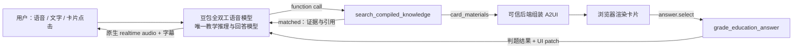

# 豆包全双工 AI 教师

这是一个“全双工语音 + 知识编译 + A2UI 教学卡片”的本地演示。教育模式采用单一实时大脑：**豆包全双工语音模型既理解用户，也完成教学推理，并直接输出原生 realtime audio**。知识检索、确定性判题和可信卡片组装作为工具与旁路能力提供，不再把每轮请求转发给第二个教师大模型。

## 最新实时链路



关键约束：

- 命中知识时，双工模型先理解检索证据，再用自然口语回答；不逐字朗读检索结果。
- `status=no_match` 时，双工模型直接使用自身通用知识回答，并明确不伪造知识库引用。
- 全双工课堂使用火山原生音频流；文字回复的播报使用与课堂隔离的火山流式语音短连接。浏览器不使用 `speechSynthesis`，也不接触火山凭证。
- A2UI JSON 不由模型自由生成。后端只把检索结果中的可信 `card_materials` 转成已注册卡型。
- 单选题由 `grade_education_answer` 确定性判题。点击与“我选 A”的语音输入进入同一双工会话。
- `teacher_turn` 和外部教师 Agent 不在实时主链。`POST /api/teacher/turn` 仅可保留给旧客户端或离线兼容。

详细设计见 [总体架构](docs/architecture.md) 和 [双工教师配置蓝图](docs/teacher-agent-blueprint.md)。

## 教育工具

### `search_compiled_knowledge`

输入查询文本，可选限定知识产物与返回数量。结果分为：

- `matched`：在 `matches` 中返回可供模型推理的知识正文、引用和精简 `card_materials`；后端用同源素材旁路组装卡片。
- `no_match`：不返回伪证据，通知双工模型改用通用知识自由回答。
- `tool_error`：由网关在检索异常时返回，与“没有相关知识”严格区分。

### `grade_education_answer`

输入 `question_id` 和用户选择，返回确定性的正误、解释和卡片状态更新。未作答前，正确答案不得进入浏览器数据或卡片状态。

## 知识编译与 A2UI

Mock 编译服务支持 `audio`、`image`、`text`、`pdf`，统一输出 `KnowledgeArtifact`：

```json
{
  "artifact_id": "artifact_newton_second_law",
  "source_type": "pdf",
  "status": "compiled",
  "title": "牛顿第二定律",
  "knowledge_units": [],
  "citations": [],
  "card_materials": []
}
```

A2UI 使用受信任的 `EducationCard@1.0` 目录，支持知识讲解、单选题、思维导图、图片、Mock 视频、口语练习、考试进度/结果和编译状态。浏览器不会执行模型返回的 HTML、脚本或未知组件。

知识接口：

```http
GET  /api/knowledge/artifacts
GET  /api/knowledge/artifacts/:id
POST /api/knowledge/compile
```

教育工具的 HTTP 预览接口可用于不连接语音时验证召回和判题；它们只返回结构化结果与卡片，不生成音频。实时课堂仍以全双工 function calling 为主。

## 官方源码驱动的知识点素材生成

侧栏的“知识点素材生成”要求用户先选择一种技术。每次请求只执行一个
实现，不会并行生成四套产物：

```text
输入知识点 + technique
  → 一个选定实现
     ├─ DeepTutor：运行固定版本的官方 Python Book Engine
     │  └─ 原生 Book / Spine / Page / Block（不转 A2UI）
     ├─ OpenMAIC：运行固定版本的官方 TypeScript generation pipeline
     │  └─ 原生 Stage / Scene / Canvas / Action（不转 A2UI）
     ├─ Koji-style：本项目原创确定性渐进辅导状态机
     └─ Cell Studio：MIT 细胞数据模型与程序几何移植
        └─ 保持现有 EducationCard@1.0 / A2UI v0.9 路径
```

DeepTutor 源码固定在
`47d05809ea5d19e8b1390d4b42402302c37709bb`（Apache-2.0），OpenMAIC
源码固定在 `fcdb6d62b380c066de2a4733910669c9e697b83a`
（v0.3.0、MIT）；原始仓库与许可证保存在 `third_party/`。这两项返回源码
程序自身的数据模型，工作台直接按原生层级展示，不再生成本项目的
`card_materials` 或 `a2ui`。

当前 DeepTutor 入口执行 Spine、Overview，并为每个普通章节选取官方
`PagePlanner` 规划的首个长文 `SECTION`，交给官方 `BookCompiler` /
`SectionGenerator` 完成提纲与小节填充；返回的普通 Page 和 Block 均为
`ready`。这是受控的宿主兼容配置：题库、Figure、Interactive、Animation
等依赖独立 Agent 或 Manim 工具链的可选 Block 不在本入口执行，也不会伪装为
已生成。
OpenMAIC 入口完整执行文本课程的 outline、scene content、action 与 Scene 创建；
PBL、媒体生成、TTS、搜索和持久化不属于这个本地文本入口。

Cell Studio 记录上游仓库、固定 revision、许可证与实际复用文件。其上游是七
类细胞标本画廊，不是通用
text-to-3D 引擎，因此非细胞或歧义内容会明确拒绝，不会生成仿制场景。
Koji 没有纳入范围的可复用开源源码，所以始终标注为 `Koji-style`。

DeepTutor 的 Draft → Critique → Revise 与 OpenMAIC 的大纲/场景/动作生成
本来就是模型参与的官方流水线，因此选择这两项时必须配置 Ark。密钥只由宿主
Node.js 客户端持有，通过受控回调注入上游源码；不会传给子进程或写入源码
目录。Koji-style 与 Cell Studio 仍是确定性实现，不需要 Ark。配置支持两种
方式：

```bash
export ARK_API_KEY="<your-key>"
export ARK_BASE_URL="https://ark-cn-beijing.bytedance.net/api/v3"
export ARK_MODEL="<endpoint-id>"
export ARK_REQUEST_TIMEOUT_MS="120000"
```

模型单次请求默认等待 120 秒；如配置了重试，每次尝试分别使用该超时。

也可以在“知识点素材生成”页面点击右上角模型补全状态，在当前工作台内录入
`ARK_API_KEY`。页面录入的密钥只保存在 Node.js 当前进程内存中，服务重启后
需要重新录入；不会写入 `.env`、浏览器存储、生成产物或运行日志，也不会在
接口响应中回显。相关接口：

```http
GET  /api/knowledge/materials/config
POST /api/knowledge/materials/config
POST /api/knowledge/materials/generate
POST /api/knowledge/materials/generate/trace
POST /api/knowledge/materials/grade
```

`/generate/trace` 默认拒绝访问，仅允许从运行服务的本机、使用 loopback
Host/Origin 访问，响应类型为
`application/x-ndjson`。它会实时返回输入校验、官方源码阶段、Ark 请求、
重试、格式回退、经过白名单处理的上游错误码/request-id 与模型增量；
`length`、`content_filter` 等非完整终态不会标记为成功。最后以 `result`
或 `error` 记录结束。Trace 只存在于当前
HTTP 连接和页面内存中，不写入日志或浏览器存储；API Key、Authorization、
请求头、模型 URL、异常堆栈和 Worker stderr 不会进入事件。模型原始增量可能
包含尚未脱敏的教学内容或题目答案，因此该面板仅用于本机调试。

请求示例：

```json
{
  "source_text": "一段至少 20 个字符的知识内容",
  "technique": "deeptutor",
  "model_policy": "upstream_native"
}
```

`technique` 支持 `deeptutor`、`openmaic`、`koji`、`cell_studio`。选择
DeepTutor 或 OpenMAIC 时，生成响应的核心字段是
`public_bundle.source_result`，并带有 `execution.mode=upstream_native`、
固定源码 `provenance` 与真实运行信息；响应中没有 `techniques`、
`card_materials` 或 `a2ui`。Koji-style 与 Cell Studio 继续使用既有的卡片
协议，避免影响当前 App 端和其他消费模块。

OpenMAIC 原生 Quiz 的答案和解析在公开响应前会被移除；公开 Scene 仍保留
题干与选项。若官方 Action 明确宣告私有正确答案，发布门禁会拒绝整个结果，
不会改写 Action 或把它转成另一套协议。原生互动 HTML 只能在隔离的 sandbox
iframe 中展示，不会注入主页面，也不会进入 A2UI renderer。

## 其他能力

- 浏览器采集 16k PCM，Node.js 网关连接豆包全双工 WebSocket。
- 支持 ASR 字幕、文本流、24k PCM 原生音频流、打断、上下文操作和 function calling。
- 除教育模式外，仍保留零售、旅游 OTA、保险、银行等演示预设和 A2UI 示例。
- 页面内提供独立卡片库，可查看卡型、ID、数据格式、Mock 数据与渲染结果。

## 互动教材物理实验

教师端 → 更多教学工具 → 互动教材。默认提供斜面与摩擦实验，也可切换单摆、小车碰撞和二次函数示例。默认显示示例、知识点和两个主要实验参数；学科、年级、教学目标、参考材料及引擎选择收在更多设置中。

- Matter.js 0.20.0 与 Planck.js 1.4.2 使用本地依赖，按需加载；教师无需安装浏览器插件。斜面和单摆默认 Matter.js，碰撞默认 Planck.js，可在更多实验参数中切换。
- 点击生成会沿现有 Pi Agent 链路生成受约束的 `physics_lab`，只支持 `inclined_plane`、`pendulum`、`collision` 三个预设，禁止任意模型代码；参数按预设校验范围和单位。
- 支持播放、暂停、重置、操作记录/回放、Canvas WebM、操作 JSON 和单文件离线 HTML。离线文件内嵌两套引擎及 MIT 许可证注释，可断网使用。
- 物理世界采用 SI 参数与 1/120 秒步长；Matter.js 斜面使用显式库仑摩擦校准，Planck.js 使用原生摩擦。两种约束求解存在数值误差，不保证逐帧一致。实验不包含任意装置搭建；单摆忽略空气阻力，碰撞限定水平无摩擦的一维正碰。
- 聚焦验证：28 项合同、引擎计算及生成指导检查通过；浏览器验证双引擎、三实验、记录回放和离线运行。新物理生成路径尚未以真实上游模型进行端到端调用。

## 启动

源码仓库：<https://github.com/GuanZhuiGuo/edu>。建议使用 Node.js 22 LTS。
第三方源码以 Git 子模块固定版本，首次克隆时一并下载：

```bash
git clone --recurse-submodules https://github.com/GuanZhuiGuo/edu.git
cd edu
npm ci
cp .env.example .env
# 在 .env 中填写需要的服务端密钥；不要提交 .env。
npm start
```

已有克隆可执行 `git submodule update --init --recursive` 补齐第三方源码。
仓库包含课程、题库与演示档案的种子数据；本机数据库、真实学习记录、导入
文件、密钥和日志不纳入版本管理。启动时会自动创建本机数据库，也可先运行
`npm run init:data` 检查初始化。

打开：

```text
http://localhost:3042
http://localhost:3042/?display=app
http://localhost:3042/?display=pad
```

如需运行 DeepTutor 原生素材生成，另行安装 Python 3.12 及桥接依赖：

```bash
DEEPTUTOR_PYTHON=python3.12 bash source-bridges/deeptutor/install-deps.sh
```

仓库保留 OpenMAIC worker 的构建产物。若需重建 worker 或使用官方 React
renderer，按固定版本安装上游工作区依赖，再执行桥接构建：

```bash
npx --yes pnpm@10.28.0 --dir third_party/openmaic install --frozen-lockfile
node source-bridges/openmaic/build-official-worker.mjs
```

实际语音、模型生成和外部检索需要配置各自服务；未配置凭证不代表上游服务
已连接。Neo4j / Qdrant 的本地安装见 [检索基础设施](infra/education-knowledge/README.md)。

如需通过浏览器开启或关闭主应用服务，另行启动服务启停页：

```bash
npm run control
```

服务启停页地址为 `http://localhost:3043`；它只负责启动、停止和查看
`http://localhost:3042` 的运行状态，不用于录入 Ark Key。

## 安全说明

- API Key 不写入前端代码、文件、浏览器存储或产物；素材页仅将输入提交给
  本机服务并立即清空，服务端只在当前进程内存中使用，不接收远程配置请求。
- 知识内容按不可信数据处理。双工模型必须忽略知识片段中的命令、角色覆盖或工具调用指令。
- 引用只能来自本轮 `matched` 检索结果；`no_match` 自由回答不得冒充知识库内容。
- 卡片只接受已注册类型、版本和安全资源地址。
- 用户提供过的外部 Agent 密钥不应提交到仓库；当前实时链路也不需要该外部 Agent。
