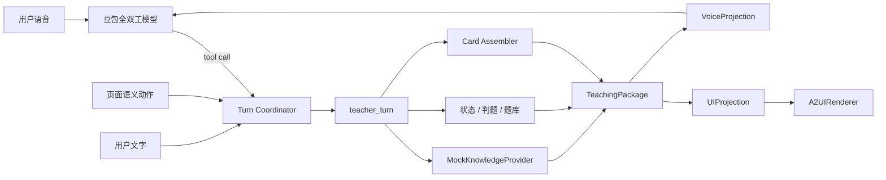
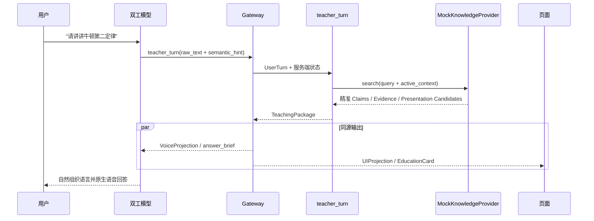

# AI 教师 MVP 1.0 产品需求文档

> 文档状态：架构基线  
> 版本：MVP 1.0  
> 日期：2026-07-25  
> 适用项目：豆包全双工语音 + A2UI 教育卡片 + 教学知识编排  
> 本文优先级：高于项目中此前“完整讲稿 + TTS”或“双工模型直连多个细粒度工具”的旧方案

## 0. 决策摘要

MVP 1.0 采用以下固定方案：

1. 一个豆包全双工模型负责听、理解自然语言、实时打断、自然组织措辞和原生语音输出。
2. 教育会话只向双工模型暴露一个聚合工具：`teacher_turn`。
3. `teacher_turn` 内部封装知识召回、判题、学习状态、题库和确定性卡片组装；不得把这些能力拆成多个模型可见工具。
4. 每个需要知识的教学回合最多进行一次知识召回；判题、点击、考试进度等状态型回合进行零次召回。
5. 双工模型消费 `TeachingPackage` 的 `VoiceProjection / answer_brief`，负责“怎么自然地说”。
6. 页面消费同一 `TeachingPackage` 的 `UIProjection / EducationCard`，负责确定性渲染。
7. 知识命中时采用“内容受控、表达自由”；公式、数字、选项、答案、评分等关键事实不可改写。
8. 知识未命中时 TeachingPackage 返回 `grounding.mode=model_prior`，VoiceProjection 扁平为 `grounding_mode=model_prior`；允许双工模型使用自身能力回答，但不得伪造知识库引用、知识卡片或学习状态变化。检索技术故障必须走独立 `tool_error`，不能伪装成未命中。
9. MVP 唯一 Mock 的外部依赖是知识提供方。Mock 直接模拟“真实检索已经返回完全符合要求的高质量教学语义对象”，不模拟不稳定的向量分数或低质量 Chunk。
10. 所有卡片必须直接复用项目当前最新的 `EducationCard@1.0`、`A2UIRenderer` 和样式，不另写一套卡片 HTML/CSS。

## 1. 产品背景

当前 AI 教师需要同时满足：

- 用户可以用语音或文字询问知识。
- 双工模型的回答具有真人教师式的自然语气、停顿、强调和可打断能力。
- 页面能同步出现与本轮教学目标强相关的知识卡片、图片、思维导图或题目。
- 用户既可以说“我选 A”，也可以点击页面中的 A。
- 两种作答方式必须进入同一题目、同一答案、同一判题和同一学习状态。
- 知识库没有相关内容时，系统仍可由双工模型回答一般问题，而不是无响应。

旧链路“教师服务写完整讲稿 → 独立 TTS 或双工模型逐字朗读”会损失语音自然度；另一种“让双工模型直接调用检索、判题、状态等多个工具”则会造成状态漂移、重复调用和卡片不一致。

MVP 1.0 的目标是验证：

> 单次教学编排可以同时驱动自然语音和确定性 GUI，并保证语音作答与页面作答语义一致。

## 2. 产品目标与成功标准

### 2.1 产品目标

- 跑通真实豆包全双工语音链路，不使用独立客户端 TTS 作为主链路。
- 跑通唯一聚合工具 `teacher_turn`。
- 用生产形态接口封装 Mock 知识提供方，未来只替换 Provider，不修改上层协议。
- 跑通知识讲解、卡片展示、语音作答、点击作答和确定性判题闭环。
- 验证知识未命中时的双工模型自由回答路径。
- 页面使用当前卡片库的最新渲染结果。

### 2.2 MVP 成功标准

以下条件必须全部满足：

- 命中 Mock 知识时，双工模型基于 `answer_brief` 自然回答，不逐字朗读原始材料。
- 语音和卡片引用同一批 `claim_id`，公式、数字、答案无冲突。
- 语音说“我选 A”、说“我选第一个”和页面点击 A 得到相同判题结果。
- 未作答前，正确答案不进入前端卡片或双工模型上下文。
- 未命中 Mock 知识时，双工模型仍原生语音回答，页面不生成伪知识卡或伪引用。
- 用户打断后停止当前播报，旧回合的晚到卡片不覆盖新回合。
- 重复工具调用或重复点击不会重复计分。
- 卡片样式来自现有卡片库，业务代码没有复制一份卡片 CSS 或自定义 HTML。

## 3. MVP 范围

### 3.1 本期范围

- 豆包全双工语音连接、ASR、原生语音输出和打断。
- 文本输入进入同一教学会话。
- `teacher_turn` 单工具编排。
- 高质量 Mock 知识召回。
- 牛顿第二定律完整教学单元。
- 知识讲解、思维导图、图片、Mock 视频、单选题、口语练习任务、模拟考试进度/结果、知识编译状态卡。
- 服务端会话状态、活动题、幂等键和状态版本。
- 语音答案与 UI Action 的统一判题。
- `TeachingPackage`、`VoiceProjection` 和 `UIProjection`。
- 知识未命中的 `model_prior` 回退。
- 关键链路日志和可回放标识。

### 3.2 唯一 Mock 边界

MVP 用 `MockKnowledgeProvider` 替代真实知识检索接口。

Mock 的是：

- 外部知识检索服务。
- 已编译知识产物、题目、引用和展示素材的返回结果。
- 视频资源可使用当前卡片库明确标记为 `availability=mock` 的素材位。

Mock 视频、虚拟编译状态和题库都是同一个 Mock Knowledge Artifact 内的本地 Fixture，不代表又增加了一个被 Mock 的外部服务。

不 Mock 的是：

- 双工语音连接和原生语音回答。
- `teacher_turn` 的回合编排。
- 状态读写、幂等和判题。
- 卡片选择与 Schema 校验。
- A2UI 渲染。
- 卡片点击回传。
- 语音“我选 A”的识别与判题。
- 命中/未命中后的分支控制。

### 3.3 本期非目标

- 接入生产向量库、真实知识库或真实 RAG 接口。
- 真实 PDF/OCR/音视频内容解析。
- 多学科大规模知识覆盖。
- 跨设备长期学习档案。
- 高风险考试的正式评分与证书能力。
- 真实视频内容生产。
- 对口语发音给出正式标准化考试分数；MVP 仅完成任务、录音事件和教学反馈闭环。

## 4. 目标用户与核心场景

### 4.1 目标用户

- 希望通过语音学习高中物理概念的学生。
- 希望边听讲解边看结构化卡片的学生。
- 希望通过选择题或口语复述即时检查理解的学生。
- 需要验证 AI 教师语音、知识和 GUI 协同效果的产品与研发人员。

### 4.2 核心用户故事

1. 作为学生，我说“请讲讲牛顿第二定律”，系统自然讲解并同步展示知识卡。
2. 作为学生，我说“用思维导图整理一下”，页面只展示强相关的思维导图卡。
3. 作为学生，我说“给我出一道题”，系统生成题卡，但不提前暴露答案。
4. 作为学生，我说“我选 A”，系统确定性判题并同步更新题卡。
5. 作为学生，我点击 A，系统得到与语音作答完全相同的结果，并由双工模型自然反馈。
6. 作为学生，我问“请讲讲光合作用”，Mock 知识未命中，双工模型用自身能力回答，页面不伪造卡片。

## 5. 架构原则

### 5.1 一个实时模型、一个模型可见工具

教育 Session 的 `session.tools` 只注册：

```text
teacher_turn
```

以下能力可以作为内部函数或服务存在，但禁止直接注册给双工模型：

- `search_compiled_knowledge`
- `grade_education_answer`
- `get_learning_state`
- `save_learning_state`
- `emit_education_cards`
- 题库、考试、掌握度或编译状态工具

原因：

- 避免模型决定调用顺序。
- 避免一次回合多次检索或重复判题。
- 保证状态和卡片原子提交。
- 保持语音和 GUI 来自同一个教学结果。

### 5.2 内容受控、表达自由

`teacher_turn` 决定：

- 本轮是否使用检索知识。
- 哪些 Claim 必须表达。
- 哪些公式、数字和结论必须精确。
- 哪些说法禁止出现。
- 是否出题、判题或更新状态。
- 展示哪些卡片以及卡片数据。

双工模型决定：

- 语气、节奏、停顿和强调。
- 解释顺序。
- 适合当前学生的类比和口语表达。
- 是否用一句自然追问结束。

### 5.3 一个教学回合、两个投影



语音和页面不是两个独立教学大脑，也不是页面生成结果后再让语音重新理解。两者只消费同一个 `TeachingPackage` 的不同投影。

## 6. 组件职责

| 组件 | MVP 职责 | 禁止事项 |
|---|---|---|
| 豆包全双工模型 | ASR、自然语言理解提示、工具调用、自然措辞、原生语音和打断 | 判题、修改得分、生成卡片 JSON、伪造引用 |
| Voice Gateway / Turn Coordinator | 生成权威 session/turn/idempotency 标识；统一排队、取消、分发投影 | 让浏览器或模型覆盖服务端状态 |
| `teacher_turn` | 统一教学入口；召回、策略、判题、状态事务、卡片选择 | 输出完整朗读稿作为主链路 |
| MockKnowledgeProvider | 返回生产形态的高质量教学语义对象 | 返回随机低质量 Chunk 或把卡片 HTML 写死 |
| Assessment Engine | 保存活动题并确定性判题 | 让模型根据常识猜答案 |
| Learning State Store | 单调版本、活动任务、幂等结果 | 旧版本覆盖新版本 |
| Card Assembler | 从当前卡片注册表组装可信 EducationCard | 复制卡片库 HTML/CSS |
| A2UIRenderer | 白名单校验和确定性渲染 | 执行模型返回的 HTML/脚本 |

## 7. 核心交互流程

### 7.1 语音知识提问：召回命中



要求：

- 模型不看到原始卡片 JSON。
- 模型不需要朗读知识原文。
- 页面不解析模型最终回答来二次生成卡片。

### 7.2 语音回答“我选 A”

1. 双工模型完成 ASR，得到原话“我选 A”。
2. 双工模型调用 `teacher_turn`，附带 `semantic_hint.action=answer.select`。
3. `teacher_turn` 读取服务端 `active_quiz`，验证 A 是合法选项。
4. Assessment Engine 使用服务端答案确定性判题。
5. `TeachingPackage` 同时包含判题后的题卡和语音反馈约束。
6. 双工模型自然反馈，页面同步显示正确/错误和解析。

该回合依赖活动题状态，不调用 KnowledgeProvider，知识召回次数为 0。

### 7.3 页面点击 A

1. 页面发送结构化 `UIAction(type=answer.select, value=A)`。
2. Gateway 直接构造 `UserTurn(source=ui)`，不让双工模型重新猜点击语义。
3. `teacher_turn` 进入与语音作答相同的 Assessment Engine。
4. 页面应用判题后的卡片。
5. Gateway 把本轮 `VoiceProjection` 和已提交状态摘要注入当前双工会话。
6. 双工模型自然反馈，但不得再次判题。

该回合同样不调用 KnowledgeProvider，知识召回次数为 0。

页面“渲染了一张卡片”本身不是新用户行为，不需要再通知语音链路；只有点击、提交、开始录音等白名单语义 Action 才形成新的 `UserTurn`。初次语音回答只通过同一 TeachingPackage 中的 `cards_present / visible_card_types` 知道页面同步展示了什么。

### 7.4 知识未命中

1. 事实型或教学型问题仍先调用一次 `teacher_turn`。
2. MockKnowledgeProvider 返回 `status=no_match`。
3. `teacher_turn` 返回 `grounding.mode=model_prior`，VoiceProjection 中扁平为 `grounding_mode=model_prior`。
4. 双工模型使用自身能力回答。
5. 页面本轮不新增知识卡、不展示引用、不修改学习状态。

纯寒暄、情绪回应等明显非事实型对话可以由双工模型直接回答，不要求调用工具。

### 7.5 文字输入

1. 文字和快捷入口通过 `conversation.item.create / input_text` 把用户可见的自然语言原文作为 Query 提交给当前双工 Session；不得使用用于主动播报的 `speech_text_buffer.commit`，不预先执行 `teacher_turn`，也不把 VoiceProjection JSON 伪装成新的用户文本。
2. 双工模型按与语音输入相同的规则理解意图；需要教学知识、卡片、出题或判题时，每回合最多调用一次唯一工具 `teacher_turn`。
3. Gateway 将 `teacher_turn` 结果以 `role=tool` 放回同一双工上下文，同时把同一 TeachingPackage 的 UIProjection 可信旁路发送给页面。
4. 双工模型只把工具结果作为内部推理依据，用原生语音自然回答；不得朗读 JSON、字段名、内部 ID、工具参数、系统规则或控制指令。
5. 双工 Session 尚未建立时，文字和快捷入口提示用户先连接，不在客户端启用独立 TTS 或伪造自由答案。

文字未命中时，VoiceProjection 必须保留用户原始 `user_text`。双工模型基于该文本使用自身能力回答，不能只收到一个没有问题正文的 `model_prior` 标志。

### 7.6 打断与过期回合

- 用户开始新语音时，Gateway 立即取消当前音频响应。
- 已取消且未提交的旧 `teacher_turn` 结果不得更新页面。
- 已完成确定性判题并提交的状态不因用户打断播报而回滚。
- 客户端只能应用当前有效 `turn_id`、不低于已应用 `turn_sequence`，且 `state_version` 不旧于本地版本的 UIProjection。

### 7.7 点击结果回注双工

页面点击后的自然语音反馈是 MVP 硬闭环，不是可延后能力。Gateway 对豆包实时协议做一层 `DuplexSessionAdapter`，业务层只依赖以下应用级合同：

```json
{
  "event_version": "1.0",
  "event_id": "inject_evt_009",
  "session_id": "lesson_001",
  "turn_id": "turn_009",
  "turn_sequence": 9,
  "package_id": "pkg_turn_009",
  "kind": "voice_projection",
  "response_mode": "immediate_voice",
  "voice_projection": {}
}
```

Adapter 注入成功后必须返回：

```json
{
  "accepted": true,
  "event_id": "inject_evt_009",
  "vendor_event_id": "vendor_evt_xxx",
  "duplex_response_id": "response_xxx"
}
```

约束：

- `event_id` 幂等；同一注入事件不得触发两次语音。
- `duplex_response_id` 必须写入本轮日志，并与 `turn_id / package_id` 关联。
- 所有模式统一使用 `kind=voice_projection`；由 VoiceProjection 内的 `grounding_mode / response_directive` 区分知识回答、状态反馈、自由回答、澄清和工具故障。
- 点击结果以 `state_authoritative` 投影注入，模型只能反馈，不能再次调用工具判题。
- 在业务开发开始前完成实时 API Spike，冻结 `DuplexSessionAdapter` 对应的正式事件序列、确认回执和取消方式，并验证五种 VoiceProjection 均不会触发二次 `teacher_turn`。
- 若 Spike 无法证明活动 Session 可接收投影并返回可关联的响应 ID，AC-04 不成立，MVP 不得以“页面有结果但语音不反馈”视为完成。

## 8. 输入与输出合同

### 8.1 模型可见 `teacher_turn` 输入

模型只提供自然语言及语义提示。权威标识由 Gateway 生成。

```json
{
  "raw_text": "我选第一个",
  "semantic_hint": {
    "intent": "quiz.answer",
    "topic_id": "physics.newton.second_law",
    "action": {
      "type": "answer.select",
      "value": "A"
    },
    "confidence": 0.94
  }
}
```

`semantic_hint` 只是提示，不是业务事实。`teacher_turn` 必须结合服务端状态重新验证。

`teacher_turn` 本身不接收音频，也不负责 ASR。语音由双工模型转成 `raw_text`，并可附带一次非权威的 `semantic_hint`；真正的题目、合法选项、当前状态和知识事实由 `teacher_turn` 再校验。换言之：

```text
听懂声音：双工模型 ASR
初步理解意图：双工模型 semantic_hint
确定业务语义：teacher_turn + 服务端状态 + 确定性规则
理解教学知识：KnowledgeProvider 返回的 Claims / Relations / Materials
```

### 8.2 内部 `UserTurn`

```json
{
  "contract_version": "1.0",
  "session_id": "lesson_001",
  "turn_id": "turn_008",
  "turn_sequence": 8,
  "idempotency_key": "call_008",
  "source": "voice",
  "raw_text": "我选第一个",
  "semantic_hint": {
    "intent": "quiz.answer",
    "action": {
      "type": "answer.select",
      "value": "A"
    },
    "confidence": 0.94
  },
  "ui_events": [],
  "attachments": [],
  "state_version": 3
}
```

页面动作必须携带当前题目标识：

```json
{
  "event_id": "ui_evt_009",
  "type": "answer.select",
  "question_id": "quiz_newton_force_mass_01",
  "value": "A",
  "observed_state_version": 3
}
```

语义路由优先级：

```text
结构化 UIAction
> 当前活动任务（active quiz / exam / oral practice）
> raw_text 中可确定性归一化的明确动词与实体
> 与 raw_text 一致且经过状态校验的 semantic_hint
> 知识检索
> model_prior 或澄清
```

冲突与拒判规则：

- `semantic_hint` 只能帮助路由，不能单独决定不可逆的选项、得分或状态变化。
- 对“我选 A”“第一个”等答案，服务端先从 `raw_text` 确定性归一化；hint 与归一化结果一致才可使用。
- `raw_text` 明确为 A、hint 为 B 时返回 `grounding.mode=clarify`，不得判 A 或 B。
- `raw_text` 无法确定答案时，即使 hint 给出一个合法选项，也先澄清，不凭 hint 判题。
- 没有 `active_quiz` 时收到语音答案，返回 `clarify(reason=no_active_question)`，不召回、不改状态。
- UIAction 的 `question_id` 与活动题不一致或 `observed_state_version` 过期时，返回 `state_authoritative(status=stale_action)`；页面刷新当前题，不执行旧点击。
- 已锁题目收到新的不同事件时返回 `state_authoritative(status=already_answered)`，不得二次计分。

### 8.3 `TeachingPackage@1.0`

`grounding.mode` 的合法值：

| 值 | 含义 |
|---|---|
| `retrieved` | 本轮答案受召回知识和 Claim 约束 |
| `state_authoritative` | 本轮是判题、考试进度等服务端权威状态结果 |
| `model_prior` | 知识未命中，允许双工模型使用自身能力回答 |
| `clarify` | 语音、指代或教学状态不足以确定用户意图，需要澄清 |
| `tool_error` | KnowledgeProvider 或内部工具发生技术故障；不等同于未命中，不允许静默转为模型自由回答 |

```json
{
  "package_version": "1.0",
  "package_id": "pkg_turn_008",
  "session_id": "lesson_001",
  "turn_id": "turn_008",
  "turn_sequence": 8,
  "idempotency_key": "call_008",
  "artifact_version": "physics_newton2_mock_mvp1",
  "grounding": {
    "mode": "retrieved",
    "retrieval_id": "retrieval_mock_newton2_001"
  },
  "answer_brief": {
    "direct_answer": "质量不变时，加速度与合外力成正比。",
    "must_include": [
      {
        "claim_id": "claim_newton2_formula",
        "text": "F=ma",
        "delivery": "verbatim"
      },
      {
        "claim_id": "claim_newton2_force_ratio",
        "text": "质量不变时，加速度与合外力成正比。",
        "delivery": "semantic"
      }
    ],
    "exact_values": [
      {
        "name": "force_multiplier",
        "value": 2,
        "spoken_text": "合外力变为 2 倍"
      },
      {
        "name": "acceleration_multiplier",
        "value": 2,
        "spoken_text": "加速度变为 2 倍"
      }
    ],
    "supporting_facts": [
      "可用推动同一辆小车作类比。"
    ],
    "must_not_claim": [
      "任意一个力都等于 ma",
      "加速度方向一定与速度方向相同"
    ],
    "target_duration_seconds": 25,
    "next_move": "可以询问学生是否想做一道题。"
  },
  "authoritative_result": null,
  "clarification": null,
  "cards": [
    {
      "id": "card_newton2_explanation_turn_008",
      "type": "knowledge.explanation",
      "version": "1.0",
      "meta": {
        "title": "核心讲解",
        "eyebrow": "高中物理 · 必修一",
        "badge": "核心概念",
        "tags": ["运动与力", "F=ma"],
        "artifact_ids": ["artifact_physics_newton2_mvp1"]
      },
      "props": {
        "title": "牛顿第二定律",
        "summary": "物体的加速度由合外力和质量共同决定。",
        "body": "先选定研究对象并求合外力，再由 F=ma 分析加速度。",
        "formula": "F = ma",
        "key_points": [
          "F 表示合外力",
          "质量不变时，加速度与合外力成正比"
        ],
        "callout": "判断比例关系前，先确认保持不变的物理量。",
        "sources": [
          {
            "title": "牛顿第二定律 MVP 演示知识单元",
            "citation_id": "evidence_newton2_note_01"
          }
        ]
      },
      "state": {
        "status": "ready"
      },
      "actions": [
        {
          "type": "quiz.start",
          "label": "用一道题检验"
        }
      ]
    }
  ],
  "card_claim_bindings": [
    {
      "card_id": "card_newton2_explanation_turn_008",
      "supports_claim_ids": [
        "claim_newton2_formula",
        "claim_newton2_force_ratio"
      ]
    }
  ],
  "evidence": [
    {
      "evidence_id": "evidence_newton2_note_01",
      "title": "牛顿第二定律 MVP 演示知识单元",
      "locator": "mock://physics/newton-second-law"
    }
  ],
  "expected_actions": [
    {
      "type": "quiz.start"
    }
  ],
  "public_state_patch": {
    "active_claim_ids": [
      "claim_newton2_formula",
      "claim_newton2_force_ratio"
    ]
  },
  "state_version": 4,
  "presentation": {
    "surface_policy": "replace",
    "max_cards": 2
  }
}
```

### 8.3.1 其他 Grounding 模式

除第 8.3 节的 `retrieved` 示例外，另外四种模式使用相同信封。下列是可以直接校验的最小 TeachingPackage：

```json
[
  {
    "package_version": "1.0",
    "package_id": "pkg_turn_009",
    "session_id": "lesson_001",
    "turn_id": "turn_009",
    "turn_sequence": 9,
    "idempotency_key": "ui_evt_009",
    "artifact_version": null,
    "grounding": {
      "mode": "state_authoritative",
      "retrieval_id": null
    },
    "answer_brief": null,
    "authoritative_result": {
      "status": "already_answered",
      "question_id": "quiz_newton_force_mass_01",
      "selected_option": "A",
      "is_correct": true
    },
    "clarification": null,
    "cards": [],
    "card_claim_bindings": [],
    "evidence": [],
    "expected_actions": [],
    "public_state_patch": {},
    "state_version": 4,
    "presentation": {
      "surface_policy": "preserve",
      "max_cards": 0
    }
  },
  {
    "package_version": "1.0",
    "package_id": "pkg_turn_010",
    "session_id": "lesson_001",
    "turn_id": "turn_010",
    "turn_sequence": 10,
    "idempotency_key": "call_010",
    "artifact_version": null,
    "grounding": {
      "mode": "model_prior",
      "retrieval_id": "retrieval_mock_no_match_002"
    },
    "answer_brief": null,
    "authoritative_result": null,
    "clarification": null,
    "cards": [],
    "card_claim_bindings": [],
    "evidence": [],
    "expected_actions": [],
    "public_state_patch": {},
    "state_version": 4,
    "presentation": {
      "surface_policy": "preserve",
      "max_cards": 0
    }
  },
  {
    "package_version": "1.0",
    "package_id": "pkg_turn_011",
    "session_id": "lesson_001",
    "turn_id": "turn_011",
    "turn_sequence": 11,
    "idempotency_key": "call_011",
    "artifact_version": null,
    "grounding": {
      "mode": "clarify",
      "retrieval_id": null
    },
    "answer_brief": null,
    "authoritative_result": null,
    "clarification": {
      "reason": "semantic_conflict",
      "prompt": "我听到你说选 A，但识别结果不一致。请再说一次选项。"
    },
    "cards": [],
    "card_claim_bindings": [],
    "evidence": [],
    "expected_actions": [],
    "public_state_patch": {},
    "state_version": 4,
    "presentation": {
      "surface_policy": "preserve",
      "max_cards": 0
    }
  },
  {
    "package_version": "1.0",
    "package_id": "pkg_turn_012",
    "session_id": "lesson_001",
    "turn_id": "turn_012",
    "turn_sequence": 12,
    "idempotency_key": "call_012",
    "artifact_version": null,
    "grounding": {
      "mode": "tool_error",
      "retrieval_id": "retrieval_mock_fault_003"
    },
    "answer_brief": null,
    "authoritative_result": null,
    "clarification": null,
    "public_error": {
      "code": "KNOWLEDGE_PROVIDER_UNAVAILABLE",
      "retryable": true,
      "user_message": "知识服务暂时不可用，请稍后重试。"
    },
    "cards": [],
    "card_claim_bindings": [],
    "evidence": [],
    "expected_actions": [
      {
        "type": "turn.retry"
      }
    ],
    "public_state_patch": {},
    "state_version": 4,
    "presentation": {
      "surface_policy": "preserve",
      "max_cards": 0
    }
  }
]
```

`model_prior` 的 TeachingPackage 不携带自由回答正文；原始问题通过 VoiceProjection 的 `user_text` 交给双工模型。`state_authoritative` 若本轮首次完成判题，则实际包还必须带判题后的题卡；上例是已锁题目的重复事件，因此保留现有 Surface。`tool_error` 只携带脱敏后的公开错误，不包含堆栈、内部地址或密钥。

### 8.4 `VoiceProjection`

`TeachingPackage.grounding.mode` 是包内权威字段；VoiceProjection 为降低实时模型解析负担，将其扁平为 `grounding_mode`。

正式合同：

```json
{
  "projection_version": "1.0",
  "session_id": "lesson_001",
  "turn_id": "turn_008",
  "turn_sequence": 8,
  "package_id": "pkg_turn_008",
  "state_version": 4,
  "grounding_mode": "retrieved",
  "response_directive": "answer_from_brief",
  "user_text": "质量不变时，合外力变成两倍，加速度会怎样？",
  "answer_brief": {
    "direct_answer": "加速度也变为 2 倍。",
    "must_include": [
      {
        "claim_id": "claim_newton2_double_force",
        "text": "质量不变，合外力变为 2 倍，加速度也变为 2 倍。",
        "delivery": "semantic"
      }
    ],
    "exact_values": [
      {
        "name": "acceleration_multiplier",
        "value": 2,
        "spoken_text": "加速度变为 2 倍"
      }
    ],
    "must_not_claim": [
      "任意一个力都等于 ma"
    ],
    "target_duration_seconds": 20
  },
  "authoritative_result": null,
  "clarification": null,
  "public_error": null,
  "response_policy": {
    "may_use_model_prior": false,
    "may_call_teacher_turn_again": false,
    "must_not_claim_retrieval": false
  },
  "cards_present": true,
  "visible_card_types": [
    "knowledge.explanation"
  ]
}
```

五种模式的必需语义：

| `grounding_mode` | `response_directive` | 必需载荷 | 行为 |
|---|---|---|---|
| `retrieved` | `answer_from_brief` | `user_text + answer_brief` | 受 Claim 约束，自然表达 |
| `state_authoritative` | `acknowledge_result` | `authoritative_result` | 只反馈已提交的判题/状态，不再次调用工具 |
| `model_prior` | `answer_from_model_prior` | `user_text` | 可用模型自身知识，不声称检索命中 |
| `clarify` | `ask_clarification` | `user_text + clarification` | 只问澄清问题，不判题、不改状态 |
| `tool_error` | `apologize_and_offer_retry` | `public_error` | 说明暂时不可用并允许重试，不使用模型知识冒充召回结果 |

其余模式的载荷示例：

```json
[
  {
    "grounding_mode": "state_authoritative",
    "response_directive": "acknowledge_result",
    "authoritative_result": {
      "status": "graded",
      "question_id": "quiz_newton_force_mass_01",
      "selected_option": "A",
      "is_correct": true,
      "correct_option": "A",
      "explanation": "质量不变时，加速度与合外力成正比。"
    },
    "cards_present": true,
    "visible_card_types": ["quiz.single-choice"]
  },
  {
    "grounding_mode": "model_prior",
    "response_directive": "answer_from_model_prior",
    "user_text": "请讲讲光合作用。",
    "answer_brief": null,
    "response_policy": {
      "may_use_model_prior": true,
      "may_call_teacher_turn_again": false,
      "must_not_claim_retrieval": true
    },
    "cards_present": false,
    "visible_card_types": []
  },
  {
    "grounding_mode": "clarify",
    "response_directive": "ask_clarification",
    "user_text": "就选它吧。",
    "clarification": {
      "reason": "ambiguous_answer",
      "prompt": "你想选 A、B 还是 C？"
    },
    "cards_present": true,
    "visible_card_types": ["quiz.single-choice"]
  },
  {
    "grounding_mode": "tool_error",
    "response_directive": "apologize_and_offer_retry",
    "public_error": {
      "code": "KNOWLEDGE_PROVIDER_UNAVAILABLE",
      "retryable": true,
      "user_message": "知识服务暂时不可用，请稍后重试。"
    },
    "response_policy": {
      "may_use_model_prior": false,
      "may_call_teacher_turn_again": false,
      "must_not_claim_retrieval": true
    },
    "cards_present": false,
    "visible_card_types": []
  }
]
```

以上数组省略了与正式合同相同的投影信封字段；实现返回时不得省略。

禁止包含：

- 完整卡片 JSON。
- 原始 Chunk。
- 未作答题目的答案。
- 内部评分规则或服务端私有状态。

### 8.5 `UIProjection`

正式合同：

```json
{
  "projection_version": "1.0",
  "session_id": "lesson_001",
  "turn_id": "turn_008",
  "turn_sequence": 8,
  "package_id": "pkg_turn_008",
  "state_version": 4,
  "surface": {
    "surface_id": "lesson_surface_main",
    "operation": "replace"
  },
  "cards": [
    {
      "id": "card_newton2_explanation_turn_008",
      "type": "knowledge.explanation",
      "version": "1.0",
      "meta": {
        "artifact_ids": [
          "artifact_physics_newton2_mvp1"
        ]
      },
      "props": {
        "title": "牛顿第二定律",
        "body": "质量不变时，加速度与合外力成正比。"
      },
      "state": {
        "status": "ready"
      },
      "actions": []
    }
  ],
  "card_claim_bindings": [
    {
      "card_id": "card_newton2_explanation_turn_008",
      "supports_claim_ids": [
        "claim_newton2_formula"
      ]
    }
  ],
  "expected_actions": [
    {
      "type": "quiz.start"
    }
  ],
  "evidence": [
    {
      "evidence_id": "evidence_newton2_note_01",
      "title": "牛顿第二定律 MVP 演示知识单元"
    }
  ]
}
```

示例卡片只保留通过 Schema 所需的最小字段；实际卡片由第 9.4 节 TeachingMaterial 映射成第 8.3/10.3 节的完整展示内容。

页面不依赖双工模型最终文本生成卡片。

客户端应用顺序：

1. `turn_sequence` 小于当前已应用序号：整包丢弃。
2. `turn_sequence` 相同但 `package_id` 不同：记录协议错误，不覆盖页面。
3. `state_version` 小于本地状态版本：状态与交互卡丢弃。
4. 通过以上检查后，再将 `surface.operation` 映射为当前 A2UI v0.9 的标准消息。

Claim 关联的唯一权威字段是 TeachingPackage/UIProjection 顶层的 `card_claim_bindings`。当前卡片 Registry 的 `META_SCHEMA` 未显式定义 `supports_claim_ids`，所以 MVP 不把该字段塞进 `EducationCard.meta`；若未来 Registry 正式加入，再通过映射器镜像，业务判断仍以顶层绑定为准。

## 9. Mock 知识设计

### 9.1 Mock 原则

不 Mock Embedding、随机分数或向量数据库行为，而是直接 Mock：

> 真实知识服务已经返回精准、完整、可引用、可组卡的教学语义结果。

保留可替换接口：

```text
teacher_turn
  -> RetrieverPort.search()
       -> MVP: MockKnowledgeProvider
       -> Future: HttpKnowledgeProvider
```

两种 Provider 必须返回同一合同。未来接真实接口时，不修改：

- 双工模型提示词。
- `teacher_turn`。
- Assessment Engine。
- Card Assembler。
- A2UI 页面协议。

### 9.2 Mock 教学单元

MVP 只做一个完整教学单元：

> 高中物理 · 必修一 · 牛顿第二定律

稳定 Claim：

| Claim ID | 权威事实 |
|---|---|
| `claim_newton2_formula` | 牛顿第二定律写作 `F=ma`，其中 F 是合外力 |
| `claim_newton2_direction` | 加速度方向与合外力方向一致 |
| `claim_newton2_force_ratio` | 质量不变时，加速度与合外力成正比 |
| `claim_newton2_mass_ratio` | 合外力不变时，加速度与质量成反比 |
| `claim_newton2_double_force` | 质量不变，合外力变为 2 倍，加速度也变为 2 倍 |
| `claim_newton2_steps` | 解题步骤：选研究对象、画受力图、求合外力、列方程 |

稳定误区：

- “任意一个力都等于 `ma`”是错误说法。
- “加速度方向一定与速度方向相同”是错误说法。
- 判断比例关系时必须明确哪个物理量保持不变。

### 9.3 Mock Provider 返回合同

Mock Provider 返回的是 `teacher_turn` 内部数据，不整体透传给双工模型：

```json
{
  "retrieval_id": "retrieval_mock_newton2_001",
  "provider": "mock",
  "status": "matched",
  "query": "质量不变时，合外力变成两倍，加速度会怎样？",
  "artifact_id": "artifact_physics_newton2_mvp1",
  "artifact_version": "physics_newton2_mock_mvp1",
  "matches": [
    {
      "knowledge_unit_id": "ku_newton2_force_ratio",
      "score": 1,
      "match_reason": "supported_topic_exact_mock",
      "claims": [
        {
          "claim_id": "claim_newton2_force_ratio",
          "text": "质量不变时，加速度与合外力成正比。"
        },
        {
          "claim_id": "claim_newton2_double_force",
          "text": "合外力变为 2 倍，加速度也变为 2 倍。"
        }
      ],
      "must_not_claim": [
        "任意一个力都等于 ma",
        "未说明质量不变时直接断言加速度与力成正比"
      ],
      "evidence_refs": ["evidence_newton2_note_01"],
      "presentation_candidates": [
        {
          "material_id": "material_newton2_explanation",
          "recommended_type": "knowledge.explanation",
          "supports_claim_ids": [
            "claim_newton2_force_ratio",
            "claim_newton2_double_force"
          ]
        }
      ],
      "assessment_item_ids": ["quiz_newton_force_mass_01"]
    }
  ],
  "evidence": [
    {
      "evidence_id": "evidence_newton2_note_01",
      "title": "牛顿第二定律 MVP 演示知识单元",
      "source_type": "mock",
      "locator": "mock://physics/newton-second-law",
      "excerpt": "质量不变时，加速度与合外力成正比。"
    }
  ]
}
```

未命中必须返回正常业务结果，不得伪装成超时或工具异常：

```json
{
  "retrieval_id": "retrieval_mock_no_match_002",
  "provider": "mock",
  "status": "no_match",
  "query": "请讲讲光合作用。",
  "normalized_query": "请讲讲光合作用",
  "reason": "unsupported_topic",
  "artifact_id": null,
  "artifact_version": null,
  "matches": [],
  "evidence": []
}
```

技术故障必须使用独立状态：

```json
{
  "retrieval_id": "retrieval_mock_fault_003",
  "provider": "mock",
  "status": "error",
  "query": "请讲讲牛顿第二定律。",
  "matches": [],
  "evidence": [],
  "error": {
    "code": "PROVIDER_TIMEOUT",
    "retryable": true
  }
}
```

`status=error` 映射为 `grounding.mode=tool_error`，不得映射为 `no_match/model_prior`。Mock 的故障只允许通过测试注入开关触发，不能用某句普通用户问题作为“暗号”，避免污染真实路由规则。

### 9.4 TeachingMaterial Fixture

`presentation_candidates` 只负责引用素材，完整素材放在独立的 `TeachingMaterial@1.0` Fixture 中。Card Assembler 通过 `material_id` 读取素材，`teacher_turn` 不得硬编码卡片 props。

知识讲解素材示例：

```json
{
  "material_version": "1.0",
  "material_id": "material_newton2_explanation",
  "material_type": "explanation",
  "supported_card_types": [
    "knowledge.explanation"
  ],
  "supports_claim_ids": [
    "claim_newton2_formula",
    "claim_newton2_force_ratio",
    "claim_newton2_double_force"
  ],
  "evidence_refs": [
    "evidence_newton2_note_01"
  ],
  "content": {
    "title": "牛顿第二定律",
    "summary": "物体的加速度由合外力和质量共同决定。",
    "body": "先选研究对象并求合外力，再由 F=ma 分析加速度。",
    "formula": "F = ma",
    "key_point_claim_ids": [
      "claim_newton2_formula",
      "claim_newton2_force_ratio"
    ],
    "callout": "判断比例关系前，先确认保持不变的物理量。"
  },
  "presentation": {
    "eyebrow": "高中物理 · 必修一",
    "badge": "核心概念",
    "tags": [
      "运动与力",
      "F=ma"
    ]
  }
}
```

确定性映射：

| TeachingMaterial | EducationCard |
|---|---|
| `content.title / summary / body / formula / callout` | `knowledge.explanation.props` 同名字段 |
| `content.key_point_claim_ids` | 从 Claim Registry 解析文本后写入 `props.key_points` |
| `evidence_refs` | 从 Evidence Registry 解析为 `props.sources` |
| `presentation` | 映射为当前 Registry 允许的 `meta.eyebrow / badge / tags` |
| `supports_claim_ids` | 写入顶层 `card_claim_bindings`，不写入 Card meta |

其他 MVP 素材类型采用同一外壳：

- `mindmap`：保存稳定树节点和关联 Claim。
- `image`：保存白名单 asset、教学型 alt、caption 和关联 Claim。
- `video`：保存白名单 asset/poster、时长、caption、`availability=mock`。
- `oral_task`：保存任务、时限、参考表达和反馈维度。
- `compiler_status`：保存编译产物及展示步骤。
- 单选题和考试答案不进入 TeachingMaterial，由私有 Assessment Fixture 提供。

Card Assembler 必须从 `card-library-data.js` 导入当前卡型定义与 JSON Schema，映射后先校验再输出。缺素材、Claim 或 Schema 校验失败时不渲染该卡，并记录明确错误，不回退为 `teacher_turn` 内的手写卡片。

### 9.5 Mock 题库

至少预置三道服务端私有题：

1. 质量不变，合外力变为 2 倍，加速度如何变化；正确答案 A：变为 2 倍。
2. 合外力不变，质量变为 2 倍，加速度如何变化；正确答案 B：变为原来的 1/2。
3. 加速度方向与什么方向一致；正确答案 C：合外力方向。

要求：

- 答案和解析只保存在服务端私有题库。
- 出题时前端只收到题干、选项和 `question_id`。
- 判题后才允许返回正确答案和解析。
- 语音与点击必须使用同一 `question_id`。

### 9.6 Presentation Candidates

Mock 知识只保存教学语义与推荐卡型，不保存 HTML/CSS。

建议素材：

- `knowledge.explanation`：公式、结论、关键点和误区。
- `knowledge.mindmap`：公式、物理量、比例关系、解题步骤。
- `media.image`：`/assets/newton-cart-lesson.png`。
- `media.video`：当前 Mock 视频位，必须明确 `availability=mock`。
- `quiz.single-choice`：三道私有题。
- `oral.practice`：30 秒复述任务和评分维度。
- `exam.progress / exam.result`：三题模拟测验。
- `compiler.status`：已编译完成的牛顿第二定律演示资料。

### 9.7 Mock 命中规则

Mock 使用可解释主题白名单，不使用随机分数。

归一化与阈值：

- Unicode 使用 NFKC 归一化；去除首尾空白、重复空格和句末标点。
- 英文字母统一小写，并去除公式内部空白，因此 `F=ma`、`f = m a` 进入同一公式词形。
- “第一项/第一个/选项一”只在活动题上下文中归一化为 A。
- 明确排除词“第一定律”“第三定律”优先于任何 topic hint。
- `semantic_hint.topic_id=physics.newton.second_law` 的采用阈值固定为 `confidence >= 0.85`，且 raw_text 不得存在显式冲突；hint 不能单独触发判题。
- 命中结果固定 `score=1`，未命中不返回伪分数；MVP 不模拟相似度排序。
- 上下文追问有效期为最近 3 个已接受用户回合或 10 分钟，以先到者为准；显式切换主题、开始新 Session 或清空页面时立即失效。

以下情况必命中：

- `semantic_hint.topic_id=physics.newton.second_law` 达到阈值，同时 raw_text 至少含一个物理弱提示且无冲突。
- 原话包含“牛顿第二定律”或“F=ma”。
- 原话同时包含“合外力”和“加速度”。
- 原话同时讨论“力、质量、加速度”的关系。
- 在已命中牛顿第二定律的同一会话中追问“为什么”“这个公式什么意思”等指代问题。
- 在活动牛顿题目或考试中请求答题、提示、下一题或复习。

以下情况必须未命中：

- 明确询问牛顿第一定律或第三定律。
- 只出现“质量”“力”“牛顿”等单个弱词且无上下文。
- 询问其他学科或其他物理主题。
- 无法确认问题与牛顿第二定律相关。

### 9.8 用户如何提问才能命中 Mock

最推荐的首次测试问法：

> 请用高中生能听懂的方式讲讲牛顿第二定律，并解释 F=ma 中每个量分别表示什么。

| 测试目标 | 建议直接说/输入 | 预期结果 |
|---|---|---|
| 基础讲解 | “请讲讲牛顿第二定律。” | 自然语音 + 知识讲解卡 |
| 公式解释 | “F=ma 里的 F 为什么是合外力？” | 解释卡，强调 F 是合外力 |
| 比例关系 | “质量不变时，合外力变成两倍，加速度会怎样？” | 回答 2 倍，数字必须精确 |
| 典型误区 | “是不是任意一个力都等于 ma？” | 明确否定并解释合外力 |
| 思维导图 | “帮我整理一张牛顿第二定律思维导图。” | 思维导图卡 |
| 图片辅助 | “用小车示意图解释力、质量和加速度的关系。” | 图片卡 + 简短讲解 |
| Mock 视频 | “给我看一个牛顿第二定律的动画演示。” | 明确标记 Mock 的视频卡 |
| 单题练习 | “给我出一道牛顿第二定律选择题。” | 未暴露答案的单选题卡 |
| 讲完出题 | “先讲牛顿第二定律，再出一道题考我。” | 讲解卡 + 单选题卡 |
| 口语练习 | “让我用自己的话复述牛顿第二定律。” | 口语练习卡 |
| 模拟考试 | “开始牛顿第二定律模拟测验。” | 考试进度卡 + 第一题 |
| 语音作答 | 题卡出现后说“我选 A。” | 服务端确定性判题 |
| 同义作答 | 题卡出现后说“我选第一个。” | 与选择 A 相同结果 |
| 点击作答 | 题卡出现后点击 A | 与语音选择 A 相同结果 |
| 上下文追问 | 讲解后说“为什么？” | 使用上轮 `claim_id` 继续解释 |

### 9.9 用于验证未命中的问法

以下问题应进入 `model_prior`：

- “牛顿第一定律是什么？”
- “请讲讲光合作用。”
- “莎士比亚十四行诗怎么押韵？”
- “量子引力有哪些实验依据？”
- “帮我写一首关于春天的短诗。”

预期：

- 双工模型使用自身能力自然回答。
- 页面不新增知识库卡片。
- 不展示知识库引用。
- 不改变活动题、考试、得分或掌握度。
- 日志标记 `grounding_mode=model_prior`。

## 10. 卡片库要求

### 10.1 唯一视觉与协议来源

运行时必须直接复用：

- `public/card-library-data.js`
- `public/a2ui-renderer.js`
- `public/card-library.js`
- `public/styles.css`

固定版本：

- `CARD_LIBRARY_VERSION = 1.0`
- `EducationCard.version = 1.0`
- `A2UI = v0.9`
- `catalogId = urn:a2ui:catalog:education:1.0`

版本与卡型不得在业务层复制为另一组常量：

- Card Assembler 直接导入 `CARD_LIBRARY_VERSION`、`listEducationCards()` 和对应 Schema。
- A2UI 版本与 `catalogId` 由共享 Registry 模块导出，Card Library 页面和业务页面共同引用。
- 启动自检必须确认版本为 `1.0`、Catalog 为上述 URN、卡型恰好是当前 Registry 返回的九类；不满足时阻止教育卡片链路启动并记录配置错误。

业务流程不得：

- 新写一套卡片 HTML/CSS。
- 从旧截图复制样式。
- 让模型生成 HTML、CSS 或组件树。
- 在前端根据模型文本二次猜测卡片内容。

### 10.2 最新九类卡片

| 卡型 | MVP 使用场景 | 关键要求 |
|---|---|---|
| `knowledge.explanation` | 核心知识讲解 | 公式独立高亮，关键点 3–5 条 |
| `knowledge.mindmap` | 知识结构 | 1–4 层，建议不超过 16 节点 |
| `media.image` | 小车实验图 | 保持比例，必须有教学型 alt |
| `media.video` | 动画演示 | MVP 明确标记 Mock |
| `quiz.single-choice` | 单选题 | 整行可点，状态由服务端回写 |
| `oral.practice` | 口语复述 | 任务、时限、参考表达和评分维度 |
| `exam.progress` | 模拟考试 | 只读展示题号、作答数和进度 |
| `exam.result` | 考试结果 | 分数、正确率、用时和下一步建议 |
| `compiler.status` | 演示资料已编译 | 展示产物、步骤和可用卡型 |

### 10.3 卡片统一外壳

```json
{
  "id": "card_01",
  "type": "knowledge.explanation",
  "version": "1.0",
  "meta": {
    "title": "核心讲解",
    "eyebrow": "高中物理 · 必修一",
    "badge": "核心概念",
    "tags": ["运动与力", "F=ma"],
    "artifact_ids": ["artifact_physics_newton2_mvp1"]
  },
  "props": {
    "title": "牛顿第二定律",
    "summary": "物体的加速度由合外力和质量共同决定。",
    "body": "先选定研究对象并求合外力，再由 F=ma 分析加速度。",
    "formula": "F = ma",
    "key_points": [
      "F 表示合外力",
      "质量不变时，加速度与合外力成正比"
    ],
    "callout": "判断比例关系前，先确认保持不变的物理量。",
    "sources": [
      {
        "title": "牛顿第二定律 MVP 演示知识单元",
        "citation_id": "evidence_newton2_note_01"
      }
    ]
  },
  "state": {
    "status": "ready"
  },
  "actions": [
    {
      "type": "quiz.start",
      "label": "用一道题检验"
    }
  ]
}
```

该实例必须直接通过当前 `knowledge.explanation` Schema，其中 `props.title` 与 `props.body` 为必填。对应的 Claim 关联存放在 TeachingPackage 顶层：

```json
{
  "card_id": "card_01",
  "supports_claim_ids": [
    "claim_newton2_formula"
  ]
}
```

### 10.4 卡片选择规则

- 普通知识问答默认最多展示 1 张讲解卡。
- 用户明确请求图片或思维导图时展示对应卡片。
- “讲完再出题”最多展示讲解卡 + 题卡。
- 明确多模态请求时单轮最多 3 张卡。
- 没有强相关卡片时不展示卡片。
- 默认不能因为知识命中就把所有素材一次性塞给页面。
- 知识型卡片在 `card_claim_bindings` 中的 `supports_claim_ids` 必须与 `answer_brief.must_include.claim_id` 有交集。
- 考试进度和编译状态等状态型卡片绑定权威 `state_version / exam_id / artifact_id`，不强制绑定知识 Claim。

### 10.5 渲染与降级

- 卡片渲染失败不能阻断语音回答。
- 双工语音失败不能阻断已经通过校验的卡片展示。
- 未知卡型、版本或不安全媒体地址显示安全降级卡。
- 媒体只允许项目内 `/assets/` 或经过白名单校验的 `http(s)` 地址。

## 11. 学习状态与一致性

### 11.1 服务端状态

每个 Session 至少保存：

```json
{
  "last_turn_sequence": 7,
  "state_version": 3,
  "last_claim_ids": [],
  "active_quiz": null,
  "exam": null,
  "oral_practice": null,
  "last_surface_id": "",
  "last_package_id": ""
}
```

### 11.2 状态规则

- Gateway 为每个已接受的新回合分配单调递增的 `turn_sequence`。
- 只有成功提交非空状态补丁时才执行 `state_version + 1`；例如更新最近 Claim 上下文、活动题、考试或口语任务。
- `no_match`、`clarify`、重复事件读缓存和 `already_answered` 不产生新状态补丁，因此保持原 `state_version`。
- 相同 `session_id + idempotency_key` 返回首次结果。
- 状态更新使用 compare-and-set 或单 Session 串行写入。
- UI Action 和语音工具调用共用同一回合队列。
- 每个新事件生成自己的 `idempotency_key`；相同 key 重放返回缓存，不生成新状态事务。
- 不同 key 同时回答同一道题时，只允许第一个 compare-and-set 成功；其余返回 `already_answered`。
- 未命中知识的自由回答不修改教学状态。
- 未作答题目不向客户端公开正确答案。
- 点击判题后，将权威结果摘要写入双工会话上下文，保证下一次语音能自然承接。

## 12. 双工模型行为要求

### 12.1 工具调用规则

- 教学事实、知识解释、公式、出题、答题、考试、口语任务和卡片请求必须调用 `teacher_turn`。
- 每个完整用户教学回合最多调用一次。
- 寒暄等非事实型对话可以直接回答。
- 不得直接调用内部检索或判题工具。

### 12.2 命中知识

- 先理解 `answer_brief`，再自然回答。
- 不逐字朗读检索材料。
- `delivery=verbatim`、公式、数字、选项和判题结果必须精确。
- 可以改变解释顺序、语气和类比。
- 只有 `cards_present=true` 时才提示“你可以看下面的卡片”。

### 12.3 未命中知识

- `grounding_mode=model_prior` 时允许使用模型自身知识回答。
- 不声称已查询知识库。
- 不生成知识库引用。
- 不描述页面存在不存在的卡片。
- 不改变成绩、题目或学习状态。

### 12.4 点击事件反馈

- 收到已经判题的 UI 结果时只负责自然反馈。
- 不重复调用判题。
- 不把点击改写成新的模糊用户问题。

### 12.5 工具故障

- `grounding_mode=tool_error` 时只根据 `public_error.user_message` 自然说明暂时不可用。
- 不使用模型自身知识伪装成本轮召回结果。
- 不生成新知识卡、引用或状态变化；页面保留已有 Surface。
- `retryable=true` 时可以邀请用户重试，但模型不得在同一回合自行再次调用 `teacher_turn`。

## 13. 功能需求

| ID | 需求 |
|---|---|
| FR-001 | 教育 Session 只暴露 `teacher_turn` |
| FR-002 | Gateway 将语音、文字和 UI Action 统一为 UserTurn |
| FR-003 | `teacher_turn` 在知识型回合最多召回一次；判题和纯状态/UI 回合召回零次 |
| FR-004 | MockKnowledgeProvider 返回生产形态的 Claims、Evidence、题目和展示候选 |
| FR-005 | 命中时生成 `TeachingPackage`，并派生 VoiceProjection 与 UIProjection |
| FR-006 | 双工模型基于 answer_brief 原生语音回答 |
| FR-007 | 页面使用最新 EducationCard@1.0 渲染 |
| FR-008 | 语音和点击答案进入同一确定性判题 |
| FR-009 | 未命中时进入 model_prior，且无伪引用、伪卡片和状态变化 |
| FR-010 | 支持活动题、三题模拟测验、考试进度与结果 |
| FR-011 | 支持口语复述任务和录音语义事件 |
| FR-012 | 支持打断、过期回合丢弃、幂等和状态版本 |
| FR-013 | 记录 turn/package/retrieval/response/surface 的关联 |
| FR-014 | 卡片失败与语音失败可以独立降级 |
| FR-015 | UI 判题结果通过 DuplexSessionAdapter 回注活动会话，并关联确认回执和 duplex_response_id |
| FR-016 | Card Assembler 从当前 Registry 导入版本、九类卡型和 Schema，组卡后执行真实校验 |
| FR-017 | Provider 技术故障进入 tool_error，不得降级成 no_match/model_prior |

## 14. 非功能需求

### 14.1 性能

- Mock 检索本地 P95 小于 50ms。
- `teacher_turn` 在不含外部模型推理时 P95 小于 150ms。
- 工具结果完成后，UIProjection 应在 100ms 内发给页面。
- 工具结果完成后，双工模型应尽快开始原生语音生成；目标首音频不超过 1.5 秒。
- 用户打断后，本地音频目标在 300ms 内停止。

### 14.2 可靠性

- 同一 Session 回合串行提交。
- 重复事件不重复计分。
- 旧 `state_version` 不覆盖新状态。
- `no_match` 与 `tool_error` 必须区分。
- 页面刷新或重连后可恢复 `session_id` 和最后状态版本。

### 14.3 安全

- 模型不可生成或执行 HTML、JavaScript、CSS。
- 正确答案在作答前保持服务端私有。
- 原始知识材料不直接进入双工模型上下文。
- 日志不记录密钥、完整敏感附件或不必要的学生隐私。

## 15. 可观测性

每个回合至少记录：

- `session_id`
- `turn_id`
- `turn_sequence`
- `idempotency_key`
- `package_id`
- `retrieval_id`
- `grounding_mode`
- `artifact_version`
- `claim_ids`
- `state_version_before / after`
- `duplex_response_id`
- `surface_id`
- `card_ids`
- `canceled / stale / duplicate`
- 各阶段耗时

不得记录：

- API Key。
- 未脱敏附件正文。
- 不必要的完整语音内容。

## 16. MVP 验收用例

### AC-01 基础讲解

输入：“请讲讲牛顿第二定律。”

验收：

- Mock 返回 matched。
- 双工模型自然回答。
- 页面展示最新知识讲解卡。
- VoiceProjection 的 `must_include.claim_id` 与该卡在 `card_claim_bindings` 中的 Claim 有交集。
- 最终语音转写包含“F=ma”或等价的牛顿第二定律事实；不得朗读内部 `claim_id`。
- 卡片通过当前 Registry Schema 校验并展示同一公式。

### AC-02 精确数字

输入：“质量不变，合外力变成两倍，加速度会怎样？”

验收：

- 语音明确回答加速度变为 2 倍。
- 卡片不出现矛盾数字。
- 不说“任意一个力都等于 ma”。

### AC-03 语音作答

步骤：

1. 说“给我出一道牛顿第二定律选择题。”
2. 说“我选 A。”

验收：

- 未作答题卡不含正确答案。
- 服务端判题正确。
- 双工模型反馈正确。
- 页面锁定 A 并显示正确状态。

### AC-04 点击作答

步骤：

1. 开新 Session 出同一道题。
2. 页面点击 A。

验收：

- 与 AC-03 使用同一题目和答案。
- 判题结果、解释和状态补丁一致。
- 双工模型自然反馈，但不重复判题。
- 注入事件收到 `accepted=true`，并记录可关联到本轮的 `duplex_response_id`。

### AC-05 同义语音答案

输入：“我选第一个。”

验收：

- 服务端从 raw_text 将“第一个”确定性归一化为 A。
- semantic_hint 与该结果一致；hint 本身不是答案依据。
- `teacher_turn` 根据 active_quiz 验证后判题。
- 结果与点击 A 一致。

### AC-06 指定卡型

输入：“帮我整理一张牛顿第二定律思维导图。”

验收：

- 只展示强相关的 `knowledge.mindmap`。
- 不自动附加无关题卡和视频卡。

### AC-07 知识未命中

输入：“请讲讲光合作用。”

验收：

- Mock 返回 no_match。
- TeachingPackage 标记 `grounding.mode=model_prior`，VoiceProjection 标记 `grounding_mode=model_prior`。
- 双工模型使用自身能力回答。
- 页面不新增知识卡或引用。
- 教学状态版本不因知识内容而变化。

### AC-08 重复点击

步骤：

1. 使用同一 `idempotency_key` 重放第一次点击。
2. 再使用不同 `idempotency_key` 点击同一道已经锁定的题。

验收：

- 同 key 重放返回首次缓存结果。
- 不同 key 返回 `already_answered`。
- 总共只提交一次状态变化、只计分一次，不重复生成结果卡。

### AC-09 打断

步骤：教师正在回答时，用户提出新问题。

验收：

- 300ms 目标内停止旧音频。
- 旧回合晚到 UI 不覆盖新回合。
- 已完成判题的权威状态不回滚。

### AC-10 卡片与语音独立降级

模拟卡片渲染失败。

验收：

- 双工语音仍可完成回答。
- 页面显示安全降级状态。

### AC-11 语义冲突与过期答案

分别执行：

1. raw_text 为“我选 A”，semantic_hint.value 为 B。
2. 没有活动题时说“我选 A”。
3. 页面用上一题的 `question_id` 点击 A。

验收：

- 场景 1 返回 `clarify(reason=semantic_conflict)`，不判题。
- 场景 2 返回 `clarify(reason=no_active_question)`，不召回、不改状态。
- 场景 3 返回 `state_authoritative(status=stale_action)` 并恢复当前题，不执行旧点击。
- 三个场景均不计分。

### AC-12 文字未命中

在活动双工 Session 中输入文字：“请讲讲光合作用。”

验收：

- 文字直接进入 Gateway 与 `teacher_turn`。
- VoiceProjection 保留完整 `user_text` 并进入 `model_prior`。
- 双工模型基于该文字原生语音回答；页面无伪卡片和伪引用。

### AC-13 最新卡片注册表

启动并渲染第 9.8 节覆盖的卡片请求。

验收：

- 运行时导入的 `CARD_LIBRARY_VERSION` 为 `1.0`，A2UI 为 `v0.9`，Catalog ID 为 `urn:a2ui:catalog:education:1.0`。
- 运行时 Registry 返回当前九类卡型，业务层没有另一份手写卡型白名单或复制 CSS。
- 所有输出卡片先通过对应当前 Schema；非法 `knowledge.explanation`（缺 title/body）被拒绝并安全降级。

### AC-14 检索故障

通过测试开关注入 MockKnowledgeProvider 超时。

验收：

- Provider 返回 `status=error`，TeachingPackage 为 `grounding.mode=tool_error`。
- VoiceProjection 为 `apologize_and_offer_retry`，双工模型说明暂时不可用。
- 不进入 `model_prior`，不伪造答案、引用或知识卡，不改变状态版本。
- UI 保留原 Surface；日志记录公开错误码和 `retrieval_id`，但不记录内部堆栈。

## 17. 交付物

MVP 1.0 需要交付：

- `teacher_turn` 唯一工具合同。
- `TeachingPackage@1.0` Schema。
- `VoiceProjection` 与 `UIProjection` 映射器。
- `DuplexSessionAdapter`、正式协议 Spike 记录和回注关联测试。
- `MockKnowledgeProvider` 和牛顿第二定律 Fixture。
- `TeachingMaterial@1.0` Fixture 与确定性 Card Assembler 映射。
- 确定性 Assessment Engine。
- Session State Store 与回合队列。
- 最新 EducationCard 接入。
- 语音/点击答案统一闭环。
- 命中、未命中、工具故障、打断、重复事件测试。
- 本文第 16 章的验收记录。

建议 Mock 数据目录：

```text
mock-data/education/newton-second-law/
  artifact.json
  claims.json
  assessments.json
  materials.json
  presentation-candidates.json
  search-cases.json
```

## 18. 实施顺序

1. Gate 0：完成豆包实时 API Spike，证明五种 VoiceProjection（尤其页面点击后的权威结果与文字输入的 `retrieved/model_prior`）都可注入活动 Session且不触发二次工具调用，并冻结 Adapter 事件、回执、`duplex_response_id` 与取消方式。
2. 冻结 `UserTurn`、`TeachingPackage`、VoiceProjection 和 UIProjection。
3. 将教育 Session 工具列表收敛为唯一 `teacher_turn`。
4. 实现 RetrieverPort 和 MockKnowledgeProvider。
5. 实现 Claim 选择、answer_brief 和 no_match 分支。
6. 接入 Card Assembler，直接消费当前卡片注册表和 Schema。
7. 跑通知识讲解与指定卡型。
8. 跑通单选题、语音作答和点击作答。
9. 补齐考试、口语任务、编译状态演示。
10. 加入打断、过期结果、幂等和状态版本。
11. 完成所有 MVP 验收用例。

## 19. 架构红线

以下实现不属于 MVP 1.0 目标方案：

- 双工模型直接看到 `search_compiled_knowledge`、`grade_education_answer` 等多个工具。
- 检索结果命中后把所有原始 Chunk 和卡片 JSON 塞给模型。
- `teacher_turn` 返回完整书面稿并要求模型逐字朗读。
- 页面根据模型最终文本再次理解知识和生成卡片。
- 卡片点击交给双工模型重新判断语义或正确性。
- 未命中时伪造知识库引用或知识卡片。
- 未作答前向前端或模型暴露正确答案。
- 业务页面复制卡片库的 HTML/CSS。

## 20. 后续待定项

以下事项不改变本 PRD 已冻结的 MVP 架构：

1. 双工模型原生音频已经开始输出后，关键事实只能依靠提示约束和流式文本观测，无法像独立 TTS 一样在播前完整审核；MVP 接受该风险，并通过 `verbatim/exact_values` 与测试降低偏差。
2. 真实 KnowledgeProvider 的鉴权、超时、引用格式和召回分数尚未确定，但不得改变本文定义的上层合同。
3. 口语评分 MVP 只做教学反馈；正式量化发音评分需要后续独立能力。
