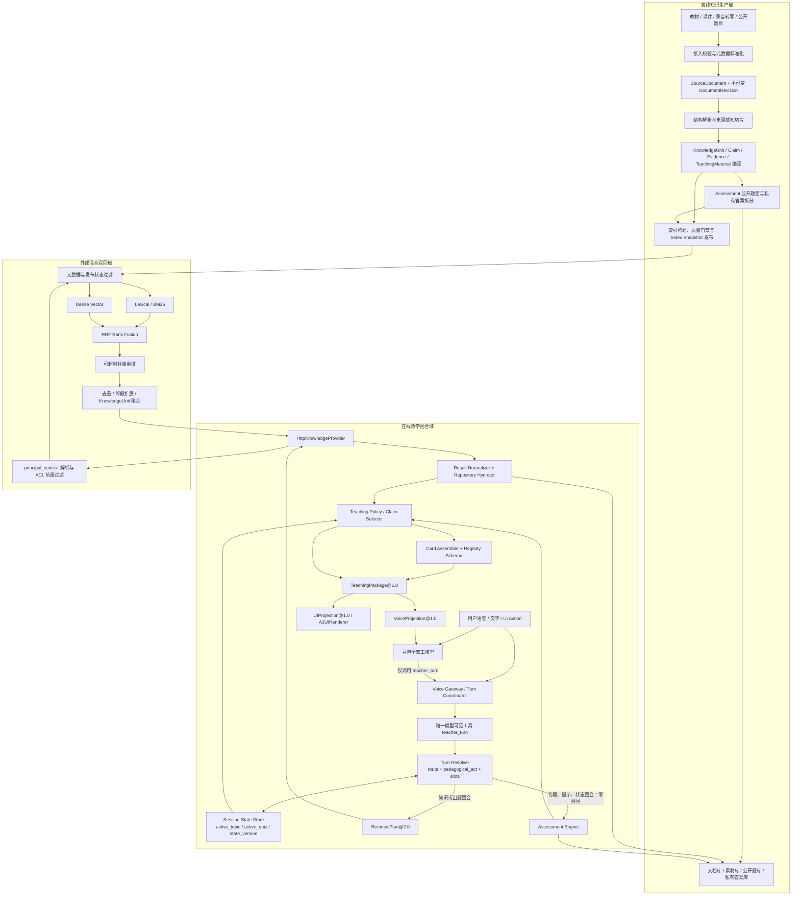
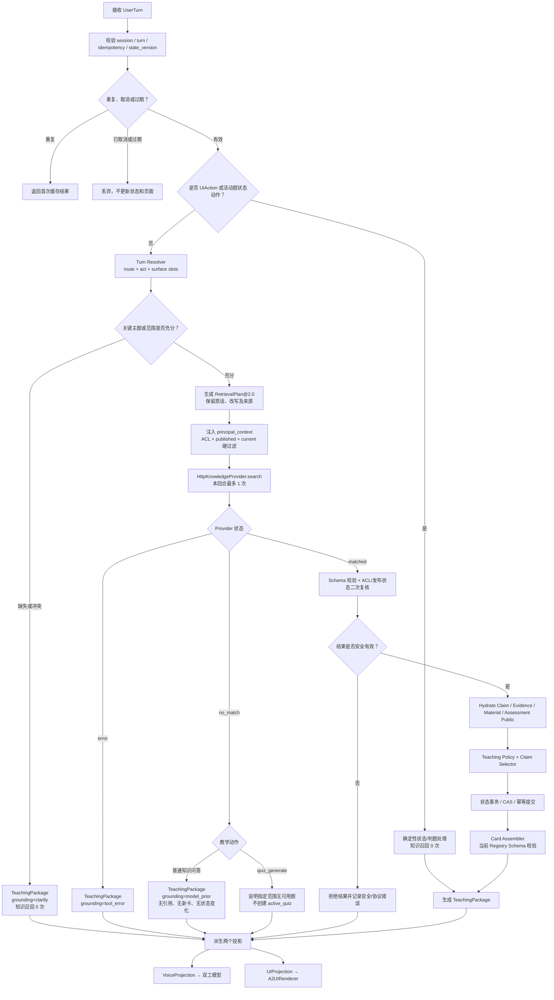
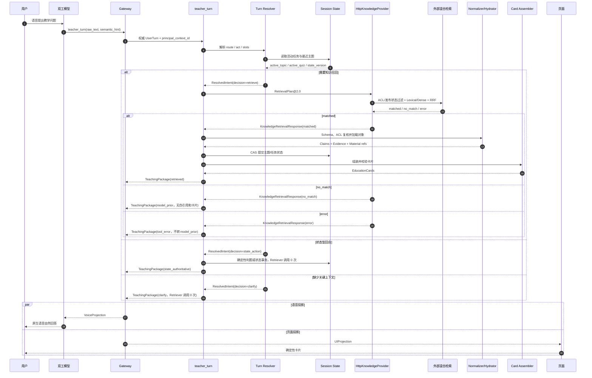
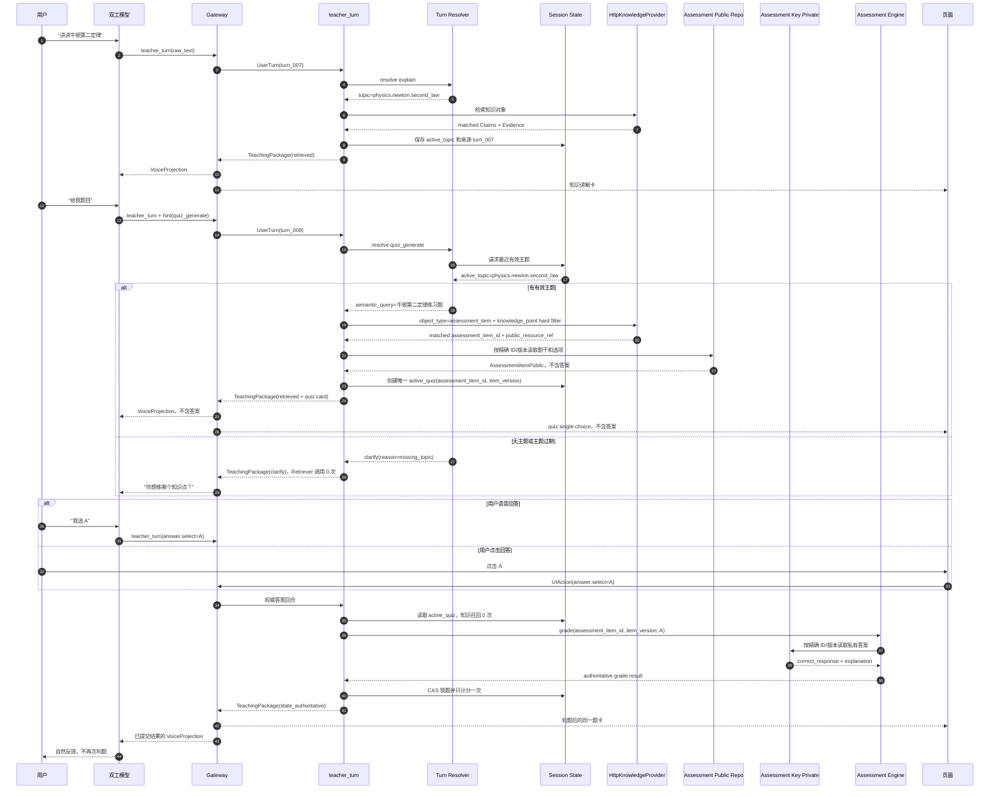
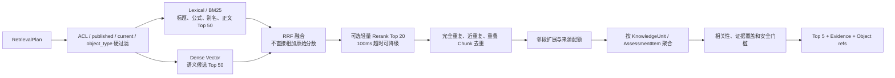
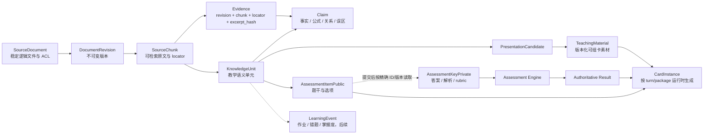
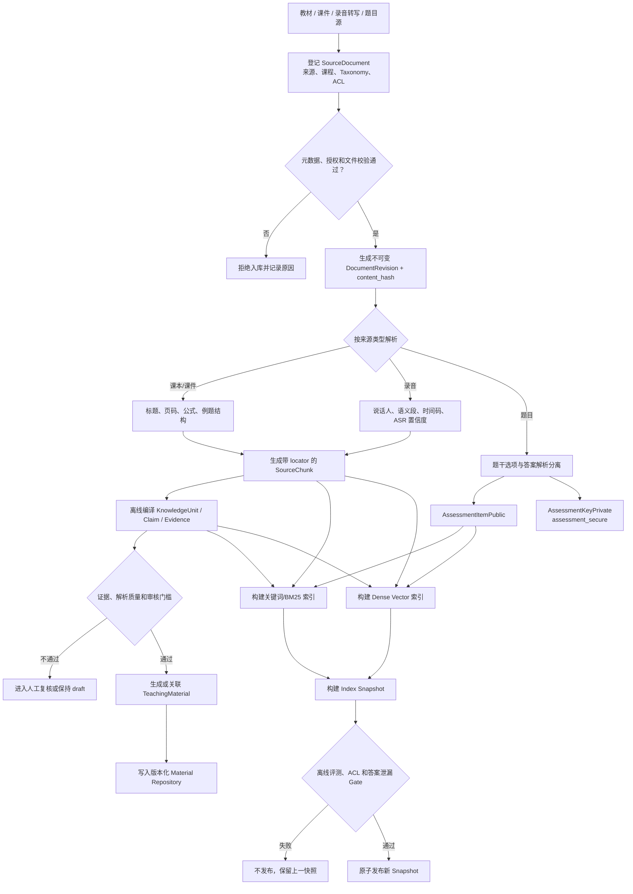
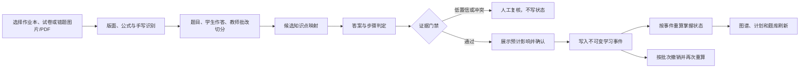
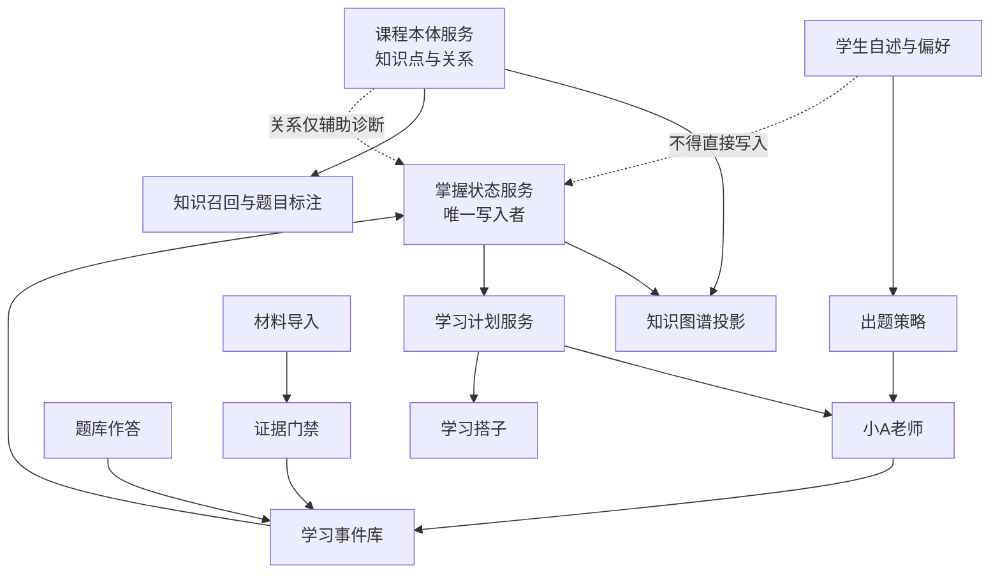

# AI 教师 MVP 2.0 产品需求文档

> 文档状态：方案基线，外部接口 Spike 后冻结性能参数  
> 版本：MVP 2.0  
> 日期：2026-08-06  
> 适用项目：豆包全双工语音 + 单一 `teacher_turn` + 真实知识召回 + A2UI 教育卡片  
> 继承基线：`AI-Teacher-MVP-1.0-PRD.md`  
> 配套词汇表：[MVP 2.0 字段与英文术语表](./AI-Teacher-MVP-2.0-字段与英文术语表.md)  
> 本文优先级：高于项目中仍描述“双工模型直连多个教育工具”或“Mock 规则即正式检索”的旧文档

## 0. 决策摘要

MVP 2.0 冻结以下方案：

1. 延续 MVP 1.0 的核心架构：一个豆包全双工模型、一个模型可见工具 `teacher_turn`、一个 `TeachingPackage`、语音和 UI 两个投影。
2. `HttpKnowledgeProvider` 替换 `MockKnowledgeProvider`，但不得改变双工模型和页面消费的上层合同。
3. 真实知识召回采用“候选生成前的元数据硬过滤 + 关键词/BM25 与 Dense Vector 并行召回 + Rank Fusion + 可降级轻量重排”。
4. 语义检索只负责“找到什么”；`Turn Resolver` 负责判断“用户要做什么”以及“继承什么教学上下文”。
5. 用户说“给我题目”时，由意图解析得到 `quiz_generate`，由服务端会话状态继承最近有效知识点，再由真实召回接口检索具体题目。
6. 双工模型在同一次 `teacher_turn` 调用中可提供非权威 `SemanticHint@2.0`；MVP 2.0 不在在线主链串行增加第二次大模型意图提槽。
7. 模型只允许输出用户原话中的 surface value，不允许生成或决定 `tenant_id / student_id / document_id / chapter_id / knowledge_point_id` 等权威内部标识。
8. ACL、租户、学校、课程、班级、学生范围、发布状态和答案可见性均由服务端形成硬过滤，并在候选生成前执行。
9. 知识对象至少分为 `SourceDocument / DocumentRevision / SourceChunk / KnowledgeUnit & Claim / TeachingMaterial / AssessmentItem`；后续个体化预留 `LearningEvent`。
10. 题目公开内容、答案解析、学生作答必须分域；未作答前，答案和评分规则不得进入通用索引、Retriever 响应、模型上下文、卡片或日志。
11. 检索元数据可保存 `recommended_card_type / material_id / supports_claim_ids`，不得保存运行时 `card_id` 或完整 `EducationCard` JSON。
12. Provider 的 `matched / no_match / error` 三态继续严格区分：`error` 不得伪装成 `no_match`，`no_match` 不得伪造知识卡、引用或可计分题目。
13. 每个知识型用户回合最多调用一次真实 Retriever；判题、活动题提示、考试进度和页面点击等状态型回合调用零次。
14. 任何被取消或已过期回合的晚到检索、卡片和状态结果均不得覆盖当前回合。
15. 新增“知识图谱、学习记录、题库、学习计划、学习搭子、语音配置”六个工作区；原“小A老师”改为左语音、右文字的同会话双入口。
16. 课程知识本体与学生掌握状态分开存储，以稳定 `knowledge_point_id` 关联；本体描述“知识是什么、如何关联”，学生状态描述“这个学生目前掌握得怎样”。
17. 初中数学首版知识本体固化为 4 个领域、19 个主题、140 个可测知识点和 519 条关系，可直接支持分组图谱、局部关系展开和来源追溯。
18. 学生说“某知识点很简单，不要再考”只形成有期限的直接考查偏好；不得直接修改该知识点或任何前置知识点的掌握度。
19. 作业本、试卷和错题导入采用“识别—切题—判卷—知识点映射—证据门禁—人工确认—写入—可撤销重算”流程，不把 OCR 结果直接当作掌握事实。
20. “学习搭子”承担陪伴、节奏和习惯，不承担讲课、判题和掌握状态写入；教学权威继续归“小A老师”和服务端学习状态引擎。

术语说明：

- 本文使用“语义检索”表示基于文本语义向量的检索。
- 即使外部供应商支持直接输入音频，MVP 2.0 仍以全双工会话产生的最终文本进入 `teacher_turn`；外部知识 Provider 不接管 ASR、判题或语音输出。

## 1. 产品背景与 MVP 1.0 问题

MVP 1.0 已经验证：

- 双工模型能够通过唯一 `teacher_turn` 驱动自然语音和确定性卡片。
- `TeachingPackage` 能同时派生 `VoiceProjection` 与 `UIProjection`。
- 语音答案与卡片点击可以进入同一 Assessment Engine。
- `retrieved / state_authoritative / model_prior / clarify / tool_error` 五种语义可以保持一致。

但 MVP 1.0 的知识 Provider 仍是确定性 Mock，意图、上下文继承和知识命中依赖窄规则。典型问题是：

> 在刚讲完牛顿第二定律后，用户说“给我题目”，系统返回 `no_match → model_prior`，页面没有题卡；而用户说“给我出一道牛顿第二定律选择题”时可以正常出题。

该问题不是单一的“题库为空”，而是四层问题叠加：

| 层级 | MVP 1.0 问题 | MVP 2.0 解决方式 |
|---|---|---|
| 教学动作 | “给我题目”未稳定识别为 `quiz_generate` | 双工 hint + 服务端 Turn Resolver |
| 上下文 | 只有少量固定追问可以继承最近主题 | 显式 `active_topic` 与上下文生命周期 |
| 召回 | Mock 依赖主题词和正则，没有真实语义召回 | 元数据过滤 + Lexical/Dense 混合检索 |
| 题卡素材 | 只有命中预置 Fixture 才能取得题目 | 独立 `assessment_item` 对象与公开/私有 Repository |

因此 MVP 2.0 的设计结论是：

> 外部召回接口可以消除脆弱的关键词命中，但不能独立猜测教学动作、历史主题和卡片类型；必须与 Turn Resolver、会话状态和题目安全域共同工作。

## 2. 产品目标与成功标准

### 2.1 产品目标

- 接入真实、可替换、可观测的外部知识召回接口。
- 支持教材、课件、课堂录音转写和独立题目对象的真实检索。
- 支持学科、年级、教材版本、课程、章节、知识点、来源类型和时间范围等元数据约束。
- 支持显式主题问题和上下文省略式问题。
- 让“给我题目、来一道题、练一题、考考我”等表达稳定进入同一出题闭环。
- 建立可回放的 Document、Revision、Chunk、Claim、Evidence、Material、Assessment 数据关系。
- 在不牺牲首音频、打断、幂等、状态一致性和答案保密的前提下完成真实召回。
- 建立离线评测集、真实延迟基线、灰度开关和故障回退能力。
- 为学生提供可浏览、可搜索、可筛选的课程知识图谱，并以文字颜色呈现全局掌握面积。
- 把课堂、题库、材料导入和学习计划产生的有效事件统一沉淀为可审计的学习记录。
- 让历史题目、知识状态、周计划和学习陪伴形成同一套可追溯学习闭环。

### 2.2 MVP 成功标准

以下条件必须全部满足：

- 讲解牛顿第二定律后说“给我题目”，任务成功率不低于 95%。
- `route` Macro-F1 不低于 0.95，`quiz_generate` Recall 不低于 0.98。
- 有相关对象的标注集上 `Recall@5 ≥ 0.90`、`nDCG@10 ≥ 0.80`；题目检索 `MRR@5 ≥ 0.85`。
- 上下文省略查询相对对应完整查询的 `Recall@5` 下降不超过 5 个百分点。
- ACL、发布状态、章节/来源/时间等硬过滤符合率为 100%。
- 未作答答案、解析和评分规则的外发次数为 0。
- 每个用于 `answer_brief` 的 Claim 至少绑定一个可解析 Evidence。
- Citation 可解析率为 100%，人工抽检 Claim-Evidence 支持准确率不低于 0.95。
- 外部召回 P95 不超过 350ms，硬超时不超过 500ms。
- `teacher_turn` 服务端 P95 目标不超过 600ms；端到端首音频继续以 1.5 秒为目标。
- Provider `no_match` 与 `error` 分类正确率为 100%。
- MVP 1.0 全量验收用例继续通过。

## 3. MVP 范围

### 3.1 本期范围

- 真实 `RetrieverPort` 和 `HttpKnowledgeProvider`。
- 外部接口鉴权、超时、重试边界、错误映射和响应 Schema 校验。
- `SemanticHint@2.0`、`ResolvedIntent@2.0` 和 `RetrievalPlan@2.0`。
- 基于服务端状态的主题继承、显式主题覆盖、上下文过期和最小澄清。
- 元数据候选前过滤。
- BM25/关键词召回与 Dense Vector 召回。
- RRF 融合、可选轻量重排、去重、邻段扩展和 KnowledgeUnit 聚合。
- `SourceDocument / DocumentRevision / SourceChunk / KnowledgeUnit / Claim / Evidence / TeachingMaterial / AssessmentItem` Schema。
- 教材、课件、课堂录音转写、公开题目四类数据。
- `shared_curriculum / organization_or_course / assessment_secure` 安全域。
- 初中数学课程本体、知识图谱浏览和学生掌握状态投影。
- 学习记录中的画像记忆、事件记忆及学习材料导入确认流程。
- 历史题库的知识点、作答结果和来源筛选。
- 状态驱动的周学习计划与非权威学习搭子。
- 题目公开内容与私有答案拆分。
- 精确到页码、课件页、录音时间码或题号的引用。
- Index Snapshot、策略版本和可回放日志。
- 离线评测集、Shadow 对比、灰度发布和 Session 级回退。

### 3.2 本期非目标

- 学生作业全文和错题进入通用知识检索索引；本期只进入学生私有学习事件与题库，不参与课程事实召回。
- `student_private` 长期学习档案的跨设备同步与多端冲突合并。
- 正式考试评分、证书或高风险教育决策。
- 在在线主链增加第二个大模型专门做意图提槽。
- 自研 OCR、PPT 解析或录音 ASR；本期接收上游解析结果。
- 用户侧完整知识上传、审核和运营后台。
- 无证据的大模型临时出题并进入正式计分。
- 自动修复或自动发布低质量 OCR/ASR 内容。
- 用完整卡片 JSON 作为知识索引内容。

### 3.3 Schema 预留但不在线启用

- 作业：`assignment / submission / teacher_feedback`。
- 错题：`LearningEvent / Attempt / Misconception / Mastery`。
- 学生私有内容：`student_private` 命名空间。

## 4. 目标用户与核心用户故事

1. 作为学生，我说“讲讲牛顿第二定律”，系统从授权资料中召回证据并自然讲解。
2. 作为学生，我在讲解后说“给我题目”，系统继承当前知识点并展示一道相关题。
3. 作为学生，我说“来一道题、练一题、考考我”，系统得到与“给我题目”等价的教学动作。
4. 作为学生，我在新会话直接说“给我题目”，系统询问要练哪个知识点，而不是随机出题。
5. 作为学生，我在牛顿第二定律上下文中说“给我一道欧姆定律题”，系统使用显式新主题覆盖旧主题。
6. 作为学生，我说“把上周课堂讲过的牛顿第二定律用思维导图复习一下”，系统联合使用来源、时间、主题和展示目标。
7. 作为学生，我说“我选 A”或点击 A，系统使用当前活动题确定性判题，且不再次召回知识。
8. 作为学生，我说“给我提示”，系统基于活动题私有数据给提示，不泄露答案，也不重新检索全库。
9. 作为教师或内容管理员，我更新一份资料后，新回合引用最新 Revision，历史回合仍能回放旧引用。
10. 作为系统管理员，我可以确认每条召回结果的授权范围、索引快照、策略版本和来源定位。

## 5. 延续自 MVP 1.0 的架构原则

### 5.1 一个实时模型、一个模型可见工具

教育 Session 继续只注册：

```text
teacher_turn
```

以下能力只能作为内部 Port、Service 或 Repository 存在：

- `resolve_turn`
- `search_knowledge`
- `hydrate_knowledge_objects`
- `grade_answer`
- `get_or_update_learning_state`
- `assemble_cards`
- `load_assessment_key`

### 5.2 内容受控、表达自由

`teacher_turn` 决定：

- 是否需要召回以及召回一次还是零次。
- 本轮教学动作和展示目标。
- 哪些过滤条件是硬约束，哪些只是排序偏好。
- 哪些 Claims、公式、数字和答案必须精确。
- 哪些卡片可以展示以及状态如何更新。

双工模型决定：

- 自然语气、节奏、停顿和强调。
- 解释顺序、类比和追问方式。
- 在不改变关键事实的前提下如何口语化表达。

### 5.3 一个教学结果、两个投影

- 双工模型只消费 `VoiceProjection`。
- 页面只消费 `UIProjection`。
- 两个投影必须由同一个 `TeachingPackage` 派生。
- 页面不得解析模型最终文本来二次生成卡片。

### 5.4 权限和状态不由模型决定

- 模型和客户端不能提供或扩大 ACL。
- 模型不能决定正确答案、得分或题目是否已作答。
- 外部知识服务不能覆盖服务端 `state_version`。
- 所有模型输出的语义字段都必须保留来源并由服务端校验。

## 6. 总体架构图



### 6.1 信任边界

| 边界 | 可以信任 | 不可直接信任 |
|---|---|---|
| 双工模型 | 原始转写、自然语言理解提示 | 内部 ID、ACL、答案、得分、状态 |
| 客户端 | 已签名 UI Action 中的表面事件 | 本地题目答案、状态版本覆盖 |
| 外部 Retriever | 通过 Schema 的候选 ID、得分、证据定位 | 权限最终裁决、卡片 JSON、状态更新 |
| Repository | 当前版本对象、私有答案、素材 | 未经授权的调用方请求 |
| `teacher_turn` | Gateway 权威标识和服务端状态 | 未校验的模型 hint 与知识正文指令 |

## 7. 组件职责

| 组件 | MVP 2.0 职责 | 禁止事项 |
|---|---|---|
| 豆包全双工模型 | ASR、自然理解提示、工具调用、自然原生语音 | 直接调用 Retriever、生成 ACL、判题或卡片 JSON |
| Gateway | 权威回合标识、排队、取消、投影分发、回注 | 让模型或页面覆盖状态 |
| `teacher_turn` | 统一编排解析、召回、判题、状态和卡片 | 每回合多次知识召回 |
| Turn Resolver | 解析 route、教学动作、surface slots 和上下文 | 根据模型 hint 伪造内部 ID |
| Session State Store | 活动主题、活动题、幂等、状态版本 | 旧回合覆盖新状态 |
| Retrieval Planner | 原话、语义改写、硬/软过滤与来源追踪 | 无审计改写查询或扩大权限 |
| HttpKnowledgeProvider | 调用外部混合检索并映射三态 | 把技术错误映射成空结果 |
| External Retriever | 元数据前置过滤、混合召回、融合与排序 | 返回完整卡片或私有答案 |
| Result Normalizer | Schema 校验、ACL 复核、对象 Hydrate | 直接透传任意 Chunk 给双工模型 |
| Knowledge Repositories | 提供当前版本 Claim、Material、Evidence | 用索引作为唯一事实源 |
| Assessment Engine | 精确题目 ID 判题、幂等和答案保密 | 用语义召回猜答案 |
| Card Assembler | 从 Material/Assessment Public 生成卡片 | 保存或执行模型 HTML/CSS/JS |

## 8. 回合解析：意图、槽位和查询计划

### 8.1 因子化语义

避免维护无限扩张的单一 Intent 枚举。MVP 2.0 将语义拆成三个正交维度：

| 维度 | 合法值 |
|---|---|
| `route` | `conversation / knowledge / state_action / clarify` |
| `pedagogical_act` | `explain / define / compare / solve / summarize / review / quiz_generate / quiz_answer / hint / resource_find / task_control` |
| `presentation_goal` | `voice_only / explanation / mindmap / image / video / quiz / oral_practice` |

示例：

```text
“把上周课堂讲过的牛顿第二定律用思维导图复习一下”

route = knowledge
pedagogical_act = review
presentation_goal = mindmap
topic_surface = 牛顿第二定律
source_surface = 课堂讲过的
time_surface = 上周
```

### 8.2 模型可见 `SemanticHint@2.0`

```json
{
  "schema_version": "2.0",
  "route_hint": "knowledge",
  "pedagogical_act": "quiz_generate",
  "query_text": "题目",
  "context_dependency": "required",
  "presentation_goal": {
    "card_type": "quiz.single-choice"
  },
  "surface_slots": [],
  "action": null,
  "confidence": 0.93
}
```

约束：

- `surface_slots` 只能包含用户原话中出现的表面文本。
- 模型不得生成 `knowledge_point_id / document_id / chapter_id / student_id`。
- `SemanticHint` 缺失、非法或超时不得阻断知识回合。
- 对不可逆状态动作，hint 不能替代原话、UI Action 或服务端状态。

### 8.3 内部权威 `ResolvedIntent@2.0`

```json
{
  "schema_version": "2.0",
  "turn_id": "turn_008",
  "decision": "retrieve",
  "route": "knowledge",
  "pedagogical_act": "quiz_generate",
  "query": {
    "raw_text": "给我题目",
    "normalized_text": "给我题目",
    "semantic_query": "牛顿第二定律练习题"
  },
  "topic": {
    "status": "resolved",
    "knowledge_point_ids": [
      "physics.newton.second_law"
    ],
    "source": "recent_context",
    "source_turn_id": "turn_007"
  },
  "slots": [
    {
      "name": "object_type",
      "value": "assessment_item",
      "source": "resolver_policy",
      "enforcement": "must"
    },
    {
      "name": "knowledge_point_id",
      "value": "physics.newton.second_law",
      "source": "server_state",
      "enforcement": "must"
    },
    {
      "name": "question_type",
      "value": "single_choice",
      "source": "semantic_hint",
      "enforcement": "prefer"
    }
  ],
  "presentation_goal": {
    "card_type": "quiz.single-choice"
  },
  "confidence": 0.97,
  "clarification": null
}
```

`decision` 只允许：

```text
retrieve | state_action | conversation | clarify
```

### 8.4 槽位来源与硬软约束

| 来源 | 可成为 `must` | 可成为 `prefer` |
|---|---:|---:|
| `server_auth` | 是 | 是 |
| `ui_action` | 是 | 是 |
| `explicit_user` 经确定性解析 | 是 | 是 |
| `server_state` | 是 | 是 |
| `resolved_context` | 是 | 是 |
| `semantic_hint` | 否，除非与原话和状态再次验证 | 是 |
| `retrieval_inference` | 否 | 是 |
| `resolver_policy` | 是，仅用于由已确认教学动作推导的对象类型等条件 | 是 |
| `system_policy` | 是，仅用于发布状态、安全域等系统策略 | 是 |

### 8.5 权威解析优先级

```text
结构化 UIAction
> 活动题、考试和服务端身份
> raw_text 确定性归一化
> 与原话一致的 SemanticHint
> 最近有效主题上下文
> 宽召回
> 最小澄清
```

## 9. 上下文继承与服务端状态

### 9.1 状态扩展

```json
{
  "last_turn_sequence": 7,
  "state_version": 4,
  "active_topic": {
    "knowledge_point_ids": [
      "physics.newton.second_law"
    ],
    "chapter_id": "chapter_newton_laws",
    "source": "retrieved",
    "confidence": 0.98,
    "established_turn_sequence": 7,
    "expires_at": "2026-07-25T08:10:00Z"
  },
  "last_retrieval_scope": {
    "source_types": [
      "textbook",
      "courseware"
    ],
    "course_id": "course_physics_101",
    "lesson_id": null,
    "event_time_range": null
  },
  "active_quiz": null,
  "exam": null,
  "oral_practice": null,
  "last_package_id": "pkg_turn_007",
  "context_policy_id": "recent_topic_3turn_10min_v1"
}
```

### 9.2 继承规则

- 明确新主题覆盖旧主题。
- “给我题目、再来一道、考考我”等省略式教学动作可以继承未过期主题。
- 没有可继承主题时返回 `clarify(reason=missing_topic)`，不调用 Retriever。
- 用户显式切题、清空页面、结束学习或开始新 Session 后立即清除主题。
- 初始策略延续最近 3 个已接受用户回合或 10 分钟，以先到者为准。
- `source_type / difficulty / presentation_goal` 默认只作用于当前回合。
- 只有可信 Profile 或用户明确确认的 `grade / curriculum / edition` 可以跨回合。
- 已存在 `active_quiz` 时，“我选 A、给我提示、下一题”优先走状态路径。

## 10. 在线处理流程图



## 11. 关键时序图

### 11.1 通用知识召回时序



### 11.2 “讲解后说给我题目”与作答闭环



## 12. `RetrievalPlan@2.0`

```json
{
  "plan_version": "2.0",
  "request_id": "req_turn_008",
  "plan_id": "plan_turn_008",
  "turn_id": "turn_008",
  "principal_context_id": "authctx_7f91",
  "targets": {
    "object_types": [
      "assessment_item"
    ]
  },
  "query": {
    "raw_text": "给我题目",
    "semantic_text": "牛顿第二定律练习题",
    "lexical_terms": [
      "牛顿第二定律"
    ],
    "rewrite_provenance": [
      {
        "term": "牛顿第二定律",
        "source": "recent_context",
        "source_turn_id": "turn_007"
      }
    ]
  },
  "filters": {
    "must": [
      {
        "field": "tenant_id",
        "op": "eq",
        "value": "tenant_01",
        "source": "server_auth"
      },
      {
        "field": "knowledge_point_ids",
        "op": "contains",
        "value": "physics.newton.second_law",
        "source": "server_state"
      },
      {
        "field": "lifecycle",
        "op": "eq",
        "value": "published",
        "source": "system_policy"
      }
    ],
    "prefer": [
      {
        "field": "question_type",
        "op": "eq",
        "value": "single_choice",
        "weight": 1.2,
        "source": "semantic_hint"
      }
    ],
    "must_not": [
      {
        "field": "namespace",
        "op": "eq",
        "value": "assessment_secure",
        "source": "system_policy"
      }
    ]
  },
  "ranking": {
    "policy_id": "edu_hybrid_v1",
    "lexical_candidate_k": 50,
    "dense_candidate_k": 50,
    "fusion": {
      "type": "rrf",
      "rank_constant": 60
    },
    "rerank": {
      "enabled": true,
      "top_k": 20,
      "timeout_ms": 100
    },
    "result_limit": 5,
    "timeout_ms": 500
  },
  "result_policy": {
    "require_evidence": true,
    "answer_visibility": "question_only",
    "max_units": 5
  }
}
```

要求：

- `principal_context_id` 由服务端签发，模型和客户端不能指定或修改。
- 原始问题、改写后的查询和改写来源必须同时保留。
- Query Rewrite 不得引入与显式用户主题冲突的历史主题。
- 模型推断的来源、章节和难度默认只进入 `prefer`。
- 安全域、发布状态、当前 Revision 和授权范围必须进入 `must`。
- Filter 字段与操作符使用服务端白名单，拒绝任意表达式。

## 13. 混合召回策略



### 13.1 查询规范化

- Unicode NFKC。
- 公式归一化，例如 `F = m a` 与 `F=ma` 进入同一检索词形。
- 中文分词与字符级召回同时保留。
- 教材术语、简称和别名词典。
- 保留原话中的公式、数字、专有名词和否定词。
- 可同时使用“原始问题”和“上下文补全问题”两路召回。

### 13.2 排序原则

- 初始融合使用 RRF，避免直接相加 BM25 与 Cosine 等不同尺度分数。
- Rerank 只作用于有限候选并设置独立超时。
- Rerank 超时可以降级为融合排序，但必须记录 `degraded_stage=rerank_timeout`。
- Lexical、Dense、ACL 或主索引失败不得伪装成 `no_match`。
- “最近、上周、最新版”等时间意图出现时才启用时间相关性；默认不能让新录音压过权威教材。
- 同一页或同一录音相邻片段不得占满 Top 结果。

## 14. 外部接口能力 Gate

真实外部接口只有满足以下条件，才能声称解决 MVP 1.0 的问题：

1. 支持在候选生成前执行元数据过滤。
2. 支持关键词与语义向量混合检索，或允许应用侧分别执行两路召回。
3. 返回稳定对象 ID、对象类型、对象版本和来源定位。
4. 能按 `knowledge_unit / source_chunk / assessment_item` 等对象类型检索，而不只是整份文件。
5. 支持租户、学校、课程、班级和学生范围。
6. 区分正常空结果、超时、鉴权失败、限流和协议错误。
7. 返回或允许记录 `index_snapshot / retrieval_policy_version`。
8. 支持取消、超时或至少允许调用方丢弃过期结果。
9. P95 满足在线语音回合预算。
10. 返回内容可通过 JSON Schema、长度和字段白名单校验。

若供应商只能返回文件 Chunk：

- 必须增加 `Result Normalizer + Repository Hydrator`。
- Provider 只使用返回的稳定 ID 和 locator 去加载本地权威 Claim、Material 或 Assessment。
- 原始 Chunk 不得直接整体进入 `VoiceProjection`。
- 缺少稳定对象 ID、Revision 或 locator 的接口不得进入生产灰度。

## 15. `KnowledgeRetrievalResponse@2.0`

### 15.1 命中

```json
{
  "response_version": "2.0",
  "retrieval_id": "ret_008",
  "request_id": "req_turn_008",
  "provider": "external_hybrid",
  "status": "matched",
  "index_snapshot": "kb_20260725_03",
  "retrieval_policy_version": "edu_hybrid_v1.1",
  "degraded": false,
  "executed_query": {
    "semantic_text": "牛顿第二定律练习题",
    "lexical_terms": [
      "牛顿第二定律"
    ]
  },
  "matches": [
    {
      "rank": 1,
      "result_kind": "assessment_item",
      "object_id": "quiz_newton_001",
      "object_version": "3",
      "score": 0.91,
      "match_reasons": [
        "dense",
        "lexical",
        "knowledge_point_filter"
      ],
      "knowledge_unit_id": "ku_newton2_force_ratio",
      "claim_refs": [
        "claim_newton2_force_ratio"
      ],
      "evidence_refs": [
        "ev_01"
      ],
      "public_resource_ref": "assessment-public://quiz_newton_001@3",
      "presentation_candidates": [
        {
          "recommended_card_type": "quiz.single-choice",
          "supports_claim_ids": [
            "claim_newton2_force_ratio"
          ]
        }
      ]
    }
  ],
  "evidence": [
    {
      "evidence_id": "ev_01",
      "document_id": "doc_physics_book_01",
      "revision_id": "rev_3",
      "chunk_id": "chunk_18",
      "title": "牛顿第二定律练习",
      "locator": {
        "type": "page",
        "page": 18
      },
      "excerpt": "质量不变时，合外力增大一倍……",
      "excerpt_hash": "sha256:..."
    }
  ]
}
```

### 15.2 正常未命中

```json
{
  "response_version": "2.0",
  "retrieval_id": "ret_009",
  "request_id": "req_turn_009",
  "provider": "external_hybrid",
  "status": "no_match",
  "index_snapshot": "kb_20260725_03",
  "retrieval_policy_version": "edu_hybrid_v1.1",
  "reason": "no_relevant_result",
  "matches": [],
  "evidence": []
}
```

`reason` 内部枚举：

```text
no_relevant_result | filtered_out | unsupported_target | empty_corpus
```

对客户端不得通过差异文案暴露“某私有资料存在但你无权限”。

### 15.3 技术错误

```json
{
  "response_version": "2.0",
  "retrieval_id": "ret_010",
  "request_id": "req_turn_010",
  "provider": "external_hybrid",
  "status": "error",
  "index_snapshot": null,
  "retrieval_policy_version": "edu_hybrid_v1.1",
  "matches": [],
  "evidence": [],
  "error": {
    "code": "PROVIDER_TIMEOUT",
    "retryable": true
  }
}
```

公开错误码只允许：

```text
PROVIDER_TIMEOUT
PROVIDER_UNAVAILABLE
INVALID_RESPONSE
AUTH_SCOPE_INVALID
```

### 15.4 与 MVP 1.0 的兼容映射

| Retriever 状态 | TeachingPackage | VoiceProjection 行为 |
|---|---|---|
| `matched` | `grounding.mode=retrieved` | `answer_from_brief` |
| `no_match` | `grounding.mode=model_prior` | 普通知识可自由回答，但无伪引用和卡片 |
| `error` | `grounding.mode=tool_error` | 说明暂时不可用，不用模型知识冒充 |
| 召回前缺少关键主题 | `grounding.mode=clarify` | 只问最小澄清问题 |

对于 `quiz_generate`：

- `matched` 才能创建正式 `active_quiz`。
- `no_match` 时不得让模型生成可计分题目。
- `error` 时不得偷偷切 Mock 题库或模型题目。

## 16. 知识对象关系图



### 16.1 对象职责

| 对象 | 用途 | 是否直接进入检索 |
|---|---|---:|
| `SourceDocument` | 稳定文件身份、来源、课程和 ACL | 作为文件发现与过滤对象 |
| `DocumentRevision` | 不可变内容版本、校验和和解析版本 | 作为版本过滤与引用 |
| `SourceChunk` | 原文证据、页码/时间码/题号 | 是 |
| `KnowledgeUnit` | 经过编译的概念、关系、例题、误区 | 优先检索 |
| `Claim` | 可约束 `answer_brief` 的教学事实 | 通过 KnowledgeUnit 返回 |
| `TeachingMaterial` | 结构化可组卡内容 | 命中后按 ID 加载 |
| `AssessmentItemPublic` | 可展示题干和选项 | 独立题目索引 |
| `AssessmentKeyPrivate` | 答案、解析、评分规则 | 否，只按精确 ID 读取 |
| `CardInstance` | 当前回合 EducationCard | 否 |
| `LearningEvent` | 学生作答、错题、掌握度 | MVP 2.0 不在线启用 |

## 17. 元数据 Schema

### 17.1 Document / Revision 强制字段

| 分类 | 字段 |
|---|---|
| 身份 | `tenant_id / namespace / document_id / revision_id / revision_no` |
| 来源 | `source_type / subtype / title / source_system / author / publisher / language / mime_type` |
| 版本 | `content_hash / is_current / supersedes_revision_id` |
| 教学分类 | `subject_id / grade_id / curriculum_id / textbook_edition_id` |
| 课程范围 | `school_id / course_ids / class_ids / lesson_id / teacher_ids` |
| 章节知识 | `chapter_path / chapter_ancestor_ids / knowledge_point_ids` |
| 权限 | `visibility / access_scope_ids / owner_student_id / sensitivity / release_policy` |
| 生命周期 | `draft / reviewed / published / deprecated / deleted` |
| 质量 | `trust_tier / parse_status / ocr_confidence / asr_confidence / verification_status` |
| 编译 | `parser_version / chunker_version / embedding_version / index_build_id / indexed_at` |

### 17.2 Chunk 强制字段

```json
{
  "chunk_schema_version": "2.0",
  "chunk_id": "chunk_docrev_v3_p42_03",
  "document_id": "doc_physics_book_01",
  "revision_id": "docrev_physics_book_01_v3",
  "sequence": 27,
  "parent_chunk_id": null,
  "previous_chunk_id": "chunk_docrev_v3_p42_02",
  "next_chunk_id": "chunk_docrev_v3_p43_01",
  "locator": {
    "type": "page_span",
    "page_start": 42,
    "page_end": 43,
    "slide_no": null,
    "time_start_ms": null,
    "time_end_ms": null,
    "question_no": null,
    "char_start": 120,
    "char_end": 376
  },
  "content": {
    "display_text": "质量不变时，加速度与合外力成正比……",
    "search_text": "牛顿第二定律 合外力 质量 加速度 F=ma",
    "content_hash": "sha256:...",
    "token_count": 132
  },
  "semantics": {
    "content_role": "explanation",
    "heading_path": [
      "运动和力",
      "牛顿第二定律"
    ],
    "knowledge_point_ids": [
      "physics.newton.second_law"
    ],
    "entity_ids": [
      "entity_force",
      "entity_mass",
      "entity_acceleration"
    ],
    "formula_terms": [
      "F=ma"
    ]
  },
  "quality": {
    "authority_score": 0.95,
    "parse_confidence": 0.99,
    "asr_confidence": null
  }
}
```

权限、来源类型、章节祖先、发布状态等高频过滤字段必须反规范化到索引记录，但权威值仍以 Document/Revision Repository 为准。

### 17.3 时间字段

一个通用 `created_at` 不足以表达知识语义：

| 字段 | 含义 | 典型问题 |
|---|---|---|
| `record_created_at` | 数据库记录创建时间 | 运维审计 |
| `record_updated_at` | 元数据更新时间 | 增量同步 |
| `ingested_at` | 进入知识系统的时间 | 索引排查 |
| `source_authored_at` | 内容创作时间 | “今年的新教材” |
| `published_at` | 内容发布时间 | “最新发布的课件” |
| `event_start_at / event_end_at` | 课堂、考试、录音、提交发生时间 | “上周课堂讲过什么” |
| `valid_from / valid_to` | 内容、规则或教材版本有效期 | “当时使用的版本” |

“事实发生时间”统一建模为 `event_time` 并带 `event_type`。对公式、定理等静态知识，`event_time` 可以为空。

### 17.4 来源类型专属字段

| 来源类型 | 专属字段 | 推荐切片 |
|---|---|---|
| 课件 `courseware` | `deck_version / slide_no / lesson_id / teacher_id / teaching_date` | 标题层级与单页优先 |
| 录音 `recording` | `recording_id / class_session_id / recorded_at / speaker_role / timecode / asr_confidence / consent_status` | 语义段、说话轮次和时间码 |
| 课本 `textbook` | `isbn / publisher / edition / volume / chapter / section / page / curriculum_version` | 章节、定义、公式和例题边界 |
| 试卷/题目 `assessment` | `exam_id / region / year / question_no / question_type / difficulty / release_policy` | 一题或一个小问一单元 |
| 作业 `assignment` | `assigned_at / due_at / submitted_at / attempt_id` | Assignment、Submission、Feedback 分离 |
| 错题 `learning_event` | `student_id / attempt_id / wrong_answer / misconception_ids / occurred_at / mastery_status` | 一次作答与诊断一单元 |

MVP 2.0 在线只启用前四类；作业和错题字段用于后续兼容。

## 18. 知识入库与发布流程图



### 18.1 发布与删除规则

- `document_id` 稳定，内容变更生成新 `revision_id`。
- Revision 不可原地覆盖。
- 默认只检索 `is_current=true + lifecycle=published`。
- 历史时间问题可根据 `event_time / valid_time` 选择旧 Revision。
- 发布新 Index Snapshot 必须原子切换。
- 删除先写 Tombstone 并立即阻断访问，再异步清理索引和对象。
- 历史 TeachingPackage 记录原 `index_snapshot / revision_id / retrieval_policy_version`，支持回放。

## 19. Claim、Material、Card 和 Assessment 安全

### 19.1 允许进入检索 Payload

- `material_id`
- `material_version`
- `recommended_card_type`
- `supported_card_types`
- `supports_claim_ids`
- `evidence_refs`
- `assessment_item_id` 或公开资源引用

### 19.2 禁止进入检索 Payload

- 运行时 `card_id`
- 完整 `EducationCard` JSON
- 当前学生选择和判题状态
- `correct_response`
- 未公开解析和评分规则
- 私有学生作答全文

### 19.3 卡片生成规则

```text
KnowledgeUnit / AssessmentItemPublic
→ PresentationCandidate / material_id
→ Repository 按精确 ID 和版本加载
→ Card Assembler
→ 当前 EducationCard Registry Schema 校验
→ 按 turn_id/package_id 生成 CardInstance
```

- 卡片协议升级不得要求重建全部向量索引。
- 卡片 Schema 失败不能回退为手写 HTML 或模型 JSON。
- Material 缺失时允许语音继续，UI 安全降级并记录错误。
- 题卡在未作答前只包含题干、选项和公开提示。

### 19.4 Assessment 分域

```text
AssessmentItemPublic:
  题干 / 选项 / response_type / question_type /
  difficulty / knowledge_point_ids / evidence_refs

AssessmentKeyPrivate:
  correct_response / explanation / rubric / misconception_mapping

LearningEvent（后续）:
  student_response / mistake / mastery / occurred_at
```

- 私有答案不进入通用向量文本。
- 判题只按 `assessment_item_id + item_version` 精确读取私有 Key。
- 不允许通过语义检索寻找正确答案。
- 未作答前对 Retriever、缓存、日志、投影和卡片做自动答案泄漏扫描。

## 20. 失败、未命中与降级

| 场景 | TeachingPackage/系统行为 | UI 行为 |
|---|---|---|
| 一般知识问题正常未命中 | `model_prior`，可自由回答但不声称检索命中 | 不新增知识卡和引用 |
| 指定来源/时间范围未命中 | 说明“在指定资料中未找到”，不伪造来源 | 保留 Surface |
| `quiz_generate` 未找到题 | 不创建 active_quiz，不生成正式计分模型题 | 不展示伪题卡 |
| Provider 超时/5xx | `tool_error`，本轮不自行重试 | 保留 Surface，可显示重试动作 |
| Provider 鉴权范围无效 | Fail closed，公开 `AUTH_SCOPE_INVALID` | 不显示任何候选 |
| Dense 失败但 Lexical 仍可靠 | 可 `matched + degraded=true` | 正常展示并记录降级 |
| Lexical、Dense 主链或 ACL 失败 | `tool_error`，不能当作 no_match | 保留 Surface |
| Rerank 超时 | 使用融合结果并记录 `rerank_timeout` | 正常展示 |
| 返回对象越权 | 丢弃、告警并作为安全错误 | 不显示 |
| Provider 响应非法 | `INVALID_RESPONSE → tool_error` | 不显示非法内容 |
| Material 缺失或 Schema 失败 | 语音可继续，卡片安全降级 | 跳过或显示安全状态 |
| Assessment 私有数据不可用 | 不出题或不判题 | 题卡保持未判定 |
| 模型 hint 与原话冲突 | 原话/状态优先，必要时 `clarify` | 保留当前内容 |
| 被取消回合结果晚到 | 丢弃，不提交状态 | 不覆盖新回合 |

## 21. 状态、一致性与取消

- 相同 `session_id + idempotency_key` 返回首次结果。
- 每个 Session 的状态提交串行或使用 CAS。
- 知识召回可以并发执行，但提交必须检查当前 `turn_sequence` 和取消标记。
- 已取消且尚未提交的旧结果不得更新状态或页面。
- 已提交的确定性判题不因语音播报被打断而回滚。
- UI 只应用不旧于当前 `turn_sequence / state_version` 的投影。
- 相同题目不同幂等键并发作答时，只允许第一个提交成功。
- 题目版本必须固定在 `active_quiz` 中；判题时不得自动升级到新版本。
- Provider 调用取消失败时，允许其后台完成，但结果必须被 Gateway 丢弃。
- Session 级 Feature Flag 决定使用 Mock 还是真实 Provider；单回合真实检索失败后不得偷偷切 Mock。

## 22. 非功能需求

### 22.1 性能

以下为 MVP 2.0 目标，真实接口 Spike 后冻结：

| 阶段 | P95 目标 |
|---|---:|
| Turn Resolver | ≤50ms |
| 外部元数据过滤 + 混合召回 | ≤350ms |
| 外部 Provider 硬超时 | ≤500ms |
| ACL 二次复核 + Hydrate + Card Assembly | ≤100ms |
| `teacher_turn` 服务端总耗时 | ≤600ms |
| TeachingPackage 到 UIProjection 分发 | ≤100ms |
| 工具结果回注到首音频 | ≤700ms |
| EOU 到首音频 | ≤1.5s |
| 用户打断到本地停止旧音频 | ≤300ms |
| 内容发布到可检索 | ≤15 分钟 |

压测基线至少包括：

- 20 个并发教学 Session。
- 10 Retrieval QPS。
- 热索引与明确记录的语料规模。
- 显式知识、上下文省略式出题、复杂元数据过滤三类查询。

### 22.2 可靠性

- `matched / no_match / error` 必须使用可校验的判别联合 Schema。
- 真实 Provider 调用必须有请求 ID、超时和取消关联。
- Index Snapshot 原子发布，失败保留上一快照。
- Provider 响应、Repository 对象和卡片均做版本校验。
- 任何越权、答案泄漏、旧回合覆盖或 `error → no_match` 均为上线阻断项。
- 外部接口不可用时不影响已提交状态的恢复。

### 22.3 安全与隐私

- 所有外部请求使用 TLS、短期凭证和最小权限。
- `principal_context_id` 缺失、过期或不可验证时 Fail Closed。
- ACL 在候选生成前和返回后各校验一次。
- 外部 Provider 只接收必要检索文本和不透明授权上下文。
- 不发送学生姓名、原始音频、完整附件或无关作答历史。
- 知识正文一律视为不可信数据，不能改变系统指令、ACL、工具策略或答案可见性。
- 日志不记录密钥、答案正文、私有学生全文或内部堆栈。
- `draft / deprecated / deleted` 与非 current Revision 默认不可检索。

## 23. 可观测性与回放

每个回合新增记录：

- `resolved_route`
- `pedagogical_act`
- `presentation_goal`
- 槽位值、来源、置信度和 enforcement
- `topic_source / source_turn_id`
- `retrieval_plan_id`
- 查询原文、规范化摘要和改写来源
- Filter 字段、操作符和来源摘要
- `principal_context` 校验结果摘要
- `retrieval_id`
- `index_snapshot`
- `retrieval_policy_version`
- `strategy_used / degraded_stage`
- Lexical/Dense 候选数、Fusion/Rerank 耗时
- 返回 Object ID、KnowledgeUnit ID、Claim ID、Evidence ID、Material ID
- `no_match_reason / provider_error_code`
- `state_version_before / after`
- `turn_sequence / package_id / duplex_response_id`
- `canceled / stale / duplicate`

不得记录：

- API Key 或原始授权 Token。
- 未作答答案、解析和 Rubric。
- 不必要的完整知识正文。
- 学生私有内容全文。
- 未脱敏外部服务内部错误。

## 24. 离线评测与上线 Gate

### 24.1 数据集

建立不少于 400 条人工标注样本并固定版本：

| 类型 | 数量下限 |
|---|---:|
| 显式知识问题 | 120 |
| 上下文省略/指代，含“给我题目” | 80 |
| 同义改写与 ASR 噪声 | 60 |
| 章节、来源和时间联合过滤 | 60 |
| 正常 no_match | 40 |
| ACL 与答案泄漏对抗 | 40 |

每条样本标注：

- 期望 `route / pedagogical_act / presentation_goal`。
- 期望主题、硬过滤和软偏好。
- 相关对象及相关等级。
- 可接受 Evidence。
- 是否应 `clarify / no_match / error`。

### 24.2 对比策略

至少比较：

```text
Lexical only
Dense only
Hybrid
Hybrid + rerank
```

只有 Hybrid 在质量和延迟上同时达到门槛，才能进入灰度。

### 24.3 上线阻断条件

以下任意单例失败即阻断：

- ACL 越权。
- 未作答答案外发。
- 显式新主题被旧上下文覆盖。
- Provider `error` 被映射成 `no_match`。
- 被取消回合更新页面或状态。
- 无主题“给我题目”随机出题。
- 活动题作答触发知识召回。

普通检索核心指标相对已冻结基线下降超过 3 个百分点，也阻断发布。

## 25. MVP 2.0 验收用例

### AC-2.01 显式知识命中

输入：“请讲讲牛顿第二定律。”

验收：

- `ResolvedIntent.decision=retrieve`。
- 只调用 Retriever 一次。
- 返回至少一个具有稳定 Evidence 的 Claim。
- Voice 和 Card 使用有交集的 Claim。

### AC-2.02 有上下文的“给我题目”

步骤：

1. 上一有效回合讲解牛顿第二定律。
2. 用户说“给我题目”。

验收：

- `pedagogical_act=quiz_generate`。
- 主题来源为 `recent_context`，并保留来源 Turn。
- RetrievalPlan 硬过滤 `assessment_item + knowledge_point_id`。
- 只调用 Retriever 一次。
- 生成一张通过 Registry Schema 的题卡。
- 创建唯一 `active_quiz`。
- Voice、UI、日志均不含答案、解析或 Rubric。

### AC-2.03 同义出题表达

分别输入：

- “来一道题。”
- “练一题。”
- “考考我。”
- “给我出个牛二的选择提。”（模拟 ASR 错字）

验收：

- 在有合法上下文或显式主题时均解析为 `quiz_generate`。
- 原文、规范化文本、语义改写和来源均可追踪。

### AC-2.04 无上下文的“给我题目”

在新 Session 输入：“给我题目。”

验收：

- 返回 `clarify(reason=missing_topic)`。
- Retriever 调用 0 次。
- 无题卡、无 `active_quiz`。
- `state_version` 不变化。

### AC-2.05 显式主题覆盖上下文

当前主题为牛顿第二定律，输入：“给我一道光合作用题。”

验收：

- RetrievalPlan 只包含光合作用主题。
- 不携带牛顿第二定律过滤或改写词。
- 如果无题则正常未命中，不得返回牛顿题。

### AC-2.06 来源与时间联合过滤

输入：“把上周课堂讲过的牛顿第二定律用思维导图复习一下。”

验收：

- `pedagogical_act=review`、`presentation_goal=mindmap`。
- 解析课堂来源和上周 `event_time`。
- 权威课程上下文成为硬过滤，模型推断只作偏好。
- Evidence 定位到课件页或录音时间码。

### AC-2.07 活动题作答零召回

题卡出现后说“我选 A”或点击 A。

验收：

- 知识 Retriever 调用 0 次。
- 两种入口使用同一 `assessment_item_id + version`。
- 判题相同，只提交一次状态变化。

### AC-2.08 活动题提示零召回

题卡出现后说“给我提示。”

验收：

- 使用 `active_quiz` 和安全提示数据。
- Retriever 调用 0 次。
- 不泄露正确答案。

### AC-2.09 答案零泄漏

对所有未提交题目回合扫描：

- Retriever 请求和响应。
- Embedding/search text。
- Evidence excerpt。
- TeachingPackage、VoiceProjection、UIProjection。
- Card JSON、缓存和结构化日志。

验收：正确答案、解析和 Rubric 出现次数为 0。

### AC-2.10 ACL 零泄漏

同一查询以不同租户、课程、班级和学生身份运行。

验收：

- 返回对象全部位于授权集合。
- ACL 在 ANN Top-K 前执行。
- 返回后再次校验。
- 越权结果数为 0。

### AC-2.11 引用版本稳定

更新一份资料并发布新 Revision。

验收：

- 新回合默认使用新 Revision。
- 历史回合仍可回放原 Revision。
- 引用包含 `document_id + revision_id + chunk_id + locator + excerpt_hash`。

### AC-2.12 正常未命中

输入授权语料中没有的问题。

验收：

- Provider 返回 `no_match`。
- TeachingPackage 映射 `model_prior`。
- 无伪引用、知识卡、可计分题目或状态变化。

### AC-2.13 Provider 技术错误

注入超时或非法响应。

验收：

- 映射 `tool_error`。
- 不转 `model_prior`，不静默切 Mock。
- UI 保留原 Surface。
- 公开错误脱敏且本轮不自动再次调用 `teacher_turn`。

### AC-2.14 Rerank 降级

注入 Rerank 超时，但 Lexical/Dense/Fusion 正常。

验收：

- 可以使用融合结果继续。
- 记录 `degraded_stage=rerank_timeout`。
- 不将其记录为完整正常策略。

### AC-2.15 非法或越权 Provider 结果

Provider 返回未知对象、错误 Revision 或越权对象。

验收：

- Result Normalizer 拒绝结果。
- 页面和模型均不可见。
- 记录协议或安全告警。

### AC-2.16 卡片独立降级

Material 缺失或卡片 Schema 校验失败。

验收：

- 知识命中时语音仍可基于 Claims 完成。
- 页面不手写卡片，不执行任意 JSON/HTML。
- 记录明确的卡片错误。

### AC-2.17 取消与过期

检索过程中用户打断并提出新问题。

验收：

- 旧音频在 300ms 目标内停止。
- 晚到检索结果不提交状态、不更新页面。
- 新回合正常完成。

### AC-2.18 性能

在已声明语料规模、20 并发 Session、10 Retrieval QPS 下：

- 外部召回 P95 ≤350ms。
- `teacher_turn` P95 ≤600ms。
- EOU 到首音频 P95 ≤1.5s。
- UIProjection 在 TeachingPackage 完成后 100ms 内发送。

### AC-2.19 MVP 1.0 回归

MVP 1.0 全部验收用例必须通过，尤其包括：

- 单一 `teacher_turn`。
- 五种 Grounding。
- 语音/UI 统一判题。
- 重复点击和幂等。
- 未命中与工具故障区分。
- 打断、过期和卡片/语音独立降级。

## 26. 当前实现基线与改造项

### 26.1 已完成的 1.0 基线

- 当前教育 Session 已只暴露 `teacher_turn`。
- Gateway 会拒绝其他模型可见教育工具。
- 已有 `TeachingPackage / VoiceProjection / UIProjection`。
- 已有 Mock Provider、题目 Fixture、Card Assembler、状态版本和基本取消逻辑。

### 26.2 MVP 2.0 必须改造

1. `teacher-agent` 不再直接依赖单例 `mockKnowledgeProvider`，改为可注入 `RetrieverPort`。
2. 新增 `HttpKnowledgeProvider`、请求签名、超时、Schema 校验和三态映射。
3. 将当前窄正则升级为因子化 Turn Resolver。
4. 将“最近上下文只支持固定追问”升级为显式 `active_topic` 生命周期。
5. 新增 `RetrievalPlan@2.0`、查询改写来源和硬/软过滤。
6. 新增 Document/Revision/Chunk/KnowledgeUnit/Material/Assessment Repositories。
7. Card Assembler 和 Assessment Engine 从 Fixture 依赖迁移到 Repository Port。
8. 将进程内 Session Map 迁移为可恢复、支持 CAS 或 Session 串行的 State Store。
9. 建立索引发布、Snapshot、Tombstone 和回放机制。
10. 清理仍描述双工具实时架构的旧文档与教育预设文案。

## 27. 实施分期

### Gate 0：MVP 1.0 基线与外部接口 Spike

- 运行 MVP 1.0 全量回归。
- 冻结现有 TeachingPackage 和两个投影的兼容性。
- 验证外部接口的过滤时机、混合检索、对象类型、版本、locator、三态和延迟。
- 验证 `teacher_turn` 工具调用完成、投影回注、取消和首音频时间点。
- 清理旧的多工具架构文档和误导性 UI 标签。

### 2.0-A：Provider 与合同

- 抽象并注入 `RetrieverPort`。
- 实现 `HttpKnowledgeProvider`。
- 冻结 `SemanticHint / ResolvedIntent / RetrievalPlan / RetrievalResponse`。
- 完成鉴权、超时、错误、取消和响应校验。
- 建立 Mock/真实 Provider Session 级 Feature Flag。

### 2.0-B：数据与混合检索

- 建立 Document/Revision/Chunk/KnowledgeUnit/Claim/Evidence/Material Schema。
- 接入教材、课件和录音转写试点数据。
- 建立公开题目索引与私有答案 Repository。
- 上线元数据前置过滤、Lexical/Dense、RRF 和精确引用。
- 发布第一版离线评测集。

### 2.0-C：省略式出题闭环

- 上线 Turn Resolver 和上下文生命周期。
- 跑通“给我题目”及同义表达。
- 跑通无上下文澄清、显式主题覆盖和活动题零召回。
- 完成 Assessment Public/Private、Card Assembler 和统一判题回归。

### 2.0-D：灰度与硬化

- Shadow 比较 Mock、Lexical、Dense、Hybrid 和 Hybrid+Rerank。
- 小流量 Session 灰度。
- 完成 ACL、答案泄漏、故障、取消和版本回放演练。
- 冻结真实性能参数。
- 满足上线 Gate 后逐步扩大流量。

## 28. 交付物

- `AI-Teacher-MVP-2.0-PRD.md`。
- 外部接口能力 Spike 记录。
- `RetrieverPort` 和 `HttpKnowledgeProvider`。
- `SemanticHint@2.0 / ResolvedIntent@2.0 / RetrievalPlan@2.0` Schema。
- `KnowledgeRetrievalResponse@2.0` 判别联合 Schema。
- Document/Revision/Chunk/KnowledgeUnit/Claim/Evidence/Material Schema。
- Assessment Public/Private Schema 和 Repository。
- Metadata/Taxonomy/ACL 字段字典。
- Index 构建、Snapshot 发布和删除流程。
- Turn Resolver、上下文策略和查询改写审计。
- 离线评测集、评测脚本和策略对比报告。
- 真实 Provider 集成测试、性能报告和安全报告。
- “给我题目”完整闭环验收记录。
- MVP 1.0 回归报告。

## 29. 架构红线

以下实现不属于 MVP 2.0 目标方案：

- 双工模型直接看到 Retriever、Assessment 或状态等多个工具。
- 把意图判断完全交给外部向量库。
- 把“给我题目”原样扔给检索接口并期待其猜出历史主题和卡片类型。
- 在在线主链每轮串行增加第二个大模型提槽。
- 让模型生成或扩大 tenant、student、course、chapter、document 等内部范围。
- 先全库向量召回，再在 Top-K 后删除无权限结果。
- 把全部原始 Chunk 或任意外部 JSON 直接塞进双工模型。
- 把运行时 `card_id` 或完整 EducationCard JSON 写入向量索引。
- 把未作答答案、解析或 Rubric 写入通用索引。
- 通过语义检索猜测正确答案。
- 页面根据模型最终话术二次生成卡片。
- Provider 错误后静默切成 `no_match`、Mock 题库或模型知识。
- 无主题时随机选择知识点出题。
- 被取消或过期回合更新状态与页面。
- 让 Index 成为 Document、Material、Assessment 或 ACL 的唯一事实源。

## 30. 后续待定项

以下事项需要在外部接口 Spike 后冻结：

1. 供应商具体鉴权方式、区域、配额、限流和 SLA。
2. 供应商是否原生支持 BM25 + Dense + RRF，或由应用层做融合。
3. Filter DSL、字段类型、数组包含和时间范围语法。
4. 是否支持 `assessment_item` 独立对象索引。
5. 取消请求、过期结果和服务端 Trace 的能力。
6. Embedding 模型、向量维度、中文公式效果和版本升级策略。
7. Reranker 选型、超时和是否进入 MVP 默认路径。
8. 真实语料规模下 P95/P99 和成本预算。
9. 教材、课件和录音的版权、授权和保留期限。
10. 作业、错题和学生长期档案进入 2.1 还是 2.2。

这些待定项不得改变以下已冻结总纲：

> 双工模型负责听懂并给非权威提示，Turn Resolver 负责确定教学动作和查询范围，外部混合检索负责在权威过滤范围内找到对象；Document 管来源，Chunk 管证据，Claim 管事实，Material 管展示，Assessment 管题目安全，Card 只在当前回合运行时生成。

## 31. 学习工作台与知识图谱增补需求

### 31.1 产品判断

本增补不把产品做成“多一个图谱页面”，而是形成完整学习闭环：

```text
课程标准与教材
  → 可审核课程本体
  → 知识点召回、题目标注与图谱浏览
  → 学生实际学习事件
  → 服务端重算逐知识点掌握状态
  → 薄弱点驱动学习计划和下一轮教学
```

冻结以下产品判断：

1. 选择“学习搭子”，不选择“教室”。“教室”与“小A老师”实时课堂语义重复；学习搭子补足的是陪伴、节奏、打卡和习惯，不扩大教学权威。
2. 知识图谱首页采用有书本气息的“知识藏书室”，但进入后采用高信息密度的主题知识地图。书架负责选择知识体系，图谱负责学习诊断，两种隐喻不混用。
3. 图谱默认按领域、主题分组展示全部知识点，文字颜色直接表示掌握状态；只有选中节点后才绘制局部关系，避免 140 个节点与 519 条边同时展开形成不可读的“线团”。
4. 课程本体和学生状态必须分库或至少分对象保存。本体可被全体学生复用，学生状态是私有、可变、可撤销重算的数据。
5. 知识关系不是掌握结论。先修边可用于选诊断题、解释错因和安排学习顺序，不能仅凭后续知识做对一次题，就把全部前置知识标成掌握。
6. 学生自述属于偏好或弱线索，不属于测评证据。“太简单，不要再考”可以暂时降低直接出题频率，但仍允许在综合题中自然调用该知识。

### 31.2 信息架构

| 一级菜单 | 核心任务 | 权威写入能力 | MVP 2.0 交付状态 |
|---|---|---|---|
| 小A老师 | 语音或文字提问、讲解、练习 | 通过 `teacher_turn` 产生可审核学习事件 | 已完成双栏原型；真实会话沿用既有链路 |
| 知识图谱 | 选知识体系、搜索、筛选、查看关系与掌握面积 | 只读；不能直接改掌握度 | 已完成初中数学本体和交互原型 |
| 学习记录 | 查看画像与事件；导入作业本、试卷、错题 | 经证据门禁和确认后写入学习事件 | 已完成交互原型；OCR、判卷、状态服务待接入 |
| 题库 | 查历史作答、错题和知识点映射 | 做题可产生作答事件 | 已完成筛选与详情原型；正式题库接口待接入 |
| 学习计划 | 查看目标、周任务与调整依据 | 写计划状态；完成勾选不等于掌握 | 已完成交互原型；计划服务待接入 |
| 学习搭子 | 共学计时、节奏提醒、习惯陪伴 | 只写陪伴和习惯事件 | 已完成交互原型 |
| 知识点素材生成 | 生成讲解素材 | 写教学素材，不写掌握状态 | 继承现有能力 |
| 卡片库 | 查看可信卡型 | 无学习状态写入 | 继承现有能力 |
| 语音配置 | 配置人设、语音、知识接入和开场白 | 写会话配置 | 已从小A老师页面迁出 |

### 31.3 小A老师双入口布局

桌面端采用左 46%、右 54% 的双栏布局：

- 左侧是语音课堂，保留教师形象、实时字幕、音频状态、教学卡片和工具追踪。
- 右侧是文字课堂，适合输入公式、粘贴题目、查看长文本与结构化讲解。
- 两侧共享同一个 `session_id`、`active_topic`、`active_quiz` 和 `state_version`，不是两个教师实例。
- 语音配置不再占用教学界面；迁入“语音配置”后，应用到当前会话仍通过既有更新会话动作执行。
- 所有判题、掌握度和计划依据以服务端权威结果为准；前端只投影状态。

验收：

- 从语音切换文字不丢失当前知识点和活动题。
- 文字区能观察同会话的用户与教师文本。
- 配置表单只有一个 DOM 实例，迁移菜单后不产生双份配置状态。
- 低于 1050px 时允许上下排列；不得把语音课堂压缩为不可操作的窄列。

### 31.4 知识体系书架

首版书架展示：初中数学、初中语文、高中数学、高中物理、注册会计师、律师资格证。

交互规则：

- 已有本体的书显示“已装订”，点击后执行抽出、翻转、打开的三段动画，再进入图谱。
- 没有本体的书仍可点击，但进入明确空状态，提供“导入资料并生成”入口；不得展示伪图谱。
- 动画只承担空间过渡，不阻塞数据加载；系统设置了“减少动态效果”时，立即切换页面。
- 每套知识体系具有独立 `ontology_id` 和 `ontology_version`；学生状态通过同版本知识点 ID 投影。

### 31.5 初中数学本体基线

本地权威产物：

- `public/data/junior-math-ontology.json`
- `public/data/demo-student-mastery.json`
- 机械重建脚本 `scripts/build-learning-ontology.mjs`

当前规模：

| 层级 | 数量 | 图形呈现方式 |
|---|---:|---|
| 课程领域 | 4 | 顶层分区和领域色 |
| 课程主题 | 19 | 知识地图簇 |
| 可测知识点 | 140 | 可点击文字节点 |
| 关系 | 519 | 详情列表与选中节点局部连线 |

知识点粒度以“能否由一道或一组题形成相对明确的学习证据”为判断标准。不能测量的宽泛标题只做主题；把单个计算步骤无限拆细会造成状态稀疏，也不作为独立知识点。

核心对象：

```json
{
  "id": "M4-GE-TRI-10",
  "entity_class": "measurable_skill",
  "name": "探索并应用勾股定理及逆定理",
  "measurable_behavior": "探索并应用勾股定理及逆定理",
  "domain_id": "domain-geometry",
  "theme_id": "theme-6-3",
  "learning_stage": "第四学段",
  "source_ref": {
    "document_id": "MOE-MATH-2022",
    "printed_page": "64"
  },
  "visualization": {
    "cluster_id": "theme-6-3",
    "order": 10,
    "label_priority": 1
  },
  "review_status": "curated"
}
```

边对象：

```json
{
  "id": "edge-0270",
  "source": "M4-GE-TRI-09",
  "target": "M4-GE-TRI-10",
  "type": "prerequisite_of",
  "directed": true,
  "rationale": "知识清单明确先修",
  "review_status": "curated"
}
```

图形系统只需要读取 `source / target / type` 建边，用 `theme_id` 做分组，用 `visualization.order` 排序，不依赖中文名称猜测关系。

### 31.6 学生掌握状态

学生状态通过 `knowledge_point_id` 与本体连接：

```json
{
  "knowledge_point_id": "M4-GE-TRI-10",
  "mastery_state": "secure",
  "mastery_probability": 0.78,
  "confidence": 0.82,
  "evidence_count": 9,
  "last_event_at": "2026-08-05T19:42:00+08:00",
  "latest_source": "question_bank"
}
```

状态统一为五档：

| 状态 | 页面中文 | 产品含义 | 是否可作为“会做”的结论 |
|---|---|---|---|
| `mastered` | 熟练掌握 | 多次、跨情境、低提示成功 | 是，但仍需随时间衰减复核 |
| `secure` | 基本掌握 | 近期证据稳定，迁移性尚未完全验证 | 谨慎认为会做 |
| `learning` | 学习中 | 有正向证据但仍依赖提示或表现波动 | 否 |
| `weak` | 待加强 | 多次错误或关键步骤持续缺失 | 否 |
| `unassessed` | 未评估 | 缺少有效证据 | 未知，不等于不会 |

字体颜色优先于整块背景色，因为全图浏览时用户需要感知“绿色文字覆盖了多大面积”。状态不能只靠颜色区分，详情与筛选中必须同时显示中文标签；颜色需满足可读对比度。

#### “太简单，不要再考”的处理

保存为独立偏好：

```json
{
  "knowledge_point_id": "M4-NA-EQ-03",
  "preference": "suppress_direct_questions",
  "source": "student_self_report",
  "mastery_changed": false,
  "expires_at": "2026-08-19T23:59:59+08:00"
}
```

允许行为：

- 一段时间内减少该知识点作为主知识点的重复题。
- 在综合题、必要先修诊断和计划复核中自然出现。
- 用低成本边界题验证学生自述后，再由真实作答证据更新状态。

禁止行为：

- 直接把当前知识点改为 `mastered`。
- 沿 `prerequisite_of` 向前传播，把所有前置知识点改为掌握。
- 永久屏蔽该知识点，导致遗忘后无法发现。

### 31.7 知识图谱页面

页面由掌握概览、筛选栏、知识地图和知识点详情四部分组成。

筛选能力：

- 中文名称、可测行为和别名搜索。
- 按课程领域筛选。
- 按五档熟练度筛选。
- 按先修、强关联、联合应用和表征等关系筛选。
- 点击熟练度图例可快速只看对应状态。

节点详情至少包括：

- 知识点中文名和稳定 ID。
- 可测行为。
- 掌握状态、概率、状态可信度、有效证据数量。
- 必要先修、后续知识和相关知识。
- 课标来源页码和本体版本。
- 当前直接考查偏好及到期时间。
- “让小A老师讲解”和“按此知识点筛题”两个跨模块入口。

“熟练掌握面积”分母固定为当前知识体系全部知识点，不随筛选变化，避免用户通过筛选制造虚假高比例；筛选结果数量单独显示。

### 31.8 学习记录

#### 画像记忆

保存相对稳定、跨回合有价值的学习偏好，例如呈现方式、提示策略、练习节奏。每条画像记忆都需要：

- 事实内容。
- 来源事件集合。
- 可信度。
- 首次与最近确认时间。
- 是否需要过期或再次确认。

画像只用于调整教学方式，不替代逐知识点掌握状态。

#### 事件记忆

事件是可审计事实，例如一次作答、使用提示、课堂讲解、导入批次和学生自述。事件必须保留来源、发生时间、对象 ID、结果、证据强度和状态是否被采用。

#### 材料导入



真实服务接入前，页面必须明确标注“演示解析”，不能把定时动画伪装成真实 OCR。

### 31.9 题库

题库收纳历史做过的题，不等于课程知识库。每条题目展示：题干、题型、来源、日期、作答结果和知识点映射；详情展示学生作答、参考答案、证据分析和相似题入口。

筛选支持：

- 题干或知识点中文搜索。
- 单个知识点筛选。
- 正确、错误、部分正确筛选。
- 小A老师、题库练习、作业导入、试卷导入等来源筛选。

多知识点题必须保存各知识点在解题路径中的角色；一个最终答案错误不能默认给所有标注知识点同强度负证据。

### 31.10 学习计划

学习计划由目标、期限、当前状态、薄弱点、遗忘风险和可用时间共同生成。计划任务需说明“为什么安排”，并指向具体知识点或题组。

- 学生勾选任务只代表完成行为，不代表知识点掌握。
- 状态明显变化、连续失败或新导入试卷后，可以建议重排，但需展示变化依据。
- 至少保留一项跨知识点综合任务和一项低成本复核任务，避免只追逐红色薄弱点。

### 31.11 学习搭子

学习搭子首版包含共学计时、环境音选择、今日清单、连续学习天数和简短留言。

权限边界：

- 可以提醒休息、开始计时、整理错题和查看计划。
- 可以读取计划摘要与非敏感学习趋势，用于生成陪伴话术。
- 不讲解学科知识、不判断答案、不修改掌握状态。
- 当用户需要讲解或出题时，明确转交“小A老师”。

### 31.12 系统数据流与状态所有者



| 数据 | 唯一事实源 | 前端权限 |
|---|---|---|
| 课程本体和关系 | Ontology Repository | 只读投影 |
| 学习事件 | Learning Event Store | 提交候选事件，不能改历史事实 |
| 掌握状态 | Mastery Service | 只读；通过有效事件触发重算 |
| 直接考查偏好 | Learner Preference Store | 可新增、撤销、设置期限 |
| 历史题目与作答 | Question/Attempt Repository | 查询、发起新作答 |
| 学习计划 | Learning Plan Service | 完成、调整或确认 |
| 语音配置 | Session Configuration | 编辑并显式应用 |

### 31.13 接口接入清单

当前本地页面使用固化 JSON 与演示数据。进入真实 MVP 2.0 必须接入：

1. `GET /api/ontologies`：知识体系书架及版本状态。
2. `GET /api/ontologies/:id/graph`：领域、主题、知识点与关系。
3. `GET /api/students/:id/mastery?ontology_id=...`：逐知识点状态投影。
4. `GET /api/students/:id/learning-events`：画像来源与事件流水。
5. `POST /api/learning-imports` 与批次状态接口：材料识别、复核、确认、撤销。
6. `GET /api/students/:id/question-history`：历史作答和知识点映射。
7. `GET/PUT /api/students/:id/learning-plan`：计划生成、确认和任务状态。
8. `GET/POST /api/students/:id/preferences`：直接考查偏好及期限。

所有写接口都必须携带幂等键、权威学生身份和预期状态版本；浏览器不能自行提交新的掌握概率。

### 31.14 验收标准

#### AC-2.20 本体完整性

- 初中数学固定得到 4 个领域、19 个主题、140 个知识点和 519 条关系。
- 节点 ID、边 ID 唯一；每条边两端存在；每个知识点存在主题、领域、来源和可视化分组。
- 机械重建结果稳定，源材料或规则变化必须提升本体版本。

#### AC-2.21 图谱浏览

- 可从书架进入初中数学；未装订知识体系显示真实空状态。
- 可搜索、按领域/熟练度/关系筛选，并返回正确数量。
- 点击知识点可查看来源与局部关系，并可跳转小A老师或题库。
- 全图可同时识别五种掌握状态，且未评估不被展示为薄弱。

#### AC-2.22 状态边界

- 本体文件不保存某个学生的掌握状态。
- 学生自述“简单”后，掌握状态及所有前置点均不变，只新增有期限偏好。
- 计划勾选、搭子打卡和页面点击均不能直接提升掌握度。

#### AC-2.23 材料导入

- 导入前显示支持格式和页数限制；解析后显示题目数、可采用证据、冲突和预计影响。
- 低置信记录进入复核，不写入掌握状态。
- 确认后写入事件并重算；撤销批次后能从剩余事件再次重算。
- 演示数据与真实服务状态有明确标签。

#### AC-2.24 学习闭环

- 知识图谱进入题库时自动带入知识点筛选。
- 题目详情进入图谱时自动选中对应知识点。
- 图谱进入小A老师时生成包含知识点中文名的提问草稿。
- 学习计划的教学任务可以转交小A老师；学习搭子的讲解请求必须转交小A老师。

#### AC-2.25 视觉与可访问性

- 知识书架具备抽书和翻页过渡；减少动态效果设置下无强制动画等待。
- 页面不只靠颜色表达掌握状态，筛选器、图例和详情均有中文文字。
- 1280px 桌面宽度下主要信息不横向溢出；1050px 以下有可操作的单列降级。

### 31.15 本期实现与真实服务边界

本地原型已经实现页面、固化本体、学生状态投影、筛选、跨模块跳转和演示交互，可用于产品与视觉验收。以下仍属于后端接入工作，页面不会宣称已经真实完成：

- OCR、数学公式与手写识别。
- 题目切分、答案判定和知识点映射模型。
- 学习事件持久化、批次撤销和掌握状态重算。
- 正式题库、学习计划和学生偏好接口。
- 多学生身份、权限、跨设备同步与审计后台。

这一区分是上线门禁：界面可先验证交互，但任何演示按钮的结果都不能被当成真实学生评价。

## 32. Agent 学习闭环、题库、用户与课程增补

### 32.1 Agent 不是学习状态的权威源

MVP 2.0 将实时 Agent 和学习系统分成两个权限层：

- Agent 负责理解学生意图、组织回答，并提出知识点、事件、掌握证据、动态题和互动图的候选。
- 学习系统负责身份、本体映射、判题、证据核验、掌握度计算、存储、权限和渲染。
- Agent 的输出统一视为 proposal（提案），必须经过服务端 validate、hydrate 和 apply 后才可成为系统事实。

完整字段、安全规则、JSON 示例和参考运行时见 [Agent-系统学习闭环协议-v2.md](./Agent-系统学习闭环协议-v2.md)。

### 32.2 知识点映射

对话前，系统先用本体别名、关键词、向量、课程和上下文召回少量候选，再为本轮生成临时 `candidate_id`。Agent 只能选择这些候选；没有可靠匹配时必须返回 `null`，不能自造 `knowledge_point_id`。

| 映射状态 | 系统处理 |
|---|---|
| `mapped` | 进入证据核验，仍不代表立即改掌握度 |
| `partial_mapping` | 只处理成功映射的部分，未匹配概念进待审队列 |
| `no_match` | 可保留普通回答，不写掌握证据 |
| `conflict` | 阻断相关证据、题目和图解，重新召回或人工审核 |

### 32.3 掌握证据规则

1. 只有服务端已存在的作答或步骤证据，且用户、知识点、判题结果一致，才可返回 `apply_to_mastery=true`。
2. Agent 不允许输出 `mastery_probability`、`mastery_delta` 和最终掌握状态。
3. “太简单”“我会了”属于自述偏好，回执固定为 `preference_only`，不直接改掌握度，也不向前置点传播。
4. 掌握度引擎只消费有审计链的证据事件，不消费 Agent 自由文本。

### 32.4 题目系统

题目不能只有“所属知识点”。`question-attribute-profile@1.0` 至少包含：

- 主知识点、辅助知识点与权重；
- 题型、命题方式、认知层级、难度和情境；
- 核心能力、解题策略、多解法、常见错误和评分点；
- 题目来源、课标依据、内容审核和可发布状态；
- 与当前题一致的互动图引用。

离线题库当前为 140 个知识点各生成概念、方法、应用三种种子题，共 420 道。公开题面和私有答案分文件存储：

- 公开区只含题干、选项、题目画像、课标和图解引用；
- 私有区包含判题密钥、解题步骤、关键转折、常见错误、其他解法和评分规则；
- 解题思路在题库中默认隐藏，只有点击后才请求私有接口；
- 所有当前生成题标记为非官方真题、待教师审核、不可直接发布。

### 32.5 与题目一致的动态卡片

一般知识讲解继续使用离线固定的知识点思维导图和互动图。当涉及某道动态题时，Agent 通过 `assessment_proposal_id` 让题面和 `visual_spec` 同源绑定。

系统只允许 `interactive-visual@1.0` 的白名单类型：一次函数、二次函数、数轴、三角形、圆、坐标、统计、概率、代数和概念关系。Agent 不能输出可执行代码、HTML、URL、渲染器名或事件处理器。解题图在作答前不得下发。

### 32.6 用户隔离

原型已增加右上角用户切换和模拟用户创建，并按 `user_id` 隔离：

- Agent 会话和页面对话历史；
- 知识点掌握投影；
- 错题、“太简单”偏好和出题草稿；
- 学习记录、计划、日历和课程进度。

当前是单浏览器模拟用户原型，用于验证交互和数据范围。正式上线必须由服务端登录态注入 `tenant_id` 和 `user_id`，不能信任浏览器自报值；数据库使用行级权限或物理分区。

### 32.7 课程模块

课程是对现有知识、题库、计划和教师能力的编排层，不另造一套知识编号。当前原型包含：

- “中考数学系统课”：章节可关联知识图谱、相关题目和学习计划；
- “英语口语陪练”：章节可进入已有双工语音场景并展示双方字幕。

课程对象至少保存 `course_id`、版本、章节、参考课标/考纲、知识点集、题库范围、学习计划和用户进度。

### 32.8 新增验收标准

#### AC-2.26 Agent 权限边界

- Agent 输出掌握概率、伪造候选编号或可执行图解字段时，本轮对应提案失败关闭。
- `no_match` 不产生掌握证据。
- 学生自述“简单”不改变掌握度。

#### AC-2.27 题库与解题思路

- 140 个知识点每个至少有 3 道结构化种子题。
- 列表和初始详情不包含私有答案与完整解题步骤。
- 点击“查看解题思路”后才请求私有接口，并可再次收起。
- 知识点详情和局部关系图均能进入该知识点的相关题。

#### AC-2.28 用户隔离

- 切换用户后，Agent 会话、掌握图、历史作答、错题、偏好、计划和课程进度同步切换。
- 一个用户的存储键和 Agent conversation ID 不能被另一个用户复用。
- 原型页面明确标记模拟用户，不宣称已实现生产级登录鉴权。

#### AC-2.29 课程闭环

- 课程章节可进入教师、知识图谱、题库、计划或双工口语场景。
- 课程进度按用户隔离，不改写底层本体和题目定义。

## 33. 教材视频讲解增补

### 33.1 用户目标

教师端新增“视频讲解”菜单，把 PPT、Word 或 PDF 教材转换为可审阅、可追溯、可局部重做的讲解视频。系统不是上传后直接“一键成片”，而是依次完成教材解析、讲稿与分镜、教师审核、逐镜头媒体生成和成片合成。

### 33.2 生产链

1. 教材沿用教育文件导入链，Office 文件先转 PDF，再生成页面级 `DocumentIR`。
2. 多模态理解模型识别页面文字、图片、公式和图表；Embedding 用于相邻页面语义分段。
3. 结构化模型生成讲稿、字幕、视觉提示、教材页引用和知识点候选。
4. 教师逐镜头修改并确认后，才可明确触发 Seedream 5.0 Lite 或 Seedance 2.5。
5. 生成结果立即转存为本地资产；FFmpeg 按镜头顺序合并并写入字幕轨。
6. 项目、版本、镜头、资产和任务均写入 SQLite，离开页面后可以继续查看。

详细架构、状态机与协议见 [教材视频讲解架构与协议 v1](./教材视频讲解架构与协议-v1.md)。

### 33.3 产品边界

- 页面加载、选择项目、预览和修改设置不得创建付费媒体任务。
- 付费任务提交超时必须进入“提交结果未知”，人工确认前禁止重试。
- 浏览器不接收 Ark Key、教材页 Base64 或上游短效签名地址。
- 单镜头失败只重做该镜头，不重做整条视频。
- 首版不承诺模型生成音频逐字等于讲稿；固定音色和逐字对齐需要后续独立 TTS 链路。
- 当前讲稿与分镜规划为同步长请求，完成后才形成持久版本；生成期间需保持页面打开。后续再迁移为可恢复的后台任务。
- 本地已转存图片不能直接作为 Ark 参考图；首版只在上游签名 URL 仍有效时引用 Seedream 结果，长期复用需补受控对象存储或临时签名上传。
- 当前本机版本是 loopback 单租户工作台；正式部署前必须接入教师登录、`tenant_id` 和生成权限。

### 33.4 新增验收标准

#### AC-2.30 教材到分镜

- 支持 PPT、PPTX、DOC、DOCX 和 PDF 创建视频项目。
- 每个镜头可回到教材页，并能编辑讲稿、字幕、视觉提示、时长和知识点。
- 超过单次处理上限时明确要求选择页范围，不静默截断。

#### AC-2.31 受控媒体生成

- Seedream 和 Seedance 只在教师确认对话后调用。
- 同一镜头、同一任务类型的运行中或提交未知任务不能并发重复创建。
- 上游成功但本地转存失败时，只重试转存，不重新付费生成。

#### AC-2.32 成片与恢复

- 所有镜头视频完成前，“合成成片”不可用。
- 成片保留镜头顺序和字幕轨；FFmpeg 不可用时不得伪装成功。
- 刷新页面后仍能读取项目、分镜、任务进度、失败原因和可恢复操作。
