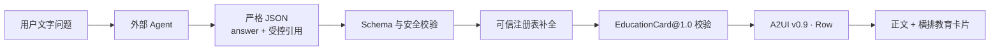

# AI 教师文字 Agent → A2UI 结构化输出协议

当前版本：`ai-teacher-ui@1.1`

## 结论

外部 Agent 不直接生成 A2UI，也不用正则从自然语言回答中“猜”卡片。Agent 只做两件事：

1. 输出面向学生的正文 `answer`。
2. 从本轮服务端提供的引用目录中选择语义卡片。

题干、选项、答案、解析、知识图节点与边、图片 URL 都由服务端可信注册表补全。最终走现有 `EducationCard@1.0 → A2UI v0.9 → A2UIRenderer` 链路。



## 卡片选择策略

| 用户意图 | Agent 选择 | 说明 |
|---|---|---|
| 知识重点、核心总结、公式、易错点、怎么理解 | `knowledge_summary` | 只选 `knowledge_ref`，正文由 Agent 讲解，卡片由可信知识库补全 |
| 前置、后续、依赖、关联、知识图谱、关系图 | `knowledge_graph` | 只选 `graph_ref`；Agent 不能生成节点、边或关系标签 |
| 大纲层级、内容梳理、思维导图 | `mindmap` | 只选 `mindmap_ref`；表达层级，不等于依赖关系图 |
| 几何图、函数图、实验图或其他视觉证据 | `image` | 只有目录存在匹配素材才选 `asset_ref` |
| 练习、做题、考考我、检验掌握 | `quiz` | 单题用 `assessment_ref`；2–3 题小测用 `assessment_refs` |

`knowledge_point` 是 `knowledge_summary` 的 1.0 兼容名，新 Agent 不应继续输出。

## 给 Agent 的提示词

工程中通过 `buildAgentEducationUiPrompt(referenceCatalog)` 生成完整提示词。运行时可从下列只读地址获得当前版本：

`GET http://localhost:3042/api/agent/ui-contract`

响应中的 `prompt` 可放入 Agent 人设，`reference_catalog` 是当前演示允许的引用目录。接入真实召回后，应按每轮检索结果动态生成目录，不把整个题库、答案或整幅知识图放入提示词。

提示词的核心约束是：

- 每次只输出一个严格 JSON 对象，禁止 Markdown 代码块、注释和前后缀说明。
- `schema_version` 必须为 `ai-teacher-ui@1.1`。
- `cards` 最多 4 个语义计划，多题 `quiz` 展开后的实际卡片总数也不得超过 4。
- 单题用 `assessment_ref`；小测用 2–3 个不重复的 `assessment_refs`，两者不得同时出现。
- Agent 不得输出题干、选项正误、答案、解析、解题步骤或答案变体。
- Agent 不得输出图谱节点、边、关系、URL、A2UI、EducationCard、组件 ID、动作 ID、会话 ID 或学生隐私字段。
- 有 `quiz` 时，`answer` 只能提示作答方法，不得透露任意一题的正确选项或解析。

## 法定引用目录示例

```json
{
  "assessments": [
    { "ref": "assessment.pythagoras.01", "label": "勾股定理·6-8 求斜边" },
    { "ref": "assessment.pythagoras.02", "label": "勾股定理·5-12 求斜边" }
  ],
  "knowledge_points": [
    { "ref": "kp.pythagoras", "label": "勾股定理" }
  ],
  "knowledge_graphs": [
    { "ref": "graph.pythagoras.dependencies", "label": "勾股定理前后置与关联知识" }
  ],
  "images": [
    { "ref": "asset.right_triangle", "label": "直角三角形示意图" }
  ],
  "mindmaps": [
    { "ref": "mindmap.pythagoras", "label": "勾股定理知识结构" }
  ]
}
```

## Agent 合法输出示例

下例用 1 张知识重点卡加 1 个两题小测，展开后共 3 张卡。

```json
{
  "schema_version": "ai-teacher-ui@1.1",
  "answer": "勾股定理要先确认直角，再区分直角边和斜边。看完重点后，用两道题检查是否掌握。",
  "cards": [
    { "type": "knowledge_summary", "knowledge_ref": "kp.pythagoras" },
    {
      "type": "quiz",
      "assessment_refs": [
        "assessment.pythagoras.01",
        "assessment.pythagoras.02"
      ]
    }
  ]
}
```

知识关系图示例：

```json
{
  "schema_version": "ai-teacher-ui@1.1",
  "answer": "勾股定理需要平方与平方根等前置基础，后续会用于坐标距离和最短路径问题。",
  "cards": [
    { "type": "knowledge_graph", "graph_ref": "graph.pythagoras.dependencies" }
  ]
}
```

## 字段解释

| 字段 | 中文含义 | 负责方 |
|---|---|---|
| `schema_version` | 协议版本 | Agent 按固定值输出 |
| `answer` | 展示给学生的教师正文 | Agent |
| `cards` | 需要展示的语义卡片计划 | Agent |
| `type` | 语义卡片类型，不是前端组件名 | Agent 从枚举值选择 |
| `knowledge_ref` | 可信知识重点引用 | 服务端给出，Agent 只选择 |
| `graph_ref` | 可信知识依赖与关联图引用 | 服务端给出，Agent 只选择 |
| `assessment_ref` | 一道可信题目的引用 | 服务端给出，Agent 只选择 |
| `assessment_refs` | 2–3 道小测题的不重复引用列表 | 服务端给出，Agent 只选择 |
| `asset_ref` | 可信图片素材引用 | 服务端给出，Agent 只选择 |
| `mindmap_ref` | 可信思维导图引用 | 服务端给出，Agent 只选择 |

## 安全转换规则

1. 对 Agent 完整返回字符串执行一次 `JSON.parse`；不去代码块、不截取花括号、不用正则解析自然语言。
2. 按 `AGENT_EDUCATION_UI_SCHEMA` 检查必填字段、枚举、长度、额外字段、语义计划数与展开后卡片数。
3. 服务端通过引用从题库、知识库、知识图库、素材库和思维导图库补全内容。语法合法但未知的引用按单卡丢弃，保留 `answer` 和其他合法卡。
4. 多题 `quiz` 只是多个受控引用；服务端将其展开为独立的 `quiz.single-choice` 卡，每题有独立 `card_id` 和判题状态。
5. 题卡首次下发不包含正确答案和解析。学生选择后，由 `POST /api/agent/ui/grade` 使用服务端私有题库判定。
6. 正文泄题检查会遍历小测中的每一题，不只检查第一题。
7. 图片必须是可信素材库中的 `/assets/` 路径或命中服务端域名白名单。
8. 每张卡再通过 `validateEducationCard`；失败时按单卡降级，不影响正文。
9. 通过 `createEducationA2UI` 生成 A2UI v0.9，并将根布局确定性设为 `Row`。
10. 过渡期 Agent 仍返回普通文字时，页面只展示正文，不猜卡片。

## 兼容与迁移

- 解析器同时接受 `ai-teacher-ui@1.1` 和旧版 `ai-teacher-ui@1.0`。
- 1.0 的 `knowledge_point` 仍等价转换为 `knowledge.explanation`；1.1 新输出应改为 `knowledge_summary`。
- 1.0 的 `mindmap` 和单题 `quiz.assessment_ref` 保持不变。
- 1.1 新增 `knowledge_graph.graph_ref` 与 `quiz.assessment_refs`。
- 现有 EducationCard 库暂无独立 graph 卡型，因此 `knowledge_graph` 暂确定性映射到受信的 `knowledge.mindmap`，用“前置知识 / 直接关联 / 后续应用”分支表达关系。Agent 仍只选 `graph_ref`，不能提交任意节点。未来新增专用 graph 卡型时，只需替换服务端映射，Agent 协议不必变更。

## 集成 API

```js
import {
  buildAgentEducationUiPrompt,
  parseAgentEducationUiResponse,
  convertAgentEducationUiResponse
} from "./agent-education-ui-contract.js";

const systemPrompt = buildAgentEducationUiPrompt(referenceCatalog);

// upstreamAnswer 整体必须是 JSON，不是夹带 JSON 的自然语言。
// 这里先做语法与安全形状校验。未知引用留给下一步按单卡跳过。
const plan = parseAgentEducationUiResponse(upstreamAnswer);

const projection = convertAgentEducationUiResponse(plan, {
  turnId,
  surfaceId: "agent_text_cards",
  assessments: privateAssessmentRegistry,
  knowledgePoints: trustedKnowledgeRegistry,
  knowledgeGraphs: trustedKnowledgeGraphRegistry,
  images: trustedImageRegistry,
  mindmaps: trustedMindmapRegistry,
  allowedMediaHosts: ["static.example.edu"]
});

// projection.answer 给文字渲染器。
// projection.a2ui.messages 交给现有 A2UIRenderer。
// projection.skipped_cards 只用于诊断与降级，不显示给学生。
```

如果是离线质检，希望任何越界引用都使整份计划失败，可在解析时显式传入 `{ allowedRefs: referenceCatalog }`。在面向学生的在线链路中，使用上述“解析时不传目录、转换时传可信注册表”的方式，才能实现未知引用按单卡降级。

实现：`agent-education-ui-contract.js` 与 `agent-education-ui-registry.js`  
定向测试：`test/agent-education-ui-contract.test.js` 与 `test/agent-education-ui-registry.test.js`
