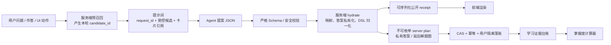

# Agent → 系统学习闭环协议 v2

协议版本：`ai-teacher-learning-loop@2.0`  
水合回执版本：`learning-agent-hydrate@2.0`  
兼容展示协议：`ai-teacher-ui@1.1`

## 1. 核心结论

Agent 只能输出「提案」，不能直接修改系统事实。

- Agent 负责：回答、从本轮候选中选知识点、建议事件类型、建议学习证据、提交动态题草案、提交受控互动图 DSL。
- 服务端负责：生成知识点候选、校验 Agent JSON、水合为系统 ID、私有存储答案、验证作答证据、幂等落账、版本冲突检测、用户隔离。
- 掌握度模型负责：仅消费服务端确认的学习证据，计算 `mastery_probability`、掌握状态和置信度。
- 前端负责：渲染公开回答、现有固定卡片、服务端验证后的题卡和受控互动图；不执行 Agent 代码。

Agent 返回的「这是勾股定理」、「学生已掌握」、「正确答案是 A」都不是系统事实。必须经过 `validate → hydrate → apply`。



## 2. 现有工程审计

### 2.1 可直接复用

| 现有能力 | 审计结论 | v2 用法 |
|---|---|---|
| `agent-education-ui-contract.js` | `ai-teacher-ui@1.1` 已约束 Agent 只选受控卡片引用，不输出 A2UI/答案/图谱节点 | v2 把完整旧协议放在 `ui_plan`，现有固定知识卡片继续保留 |
| `agent-education-ui-registry.js` | 题卡首次下发不含答案；判题按卡片、用户、会话绑定，支持幂等重放 | 可作为已登记固定题的过渡运行时 |
| `public/data/junior-math-ontology.json` | 有 140 个策展知识点和稳定 `knowledge_point_id` | 用于服务端候选映射的权威目录，不整库塞给 Agent |
| `public/data/demo-student-mastery.json` | 已表达掌握状态、概率、置信度、证据数和自述偏好边界 | 只可作为掌握模型输出，不是 Agent 可写字段 |
| `public/interactive-visual-renderer.js` | 已把原始数据归一为可执行内容为零的 `interactive-visual@1.0` | 动态题图复用现有 10 种 variant，服务端先拒绝危险字段，再归一化 |

### 2.2 当前缺口

- 现有 `ai-teacher-ui@1.1` 只解决「回答 + 卡片选择」，没有学习事件、知识映射回执、证据提案、动态题和题图绑定。
- 现有题目注册表是少量固定演示题；没有「候选题 → 校验 → 私有题库 → 发布版本」。
- 学生掌握度目前是本地演示文件，没有按租户/用户隔离的学习证据台账和 CAS 更新。
- `server.js` 已有部分 `user_id/session_id/state_version/idempotency_key`，但尚未把 v2 receipt 接入完整学习闭环。

## 3. 权威边界

| 对象 | Agent | 服务端 | 前端 |
|---|---|---|---|
| 学生可见回答 | 提案 | 安全审核/降级 | 渲染 |
| 知识点 | 只选本轮 `candidate_id` | 预召回并映射为 `knowledge_point_id` | 只显示回执 |
| 事件类型 | 提案 | 可接受或覆盖 | 不决策 |
| 掌握证据 | 提案 signal | 核对服务端 evidence | 不落账 |
| 掌握概率/变化量/状态 | **禁止输出** | 掌握模型计算 | 只展示 |
| 动态题 | 提交公开题面 + 私有答案草案 | 拆分存储、复算、审核、发布 | 仅收公开题面 |
| 题目互动图 | 提交受控 `visual_spec` | 拒绝代码，归一化为受信 DSL | 用固定 renderer 渲染 |
| A2UI/组件/动作 | **禁止输出** | 确定性组装 | 执行已登记动作 |

## 4. Agent 顶层 envelope

```json
{
  "schema_version": "ai-teacher-learning-loop@2.0",
  "request_id": "request_turn_001",
  "answer": "先确认直角三角形，再使用勾股定理。",
  "ui_plan": {
    "schema_version": "ai-teacher-ui@1.1",
    "answer": "先确认直角三角形，再使用勾股定理。",
    "cards": []
  },
  "event": {},
  "knowledge_proposals": [],
  "mastery_evidence_proposals": [],
  "assessment_proposals": [],
  "visual_proposals": []
}
```

| 字段 | 中文含义 | 边界 |
|---|---|---|
| `schema_version` | v2 协议版本 | 固定值 |
| `request_id` | 服务端生成的本轮防串线随机值 | Agent 只原样回显 |
| `answer` | 学生可见回答 | 不得包含题卡私有答案 |
| `ui_plan` | 现有 `ai-teacher-ui@1.1` 完整对象 | `ui_plan.answer` 必须与顶层相同；固定卡片仍用服务端 ref |
| `event` | 事件分类提案 | 服务端可覆盖 |
| `knowledge_proposals` | 对问题/题目涉及知识点的选择 | 只选本轮 candidate；未知项留空 |
| `mastery_evidence_proposals` | 学习证据建议 | 没有掌握度数值或结论 |
| `assessment_proposals` | 动态题草案 | 公开题面与私有答案必须分开 |
| `visual_proposals` | 知识图解或题目配图草案 | 仅受控 DSL，不允许代码 |

`answer` 在顶层和 `ui_plan` 内重复，是为了让学习闭环与现有 UI 协议分别演进。校验器强制两者完全相同，不存在双重文案权威。

## 5. 知识点 mapping

### 5.1 正确链路

1. 服务端用用户原问题执行元数据过滤 + 混合检索。
2. 服务端只把 3–8 个候选以临时 `candidate_id` 放入提示词。
3. Agent 使用 `mention` 保留它理解的用户词，用 `candidate_id` 选候选。
4. 没有可靠候选时，`candidate_id: null`；禁止自造 `M4-...` 或其他本体 ID。
5. 服务端将 candidate 再映射为当前版本的 `knowledge_point_id`。

```json
{
  "proposal_id": "knowledge.1",
  "mention": "勾股定理",
  "candidate_id": "candidate.kp.1",
  "role": "primary",
  "confidence": 0.95,
  "evidence_spans": [
    { "source": "user_text", "quote": "这题勾股定理怎么用" }
  ]
}
```

### 5.2 映射状态

| 状态 | 条件 | 系统行为 |
|---|---|---|
| `mapped` | 所有提案都选中本轮唯一有效 candidate | 可生成知识证据候选 |
| `partial_mapping` | 至少一个成功，至少一个 unmapped | 仅处理已映射部分，其余记诊断 |
| `no_match` | 没有任何可用映射，包括 Agent 正确留空或伪造 candidate | 可保留会话审计事件，**不进入掌握证据台账** |
| `conflict` | 服务端 candidate 重复或 candidate 指向的权威知识点不存在 | 阻断对应证据/题目/图解，报警并重新召回 |

Agent 的 `confidence` 只是诊断字段，不参与系统 ID 真伪判断。

## 6. 事件协议

`event.type` 枚举：

- `knowledge_question`：询问知识事实或方法。
- `explanation_request`：要求讲解、图解或举例。
- `assessment_request`：要求出题或小测。
- `assessment_answer`：学生提交作答。
- `mistake_review`：讲解错题或错因。
- `student_self_report`：「太简单」、「我不会」等自述。
- `hint_request`：请求提示。
- `course_navigation`：课程选择、进度跳转。
- `other`：不适配以上类型。

服务端如已知这是题卡提交事件，应在 `authority.event_type` 中直接给出 `assessment_answer`，覆盖 Agent 分类。

## 7. 掌握证据边界

Agent 输出：

```json
{
  "proposal_id": "evidence.1",
  "knowledge_proposal_id": "knowledge.1",
  "evidence_mode": "direct_assessment",
  "signal_type": "answer_correct",
  "evidence_ref": "attempt.20260814.1",
  "strength": "strong",
  "confidence": 0.99,
  "basis": "引用当前题卡的服务端判题结果"
}
```

| `evidence_mode` | 允许 signal | 水合条件 | 是否可交给掌握模型 |
|---|---|---|---|
| `direct_assessment` | `answer_correct` / `answer_incorrect` / `partial_credit` / `solution_step_correct` / `solution_step_error` | `evidence_ref` 必须在服务端存在，且租户、用户、知识点、实际判题 outcome 全部一致 | 是，回执 `accepted_direct + apply_to_mastery:true` |
| `inferred` | `hint_used` / `repeated_error` / `transfer_success` / `teacher_observation` | 有服务端事件时为 `accepted_inferred`，否则 `pending_review` | 不直接改掌握度；由后续策略决定低权重使用 |
| `self_report` | `self_report_easy` / `self_report_difficult` | 映射成功即可形成偏好/自述事件 | 否，回执固定为 `preference_only + apply_to_mastery:false` |

硬规则：

- Agent 不能输出 `mastery_probability`、`mastery_delta`、`mastery_state`、`confidence_after`。
- `no_match` / `conflict` 的知识点所属证据必须拒绝，不落掌握证据账。
- 学生说「太简单，不要再考」，可产生「暂停直接考查」偏好，不能推导该点或所有前置点已掌握。
- 正确与否只以服务端私有题库判题结果为准，不信任 Agent 文字结论。

## 8. 动态题与答案私有化

```json
{
  "proposal_id": "assessment.1",
  "knowledge_proposal_ids": ["knowledge.1"],
  "blueprint": {
    "item_type": "single_choice",
    "cognitive_level": "apply",
    "difficulty": "easy",
    "generation_method": "条件变式",
    "estimated_minutes": 2
  },
  "public_item": {
    "title": "勾股定理练习",
    "prompt": "直角边为 3 和 4，斜边长是多少？",
    "instruction": "选择一个答案",
    "options": [
      { "id": "A", "label": "5" },
      { "id": "B", "label": "6" }
    ]
  },
  "private_key": {
    "correct_option_ids": ["A"],
    "explanation": "3²+4²=25，所以斜边为 5。",
    "solution_paths": [
      {
        "title": "直接代入",
        "steps": ["识别斜边", "代入公式", "开平方"],
        "when_to_use": "已知两条直角边"
      }
    ],
    "common_errors": ["把直角边当成斜边"],
    "scoring_points": [
      { "criterion": "正确代入与求值", "points": 2 }
    ]
  }
}
```

水合后：

- `assessment_receipts[].public_item` 可序列化，但 `publishable:false`、`verification_status:pending_server_verification`。
- `private_key` 进入不可枚举 server plan，由 runtime 按 `tenant_id + user_id + assessment_id` 存储。
- `JSON.stringify(hydrateReceipt)` 不含 `correct_option_ids`、`accepted_answers`、`explanation`、`solution_paths`。
- 生成题必须再经过唯一答案、数值复算、相似度、版权和人工审核门禁，才能发布到通用题库。
- 用户作答前默认只显示 `public_item`；点击「查看解题思路」或作答后，服务端再按权限取出私有解析。

## 9. 与题目一致的动态互动图

Agent 不输出 JavaScript/HTML/SVG 代码，只输出与题目提案绑定的数据 DSL：

```json
{
  "proposal_id": "visual.1",
  "knowledge_proposal_ids": ["knowledge.1"],
  "assessment_proposal_id": "assessment.1",
  "purpose": "question_stimulus",
  "visibility": "immediate",
  "visual_spec": {
    "schema_version": "interactive-visual@1.0",
    "variant": "triangle",
    "title": "题目中的直角三角形",
    "description": "调节边长观察三边关系",
    "model": "right_triangle",
    "parameters": { "a": 3, "b": 4 }
  }
}
```

允许的 10 种 `variant`：

| variant | 用途 |
|---|---|
| `linear` | 一次函数 |
| `quadratic` | 二次函数 |
| `numberline` | 数轴、不等式区间 |
| `triangle` | 三角形、勾股、相似 |
| `circle` | 圆、圆心角、扇形 |
| `coordinate` | 坐标、几何变换 |
| `statistics` | 数据图表与统计 |
| `probability` | 等可能试验 |
| `algebra` | 代数式、方程步骤 |
| `concept` | 受控概念关系图 |

安全规则：

- 根字段只允许受控数据；递归拒绝 `code/script/html/css/url/src/href/renderer/component/action/on*` 等字段。
- 文本拒绝 `javascript:`、`data:`、`file:`、`eval(`、`fetch(`、`window.`、`document.`、函数箭头等。
- 服务端使用现有 `normalizeInteractiveVisualArtifact()` 产生有边界、深冻结、不包含表达式/代码的标准模型。
- `question_stimulus` 必须绑定 `assessment_proposal_id`，保证参数与题面同源。
- `solution_explanation` 只允许 `after_submit` 或 `teacher_only`；公开 receipt 在作答前只保留 `visual_id`，`visual_spec:null`。

## 10. hydrate receipt

```json
{
  "contract_version": "learning-agent-hydrate@2.0",
  "source_contract_version": "ai-teacher-learning-loop@2.0",
  "request_id": "request_turn_001",
  "authority": {
    "tenant_id": "tenant_school_1",
    "user_id": "student_1",
    "session_id": "session_1",
    "turn_id": "turn_1",
    "idempotency_key": "idem_1",
    "expected_state_version": 4
  },
  "answer": "...",
  "ui_plan": {},
  "mapping": {
    "status": "mapped",
    "mapped_count": 1,
    "proposed_count": 1,
    "items": []
  },
  "event_decision": {},
  "evidence_decisions": [],
  "assessment_receipts": [],
  "visual_receipts": [],
  "diagnostics": {
    "has_partial_result": false,
    "codes": []
  }
}
```

`hydrateLearningAgentResponse()` 返回的 receipt 可序列化，但它是服务端诊断/应用对象，不建议原样下发。下发前使用 `createPublicLearningAgentProjection()` 去掉 `authority`。

私有题库键和延后解题图保存在 receipt 的不可枚举 Symbol server plan 中，只能由同模块内的 runtime 落库。因此即使工程师误用 `JSON.stringify(receipt)`，也不会把私有答案下发。

## 11. 幂等、版本与用户隔离

### 11.1 权威请求上下文

```js
const authority = {
  tenant_id,
  user_id,
  session_id,
  turn_id,
  request_id,
  idempotency_key,
  expected_state_version,
  event_type // 可选，服务端已知时覆盖 Agent 分类
};
```

这些字段全部来自服务端登录态/会话态，不从 Agent JSON 读取。

### 11.2 应用规则

- 存储主键范围是 `tenant_id + user_id`；不同用户同名幂等键互不影响。
- 同一用户、同一 `idempotency_key`、同一请求指纹：返回首次结果，`idempotent:true`，不再增加证据。
- 同一用户、同一 `idempotency_key`、不同请求指纹：`IDEMPOTENCY_CONFLICT`。
- `expected_state_version` 不等于当前版本：`STALE_STATE_VERSION`，不写入任何学习数据。
- 幂等重放检查早于版本检查，因此已成功请求可以用旧 `expected_state_version` 安全重放。

## 12. 服务端最小接入方式

```js
import {
  buildLearningAgentContractPrompt,
  parseLearningAgentResponse,
  hydrateLearningAgentResponse,
  createLearningAgentRuntime
} from "./learning-agent-contract.js";

const learningRuntime = createLearningAgentRuntime();

// 1. 服务端预召回。candidate_id 是本轮临时 ID，不是 Agent 自造本体 ID。
const knowledgeCandidates = await preRecallKnowledge(userText, {
  tenant_id,
  course_id,
  top_k: 6
});

// 2. 服务端生成 nonce 和提示词。
const prompt = buildLearningAgentContractPrompt({
  requestId,
  knowledgeCandidates,
  uiReferenceCatalog
});

// 3. 调 Agent，并对完整返回执行一次 JSON.parse。
const raw = await callAgent({ prompt, userText });
const proposal = parseLearningAgentResponse(raw);

// 4. 服务端映射候选、核验真实作答、拆分公开/私有题目、归一化互动图。
const receipt = hydrateLearningAgentResponse(proposal, {
  authority: {
    tenant_id,
    user_id,
    session_id,
    turn_id,
    request_id: requestId,
    idempotency_key,
    expected_state_version: currentStateVersion
  },
  knowledgeCandidates,
  knowledgeRegistry,
  verifiedEvidence
});

// 5. CAS + 幂等落账。apply 可直接消费已水合 receipt，不再调 Agent。
const result = learningRuntime.apply(receipt);
if (!result.ok) return sendConflict(result);
return sendJson(result.public_projection);
```

`createLearningAgentRuntime()` 是可运行的内存参考实现，证明协议幂等、CAS、用户隔离和答案私有化可行。正式服务应把相同语义落到数据库事务：

- `learning_events`
- `learning_evidence_events`
- `assessment_drafts_public`
- `assessment_keys_private`
- `visual_drafts`
- `idempotency_receipts`
- `student_knowledge_state_versions`

## 13. 兼容现有产品

1. 现有知识点卡片、固定题、固定思维导图继续放在 `ui_plan.cards`，不删除。
2. `ui_plan` 是完整 `ai-teacher-ui@1.1`，可直接交给现有 registry/converter。
3. 动态题和与题一致的图不写入旧卡片 ref；服务端水合后获得 `assessment_id/visual_id`，再组装 EducationCard/A2UI。
4. 过渡期可按功能开关启用 v2。Agent 仍返回旧协议时，只渲染回答和固定卡片，不更新掌握状态。

## 14. 仍需接线的工作

本协议模块没有修改 `server.js`、`public/index.html`、`public/learning-workbench.js` 或 CSS。主链路还需要：

1. **服务端预召回**：将本轮召回结果转成临时 `candidate_id → knowledge_point_id` 目录，调用 prompt builder。
2. **Agent 入口**：把原来只要求 `ai-teacher-ui@1.1` 的提示词切换为 v2 envelope，并保留旧 `ui_plan`。
3. **parse/hydrate/apply**：将 Agent 完整返回交给新模块，连接真实用户、会话、作答证据和状态版本。
4. **持久化 runtime**：用数据库事务替换内存参考 runtime，实现按 tenant/user 的物理或行级隔离。
5. **题目质量门禁**：新题在进入通用题库前做复算、唯一答案、去重、版权与审核。
6. **动态 A2UI 组装**：把已水合的公开题面和 `visual_spec` 确定性映射为现有题卡/互动图容器。
7. **作答后解锁**：按 `assessment_id + user_id + attempt_id` 判题，再返回私有解析和 `after_submit` 图解。
8. **掌握模型**：从 `apply_to_mastery:true` 的台账计算掌握度；对 inferred 证据单独配置低权重策略；自述仅更新偏好。

## 15. 主要风险

| 风险 | 影响 | 当前防线 | 仍需建设 |
|---|---|---|---|
| 预召回没把正确知识点放入候选 | Agent 只能 `unmapped` | `no_match` 不落掌握证据 | 改进召回与人工同义词 |
| Agent 选错 candidate | 证据归因错误 | 只选本轮 candidate，保留 mention/evidence span | 高风险事件二次分类/人工抽检 |
| Agent 生成题答案错 | 误判掌握 | 草案默认不可发布，答案私有 | 规则求解器/独立模型复算/教师审核 |
| 题图与题干参数不一致 | 教学误导 | 两者同一 Agent 提案并绑定 proposal ID | 水合时增加题面参数↔DSL 一致性规则 |
| 私有答案泄漏 | 题库失效 | 公开/私有对象分离，server plan 不可枚举 | 数据库分表/列权限/下发监控 |
| 重试重复更新掌握度 | 学生画像漂移 | 用户范围幂等键 + CAS | 数据库唯一索引与事务 |
| 用户串数据 | 严重隐私问题 | 权威 tenant/user 不从 Agent 读，runtime 按 scope 隔离 | 真实认证、行级权限、审计日志 |

## 16. 实现与测试

- 机器可校验模块：`learning-agent-contract.js`
- 定向测试：`test/learning-agent-contract.test.js`

定向测试覆盖：

- 旧 `ai-teacher-ui@1.1` 兼容。
- 完整 JSON 解析、额外字段和掌握度越权字段拒绝。
- `mapped / partial_mapping / no_match / conflict`。
- 伪造 candidate 不做名称猜测映射。
- 直接测评证据核验、自述不改掌握度、`no_match` 不落掌握证据台账。
- 动态题公开/私有分离，可序列化 receipt 不泄漏答案。
- 与题绑定的受控互动图、作答前解题图隐藏、可执行字段拒绝。
- 幂等重放、幂等冲突、CAS 冲突、不同用户隔离。
