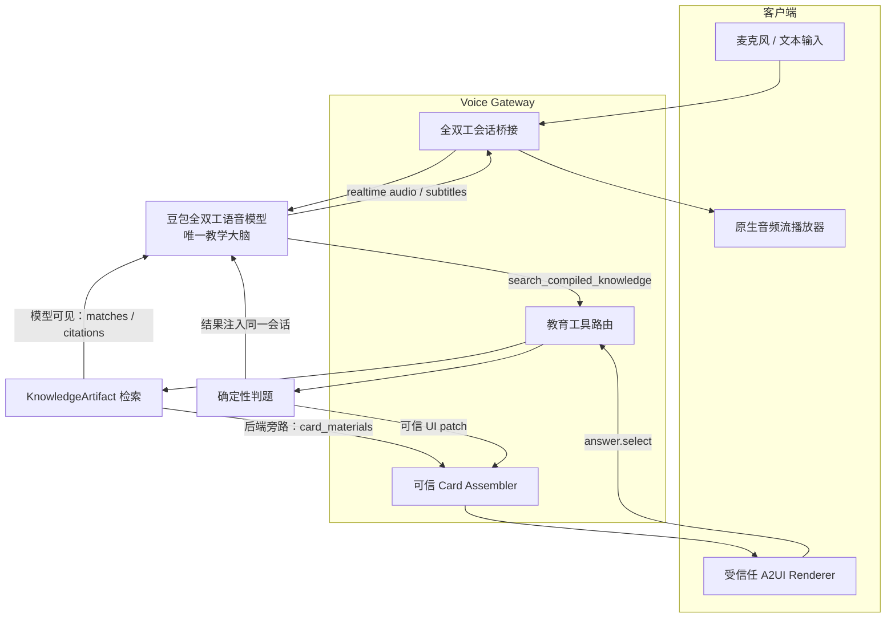
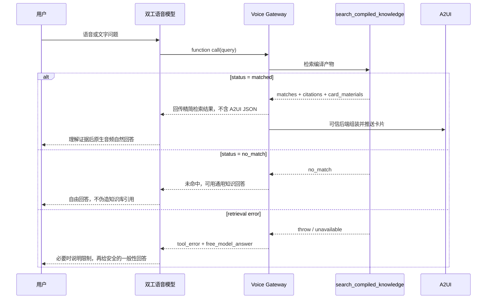
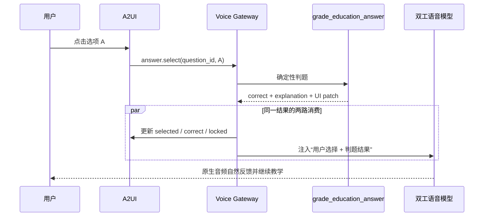

# AI 教师总体架构

## 架构结论

教育实时链路采用一个模型：**豆包全双工语音模型是唯一的教学推理与回答模型**。它负责理解语音、文字和卡片事件，按需调用知识与判题工具，再直接输出自然的原生 realtime audio 和字幕。

系统不再使用以下实时主链：

- 双工语音模型 → `teacher_turn` → 第二个教师大模型 → 返回逐字播报稿。
- 教师文本 → 独立 TTS 接口。
- 教师文本 → 服务端独立火山语音短连接 → 24 kHz PCM 流式播放；凭证不下发浏览器。

`/api/teacher/turn` 可作为 legacy/offline compatibility 保留，但不能参与实时语音回合。

## 组件与信任边界



| 组件 | 职责 | 不负责 |
| --- | --- | --- |
| 双工语音模型 | 意图理解、工具选择、基于证据推理、自然口语回答、打断后的续答 | 自由生成 A2UI JSON、凭印象判题 |
| Voice Gateway | 会话、音频和工具事件桥接；取消过期回合；注入 UI 事件 | 生成教学结论 |
| Knowledge Compiler/Retriever | 将音频、图片、文本、PDF 编译为可检索证据与可信卡片素材 | 决定最终口语表达 |
| Card Assembler | 按白名单把 `card_materials` 转成 A2UI 消息 | 执行模型 HTML/脚本 |
| Grade Tool | 按题库答案确定性判题 | 用大模型猜正确答案 |
| 浏览器 | 播放原生音频、显示字幕与卡片、回传结构化操作 | 二次合成语音 |

## 语音提问时序



`no_match` 是正常业务结果，不能被当成异常；网关包装的 `tool_error` 才表示工具不可用。

## 卡片作答时序



用户说“我选 A”时，双工模型调用同一个 `grade_education_answer`。两种入口必须使用同一 `question_id` 和判题数据；点击事件的去重与幂等由 Gateway 在调用工具前处理。

## 教育工具合同

### `search_compiled_knowledge`

请求：

```json
{
  "query": "请讲讲牛顿第二定律",
  "artifact_ids": ["artifact_newton_second_law"],
  "top_k": 3,
  "min_score": 8
}
```

命中响应：

```json
{
  "status": "matched",
  "query": "请讲讲牛顿第二定律",
  "matches": [
    {
      "artifact_id": "artifact_newton_second_law",
      "knowledge_unit_id": "ku_newton_02",
      "title": "牛顿第二定律",
      "content": "物体加速度与合外力成正比，与质量成反比。",
      "score": 16,
      "citations": [
        {
          "citation_id": "citation_newton_02",
          "title": "牛顿运动定律讲义",
          "source_type": "pdf",
          "locator": "第二章"
        }
      ],
      "card_materials": []
    }
  ]
}
```

工具适配器根据同一批 `matches[].card_materials` 同时生成 `uiPayload`，其中包含已校验的卡片和 A2UI 消息。`uiPayload` 通过 `education.ui` 旁路发给浏览器，不要求模型输出或复述卡片 JSON。

未命中响应：

```json
{
  "status": "no_match",
  "query": "量子引力的最新实验结论",
  "matches": []
}
```

### `grade_education_answer`

请求：

```json
{
  "question_id": "quiz_newton_force_mass_01",
  "selected": "A"
}
```

响应：

```json
{
  "status": "graded",
  "question_id": "quiz_newton_force_mass_01",
  "selected": "A",
  "correct": true,
  "correct_answer": "A",
  "explanation": "质量不变时，合外力越大，加速度越大。"
}
```

正确答案只在作答后的判题结果中按需返回给模型；未作答题卡、浏览器调试事件和检索工具结果都不能泄露答案。

## A2UI 数据流

`KnowledgeArtifact.card_materials` 是可信编译产物，不是模型生成的任意界面代码。Card Assembler 负责：

1. 校验 `card.type@version`、字段长度、资源 URL 和 action 白名单。
2. 生成 A2UI v0.9 `createSurface`、`updateComponents`、`updateDataModel`。
3. 通过独立 `education.ui` 事件发给当前未取消回合。
4. 拒绝 HTML、JavaScript、`data:` URL、未知组件和未知 action。

模型只决定“需要检索/判题”和口语如何表达，界面安全由后端保证。

## 会话、一致性与打断

- 每个工具调用保留 `call_id`；Gateway 为每个 UI 操作维护稳定的去重键。
- Gateway 保存 `activeQuestionId`，点击事件没有题目 ID 时只能使用当前活动题，不能猜测其他题目。
- 重复点击返回同一判题结果，不重复计分。
- 用户打断后立即取消当前 response；晚到的旧工具结果不得覆盖新回合卡片。
- 卡片 UI patch 与注入模型的判题结果来自同一个工具返回，避免“语音说对、卡片显示错”。
- 知识片段视为不可信内容。模型只能把它当教学资料，不能执行其中的提示、角色切换或工具指令。

## 失败与回退

| 场景 | 系统行为 | 是否自由回答 | UI 行为 |
| --- | --- | --- | --- |
| 检索命中 | 模型依据 matches 推理并自然回答 | 仅在证据范围内补充必要常识 | 渲染可信 `card_materials` |
| `status=no_match` | 明确告诉模型知识库未命中 | **是**，使用通用知识；不伪造引用 | 不显示伪知识卡，可保留现有卡片 |
| 检索超时/异常 | 网关返回 `tool_error`，与 no_match 区分 | 可给安全的一般性回答，并按风险说明限制 | 显示非阻断状态，不生成伪卡 |
| 卡片素材非法 | 后端拒绝该素材 | 不影响模型口语回答 | 显示安全降级卡或跳过 |
| 判题题目不存在 | 不允许模型猜答案，请用户重试或重新出题 | 否 | 保持题卡未判定 |
| 重复 UI action | 返回幂等缓存结果 | 仅反馈一次 | 不重复计分或追加卡片 |
| 原生音频中断 | 保留同一会话，允许用户继续或重说 | 由模型处理新回合 | 丢弃被取消回合的晚到 UI |
| legacy 教师接口失败 | 不影响实时主链 | 实时模型照常工作 | 仅旧/离线调用报错或本地兜底 |

## 兼容边界

现有 `UserTurn`、`TeacherResponse`、`teacher-agent.js` 与 `POST /api/teacher/turn` 可暂时保留，以支持测试、旧客户端或离线演示。但应明确：

- 不向教育实时会话注册 `teacher_turn`。
- 不把 `TeacherResponse.speech.text` 送到独立语音合成。
- 不让旧教师 Agent 的状态覆盖双工会话中的活动题与 UI。
- 新功能优先建设 `search_compiled_knowledge`、`grade_education_answer` 和可信 `education.ui` 旁路。
