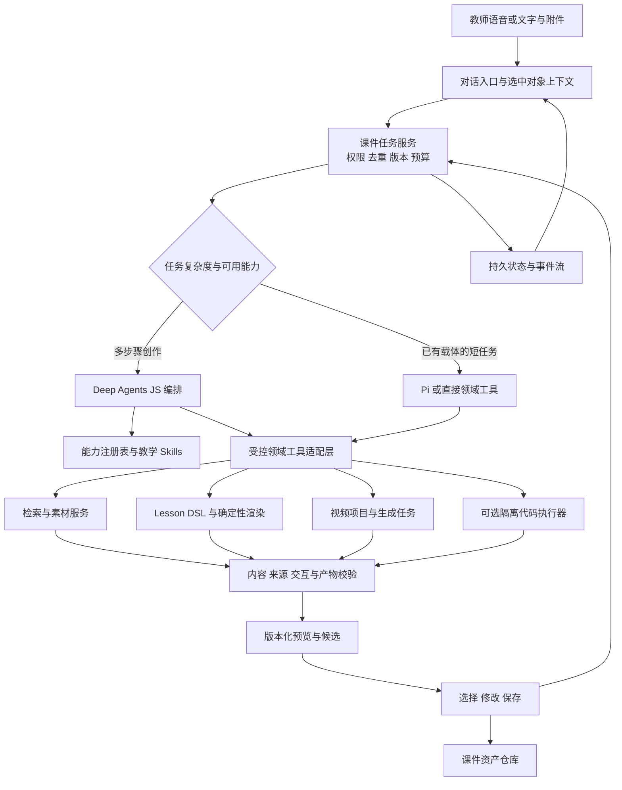

# 课件助手 Deep Agent 演进方案与框架证据

## 1. 决策结论

课件助手适合逐步引入 Deep Agent 能力：理解教学目标、选择表达技术、组织素材、执行生成、验证结果，并根据教师的自然语言反馈继续修改。优先候选是 **LangChain Deep Agents JS**，因为它可嵌入现有 Node/ESM 服务，支持替换模型，且已经提供规划、工作文件、子任务和上下文管理。[^1][^2] 现有 Pi Agent 应保留为短任务执行器及回退路径，在同一组课件任务上验证质量、时延和恢复能力后再决定是否扩大迁移。

这里的“Deep Agent”描述的是可持续完成多步骤任务的能力，不表示每次都要长时间思考、创建多个子 Agent，或生成任意代码。对现有函数图、斜面、摆、碰撞等受控课件，直接生成 Lesson DSL 通常仍是最短路径。只有素材研究、跨载体组合、较长视频、反复修改和复杂新场景值得启用任务规划与委派。

建议采用“**自然对话负责表达意图，少量可视控件负责预览、比较和确认结果**”的产品形态。语音可以成为主要输入，但不能替代几何拖拽、参数调节、镜头比较、选中某个对象、核对公式等空间操作。后台自动选择技术，教师主要看到“可以拖动的实验”“分步讲解动画”“可播放视频”等教学效果；技术名称进入可展开的专业信息。

不建议把学生实时教学链路整体改成通用 Deep Agent。当前 `teacher_turn`、学习状态更新、判分、可信卡片与 Lesson DSL 校验承担的是领域权威，不能由规划模型的文本结论代替。框架替换也不会自动修复检索服务失效、上游超时、重复付费提交、任务取消或手机排版；这些仍需在服务层和产品层落实。

## 2. 当前系统具备什么，缺什么

以下为 2026-09-12 工作区代码基线，不代表相关上游服务已在生产环境验证。

| 当前能力 | 代码证据 | 对演进方案的影响 |
| --- | --- | --- |
| Node/ESM 后端 | `package.json` 使用 `"type": "module"`，启动入口为 `server.js` | 优先同语言编排器；引入 Python 应以独立执行服务接入 |
| Pi Agent 生成受控课件 | `pi-teaching-agent.js` 使用 `@earendil-works/pi-agent-core` 和 `pi-ai`，锁文件实际为 `0.74.0` | 这是轻量 Agent Core 的领域封装，不是完整 Pi Coding Agent SDK |
| 受控发布工具 | 只开放 `publish_interactive_lesson`，经 `normalizeInteractiveLessonDsl` 校验，禁止模型直接返回 HTML/JavaScript | 应复用此边界，将“发布”名称逐渐澄清为“提交待预览课件”，避免与正式上架混淆 |
| 明确的载体范围 | 现有工具 schema 包含函数图、抛体、物理实验、酸碱实验、思维图、概念卡 | 技术推荐必须与已安装 renderer 的能力对应；不能把未实现引擎当成可执行选项 |
| 生成时可以中断后端调用 | `interactive-lesson-http.js` 把连接中止传为 `AbortSignal`；Pi 封装调用 `agent.abort()` | 已有基础取消链，但仍需验证前端显式取消、上游停止、最终状态一致性 |
| 互动课件请求仍等待完整结果 | `POST /api/interactive-lessons/generate` 等待 `service.generate()` 后返回 JSON；`trace` 在结果内返回 | 长任务应增加持久任务与进度事件。仅加入规划模型可能让等待更长 |
| Pi 封装的生成预算 | 默认超时 180 秒；最多两次外层尝试；流调用另有 `maxRetries: 1` | 必须统一总任务 deadline，避免把多个层次的重试当成独立预算；这些参数不能用于推断某条历史 trace 的实际耗时 |
| 教材素材已有专门链路 | `knowledge-material-http.js` 提供生成、`generate/trace` 与判题入口 | 编排器调用稳定工具，保留已有来源、结构、错误和事件契约 |
| 视频已有项目和任务体系 | `education-video-http.js`、`education-video-service.js`、`education-video-repository.js` 提供项目、分镜、镜头生成、轮询、取消和合成 | 应包装现有任务 API，不重造视频后台；付费提交不确定状态应先核对而非盲重试 |
| 实时教学有权威入口 | `teacher-agent.js` 定义 `teacher_turn`；`server.js` 规定 Gateway 在完整用户回合执行该入口 | 课件创作编排与学生教学回合共享资料和产物，但分开拥有生命周期与写权限 |
| 前端课件助手和课件库已存在 | `public/courseware-assistant.js`、`public/courseware-store.js`；后者用 IndexedDB 保存课件 | 可沿用预览、选择、保存入口；IndexedDB 只证明当前浏览器本地保存，不能承诺跨设备、协作或服务器任务恢复 |

这里最明显的架构缺口，是“跨多次对话、页面刷新和后台长任务的统一课件工作状态”，以及“自动技术选择到可验证结果之间的受控执行层”。这两个缺口可以渐进修补，不以立即更换 Pi 为前提。

## 3. 官方项目和版本核验

### 3.1 版本与许可

访问日期统一为 **2026-09-12**，表中日期为官方 Release 的 UTC 发布日期。在线文档持续更新，实施时应固定依赖与对应源码快照，不能直接把 `main` 文档当成已锁定版本保证。

| 项目 | 官方可核验版本 | 语言与包 | 许可/条款 | 本系统判断 |
| --- | --- | --- | --- | --- |
| Deep Agents JS | `deepagents@1.13.4`，2026-09-09；npm 与该库 Release 一致 | TypeScript；`deepagents` 提供 ESM/CJS，另有 Node/browser 导出 | MIT | 优先试点的后台编排框架。[^1][^3] |
| Deep Agents Python | `deepagents==0.7.13`，2026-09-02；PyPI 与 Release 一致 | Python `>=3.11,<4.0` | MIT | Python 工具占主导时适合；当前项目增加进程、部署和协议成本。[^4] |
| Pi | 仓库最新 `v0.85.1`，2026-09-05；本项目实际使用 `0.74.0` | TypeScript，区分 `pi-ai`、`pi-agent-core`、`pi-coding-agent` | MIT | 可继续承担受控 DSL 生成，需自行实现完整持久编排。最新文档特性不能直接视为本地版本已有。[^5][^6] |
| OpenHands Software Agent SDK | `v1.47.0`，2026-09-10 | 核心 Python `>=3.12`；另有 TypeScript Agent Server 客户端 | SDK 仓库 MIT | 适合隔离环境内代码生成、运行与修复；并非最轻的 Node 主编排器。[^7] |
| Claude Agent SDK | `@anthropic-ai/claude-agent-sdk@0.3.269`，2026-09-11；npm 声明 Node `>=18` | TypeScript/Python，带 Claude Code 原生运行程序 | npm 为 `SEE LICENSE IN README.md`；官方 README 说明受 Anthropic Commercial Terms 管理 | 可作为 Claude 专项执行候选，不应写成 MIT 或任意模型可替换的开源内核。[^8] |

Deep Agents JS 的仓库是 monorepo。`releases/latest` 此次返回的是 `@langchain/quickjs@0.6.3`，**不是** `deepagents` 库版本；应使用对应包 Release 与 npm 元数据判断版本。[^3] JS 与 Python 的版本号也不是互相对应的，不能据“1.x 对 0.x”直接推断成熟度或特性完整度。

### 3.2 核心能力比较

| 维度 | Deep Agents JS | Deep Agents Python | Pi 当前路线 | OpenHands SDK | Claude Agent SDK |
| --- | --- | --- | --- | --- | --- |
| 规划与上下文 | 内置规划、文件卸载、摘要、子 Agent 中间件 | 同类 harness 能力，具体 API 单独核对 | Core 提供循环和事件；规划、压缩与任务持久策略需本系统补充，Coding Agent SDK 有更多现成功能 | 围绕软件任务的 Agent、工具、对话、事件和 workspace | Claude Code 的 Agent 循环、工具、压缩与会话能力 |
| 模型可替换 | 接受模型标识或 LangChain ChatModel；可按子 Agent 配模型 | LangChain 模型集成 | `pi-ai` 多 provider，当前 Ark 模型已有适配 | LLM 抽象使用 LiteLLM，支持 provider/model 与 base URL | 官方支持 Claude 及其托管渠道；不是豆包/任意 OpenAI 兼容模型的替换接口 |
| 持久化 | LangGraph checkpointer 保存执行状态；Store/Backend 保存长期文件；需配置实际持久存储 | 同类机制；需正确配置服务和存储 | Core 的内存状态不会自动成为持久任务；Coding SDK 的 session 也不等于业务数据库 | `persistence_dir` 保存事件、配置、Agent 状态，支持重载 | session ID、resume/fork、磁盘会话；跨主机需安排可访问的会话与工作区 |
| 子 Agent | 支持同步委派；异步子 Agent 通过 Agent Protocol 服务运行 | 支持子 Agent；不应默认与 JS 每个新特性同步 | 官方 Coding Agent 明确不内置统一子 Agent 系统，可扩展/自行编排 | TaskToolSet 官方文档明确是同步阻塞，可用 task ID 恢复 | 支持配置专门子 Agent 与工具范围 |
| 文件/执行 | 默认 StateBackend；可接 Store/文件系统；执行依赖 shell/sandbox backend | 可插拔 backend 与 sandbox | 工具由应用暴露；Pi 默认无进程/文件/网络权限隔离 | Local/remote workspace；Agent Server 可运行于容器等环境 | 内置文件/终端工具与 sandbox 配置；部署仍需实际隔离环境 |
| 审批 | `interruptOn` 与 LangGraph interrupt，需持久 checkpoint 和 UI/语音桥接 | `interrupt_on` | hooks/扩展自行实现，不是现成领域授权系统 | ConfirmationPolicy 与 security analyzer | permission mode、rules、hooks、`canUseTool` |
| 取消 | Runnable `signal`；异步任务 `cancel_async_task`/服务取消；自定义执行器须传播 | 需核验选定部署与执行器的取消行为 | `agent.abort()`；工具须尊重 signal | `conversation.pause()` 后可恢复；暂停不自动证明外部任务已撤销 | `abortController`；流式输入可用 `interrupt()` |
| Node 接入成本 | 中等：新增依赖、tool adapter、checkpoint、任务事件与迁移测试 | 较高：增加 Python 服务和序列化边界 | 最低增量，更多编排能力需自行维护 | 较高：Python Agent Server、镜像与 API；TS 客户端官方仍标 alpha | 中等：TS 可接，但增加原生程序、会话运行环境、模型渠道和商业条款约束 |

上述是文档和接口能力比较，不是相同模型、相同任务下的质量或性能跑分。[^2][^6][^9][^10][^11][^12] 没有足够证据认定其中任一个在中文教学设计、数学正确性或移动端成品质量上必然优于另一个。

### 3.3 Deep Agents JS 的适配点与代价

`createDeepAgent` 已提供 `tools`、`subagents`、`backend`、`checkpointer`、`store`、`interruptOn` 等接入点。[^2] 可以把本系统现有“检索教材”“生成 Lesson DSL”“创建视频项目”“生成镜头”“验证课件”“保存指定版本”包装成工具；模型不需要理解全部内部路由与数据库结构。

其 npm 包为 ESM，适合当前 `server.js`。但“装一个包”并不等于低成本迁移：`deepagents@1.13.4` 的 peer dependencies 包括 LangChain、LangGraph、checkpoint、graph SDK、core、LangSmith，工具 schema 使用 Zod；现有 TypeBox/领域校验应作为权威边界保留，适配层避免手工维护两套不一致的 schema。当前读取的 `@langchain/core` npm 元数据要求 Node `>=20`，与本项目 Pi 包最低 Node 20 大体吻合，但仍应在实际部署 Node 版本上安装验证。[^3]

默认 `StateBackend` 把工作文件置于当前 graph state。持久化需要真实 checkpointer；官方 `MemorySaver` 示例是内存实现，不能承诺进程重启恢复。跨会话存储和执行 checkpoint 是两类责任，产物还应进入课件资产仓库。Postgres、Redis 等 checkpoint 实现可按规模选择，本地单机试点也可以实现受测的持久适配层，不必同时引入多种数据库。[^10]

异步子 Agent 是有条件的能力。官方 JS 文档要求 Agent Protocol 兼容服务，supervisor 通过 `start/check/update/cancel/list` 管理独立任务。把普通同步 subagent 配置进同一进程，不会自动得到“教师继续说话、子任务持续执行”的产品体验。[^9] 第一阶段可先用现有 Node 任务服务把整个课件运行放后台；只有跨独立 Agent 的并行收益明确时，再增加异步子 Agent 服务。

模型可替换同样有边界。当前 Ark 通过 Pi 的 OpenAI-compatible 配置工作，不能据此认定 LangChain ChatOpenAI 适配后完全等价。tool-call schema、流式 usage、图片格式、取消、重试、超时、长上下文、结构化输出与缓存选项都需要实测；官方兼容接口说明只是可接入证据。[^2][^13]

### 3.4 其他路线何时值得采用

**继续增强 Pi：** 对短、确定、工具少的课件任务最经济。现有 `Agent` 事件、tool hooks、`abort()` 和 `pi-ai` 模型适配已经满足基本执行需求。Pi 官方将其定位为可扩展的最小 coding harness，并明确不内置统一子 Agent 或权限弹窗；开发者可扩展，但维护成本由产品承担。[^5][^6] 若 80% 任务都能在一轮 DSL 生成内完成，就没有理由为了“Deep Agent”名称迁移全部任务。80% 是建议用于决策的任务占比门槛，不是当前统计结果。

**Deep Agents Python：** 当 Manim、科学计算、文档转换等 Python 执行大量存在，Python 子服务有价值，但不必同时把 Node 的教师服务和素材服务迁过去。优先让 Node 主编排调用 Python renderer；只有 Python 编排生态显著减少自研工作时才采用 Python 主 Agent。[^4]

**OpenHands：** 更适合“在隔离工作区生成新组件、安装受控依赖、构建、执行测试、按错误修复”这种代码任务。官方核心是 Python SDK/Agent Server；TypeScript 客户端 README 明确标注 alpha、不稳定、不建议生产使用。[^7][^11] 因而不应把它当作与 Deep Agents JS 等价的纯 TypeScript 库，也不宜为常规函数图/思维图生成启动完整软件开发环境。

**Claude Agent SDK：** 可以提供成熟形态的编程工具和会话接口，但其源码分发、运行程序和商业使用条款需按官方说明理解。官方列出的第三方 provider 是承载 Claude 的云渠道，不等于任意模型替换；对以豆包、Ark 和本地服务为主的系统，它更适合作为可选代码执行服务。[^8][^12] 官方也将 Managed Agents 描述为不同的托管产品，不能把 SDK 自动视为已托管的沙箱与任务基础设施。

## 4. Skill、MCP、Executor 和渲染契约必须分开

| 层 | 它解决的问题 | 本系统示例 | 它不能保证什么 |
| --- | --- | --- | --- |
| Skill | 可按需加载的专业步骤、规范、示例和资料组织方式 | “为初中力学设计预测—操作—观察—迁移任务”；“何时使用函数图而非视频” | 不保证依赖已安装、工具可用、数学正确、结果安全或已获写权限 |
| MCP | 以标准协议发现并调用外部 tools/resources/prompts | 检索出版社素材、获取已授权图片、调用远端渲染服务 | 不等于沙箱、工作流引擎、授权系统或课件格式；不必把同进程函数都改成 MCP |
| Executor | 真正执行计算、渲染、转码、调用付费服务的程序 | Lesson DSL renderer、Manim worker、FFmpeg composer、现有 Ark 图像/视频客户端 | 不负责自行解释教师真实意图；应只接受校验过的结构化参数 |
| Rendering contract | Agent 与前端/执行器之间的版本化产物和事件约定 | Lesson DSL、geometry visual contract、视频 storyboard、ArtifactManifest、ActionSchema | schema 合法不等于教学正确；还要内容、交互和视觉质量检验 |

Agent Skills 的官方格式把技能定义为可发现的目录，包含 `SKILL.md` 和可选脚本/资源，支持按需加载。[^14] Deep Agents 自己提供 Skill 加载机制，但“能够读技能”不代表已安装对应运行器。[^15] MCP 官方区分 tools、resources 与 prompts，传输连接成功同样不代表工具的输出可可信发布。[^16]

因此，技术目录应从“项目名称列表”发展为**可执行能力注册表**：记录 `capability_id`、可生成载体、适用学科、输入输出 schema、executor 版本、交互能力、导出格式、许可约束、预期资源预算、当前健康状态和验证等级。Skill 为选择和教学设计提供指引；Executor 负责运行；校验器决定产物能否进入预览；课件仓库记录被保存的版本。四层各自有明确接口，后续更换 Agent 框架时才不会重写整个产品。

## 5. 推荐产品与系统方案

### 5.1 教师在对话里完成创作

建议默认入口只有“描述教学目标”的语音/文字输入、素材附件和最近产物。教师说“给初二学生做一个斜面实验，让他们比较摩擦变化”，系统先回显理解的目标，并优先调用已有实验引擎。完成后直接在对话中显示可操作预览，教师可以说“把范围收窄一点”“第二版更好，保存”“加一道迁移问题”。

只在确实影响交付的缺口上追问，例如面向小学还是高中、需要互动还是必须导出视频、缺少指定教材来源。可合理推断的细节默认执行，并在可修改的简短说明中展示。不要先要求教师在十几个技术名、模型名和数据库选项中作选择。

| 操作阶段 | 对话内容 | 最少必要 GUI | 服务端责任 |
| --- | --- | --- | --- |
| 提交目标 | 语音/文字、拍照/教材附件 | 输入、附件、发送/停止 | 请求去重、用户权限、素材归属、run ID |
| 自动选型 | “做成可拖动实验，附一道迁移问题” | 一条可修改的目标摘要 | 从健康且已验证的能力中选择；确定预算 |
| 执行中 | 简短真实进度、教师可继续补充 | 任务状态、取消 | 后台 job、事件序号、总 deadline、恢复与取消 |
| 结果预览 | 直接呈现一到两份有实质差别的候选 | 交互画布、播放、必要参数、全屏 | renderer 校验、版本号、来源与 QA 状态 |
| 继续修改 | “保留第一版，但把文字简化” | 被修改对象高亮、必要时选择候选 | 绑定 artifact ID/version；保留原版本 |
| 保存复用 | “保存这个版本到课件库” | 保存状态、打开课件库 | 幂等保存、版本、资产 URL、来源与访问控制 |

“第一版”“这个角”“右边的图”依赖上下文。前端必须向服务端传递**已选对象 ID 和观察到的版本**，不能仅把屏幕上推测的对象名交给模型。语音转写应可见并可编辑；修改题目答案、发布课件等精确操作不能由含糊的转写静默决定。

手机端优先单一焦点：对话流内展开预览，复杂画布进入全屏；Pad 可将对话与预览并排，横屏时保持预览面积，竖屏可折叠侧栏。所有模式访问同一课件能力与状态，布局变化不应丢失任务、草稿、选中对象和录制进度。

### 5.2 后台总体结构

这是建议目标结构，尚未代表当前服务已实现。图中的持久状态包括 job/step 状态、外部 provider task ID、取消状态和版本引用；模型的聊天摘要只是其中一部分。

长任务由任务服务创建后立即返回可订阅的任务标识，前端通过 SSE/事件流获得真实阶段。具体执行由现有 Pi、Deep Agents JS 或某个专用 worker 承担，客户端不与框架内部事件名称耦合。进度事件只传安全摘要，不传原始私密推理、完整敏感 prompt 或凭证。

建议统一事件契约：`run.accepted`、`step.started`、`step.progress`、`artifact.preview_ready`、`run.needs_input`、`run.cancel_requested`、`run.cancelled`、`run.failed`、`run.completed`。每个事件携带 `run_id`、递增 `event_seq`、`step_id`、`timestamp` 与必要结果引用。具体名称需实施时冻结；真实阶段、幂等重放和最终状态一致性比名称更关键。

### 5.3 自动选择技术的方法

自动选型应先判定教学目标和可用能力，再选择最低复杂度的足够表达方式。确定性的参数实验用已验证 DSL/物理引擎，精确函数关系用数学图形，概念组织用卡片/思维图，必须线性播放和分镜呈现的内容使用视频。新代码生成属于扩展路线，放在独立沙箱内构建与检查，再作为待审产物返回。

推荐顺序是：复用已验证课件 → 生成已支持的 DSL/模板 → 调用专用素材/视频执行器 → 在隔离环境生成新组件。复杂性不能成为对教师的卖点；产物能否解释清楚、操作有效、来源可信和便于复用才是质量标准。

能力选择结果应包含可读理由、实际 executor、预算与回退方式。失败时先区分配置错误、暂时不可达、输入不支持、数学/内容不通过、构建失败和上游结果不确定；不能把所有失败交给模型“再试一次”。

### 5.4 连接状态、降级和取消

知识服务状态应作为工具执行的条件输入，而不是由前端右上角一个红点直接决定全部检索逻辑。Neo4j 失败可以跳过图谱扩展，Qdrant 失败可以跳过向量召回，仍有可用的关键词或本地可信索引时继续它们。没有可靠来源时，产物应标记为缺少教材依据，并明确影响的内容，不能伪造引用。

每个 provider 的健康状态、熔断器、总 deadline 与可重试错误分类在服务端生效；背景探测用于恢复，前端展示状态与最近检查时间。Deep Agent 只能从工具结果得知“降级/不可用”，不能修改这些权威开关。不能为了课件生成，在每一轮语音上都同步串行等待数据库健康检查。

取消包含四层：停止排队、停止 Agent 模型轮次、终止本地计算/渲染、请求上游取消已提交任务。JS 的 `AbortSignal`、Pi `abort()` 或 Claude `interrupt()` 都只能证明相应接口收到了中断；自定义 executor 和上游 API 是否已停止需要单独确认。[^6][^9][^12][^17] UI 应先显示“正在取消”，确认终止后再显示“已取消”；上游无法取消时，应保留任务关联并停止自动启动后续付费步骤。

当前视频服务已经保存外部任务 ID，并在重启遇到提交结果不确定时进入待核对流程。这一机制应复用。Checkpoint 恢复可能重执行中断之后的节点，[^10] 因此创建视频、保存版本、发布资产等工具都需要业务幂等键；checkpointer 不是“只执行一次”的保证。

### 5.5 持久化与安全边界

建议分成四类存储：业务数据库保存 run、step、权限和状态；checkpoint 保存框架执行上下文；工作文件存储临时产物；资产仓库保存可预览和复用的版本。只有被用户明确选择并保存的版本才进入其课件库；未保存候选可以设置保留期，但不能悄悄覆盖已保存版本。

框架工作区不应该获得应用全部文件、数据库管理权限或真实密钥。Deep Agents 官方明确说明 `LocalShellBackend` 无隔离，`virtualMode` 不能限制任意 shell 命令；文件路径约束也不能当作完整进程沙箱。[^18] Pi 官方同样说明默认以启动进程的权限运行，没有内置文件、进程、网络和凭证权限隔离。[^5]

对标准 DSL 路线，无需为 Agent 暴露 shell；只提供领域工具即可。对代码路线，执行器使用独立短生命周期环境，限定依赖、网络、CPU/内存/时长和输出路径；结果按结构和渲染检查，使用隔离 origin/iframe 等前端边界加载。已有来源文档、检索片段、MCP 返回和第三方 Skill 内容均为输入数据，不能覆盖平台授权或变更执行权限。

审批应匹配具体副作用和已有授权。预览、重新布局、修改未发布草稿不必每一步弹窗；保存所选版本、发起有费用的生成、覆盖/发布共享资产按系统既有授权和预算处理。审批卡需包含目标版本、具体动作和必要费用信息。Deep Agents 的 `interruptOn` 或 Claude 的 `canUseTool` 是实现入口，领域权限仍应在工具内强制检查；Claude 官方特别说明自动批准的工具调用可能不进入 `canUseTool` 回调。[^12]

## 6. 渐进实施与验收

### 6.1 建议顺序

| 阶段 | 交付范围 | 完成判断 | 明确不据此宣称的能力 |
| --- | --- | --- | --- |
| A：先统一产品与任务契约 | 对话内提交、真实进度、预览、选中版本、修改、保存；保持现有执行器 | 现有三类生成链路可经统一入口完成，失败/取消可见，跨视图状态稳定 | 不称为已完成多 Agent、自主代码生成或服务器课件库 |
| B：Deep Agents JS 旁路试点 | 相同 domain tools 下比较 Pi 与 Deep Agents；默认标准 DSL；持久 job/checkpoint | 通过模型兼容、续作、取消、去重、质量和预算测试；有明确回退开关 | 不用一次成功演示代替替换依据 |
| C：有收益才增加子 Agent | 素材审查、教学设计、受控生成等独立任务并行；必要时上 Agent Protocol 服务 | 并行确实缩短关键路径，结果可归因，失败可局部重跑 | 不把子 Agent 数量当成能力指标 |
| D：扩展隔离代码执行 | 新类型组件/动画的沙箱构建、验证、截图与产物返回 | 网络/文件边界、运行资源、输出安全、依赖许可和取消均有证据 | 不开放任意代码直出生产页面 |

不建议现在为四个框架同时建设完整适配器。统一领域工具和产物契约后，先做 Pi 与 Deep Agents JS 的对照；OpenHands/Claude 只在代码执行路线出现明确需求时做小范围验证，Python Deep Agents 作为语言栈变化时的备选。

### 6.2 试点必须覆盖的样本

至少包含：现成斜面实验、需要引用教材的概念课件、带精准公式的函数图、教师多次修改同一产物、带图片/教材附件、视频分镜与生成任务、知识服务不可达、模型超时、刷新/重启恢复、取消后继续新任务、两个终端同时修改、保存重试和上游提交结果不确定。数学与物理样本要有确定答案和不变量，不能只靠另一个 LLM 判好坏。

| 指标 | 验收方式 | 建议判定原则 |
| --- | --- | --- |
| 完成质量 | 同题同目标盲评，加 schema/公式/交互约束检查 | 框架路线不能牺牲内容正确性；失败保留具体原因 |
| 首次反馈与总时长 | 区分接受请求、第一条真实进度、可交互预览、最终完成的 p50/p95 | 不把“已收到”当成已生成；复杂任务必须有阶段反馈 |
| 成本 | 每个 run 聚合所有模型轮次、重试、子 Agent 与媒体费用 | 先测量，再定预算；无实测前不宣称更便宜 |
| 取消 | 模型等待、检索等待、渲染中、上游已提交四种时点 | 状态与实际活动一致；取消后不得启动新的付费任务 |
| 恢复 | 刷新页面、服务重启、worker 失败 | 能重放进度并恢复安全步骤；副作用不重复 |
| 权限和数据 | 越权素材、恶意文档指令、路径穿越、私密工具返回 | 工具层拒绝越权；模型输出不能改变授权 |
| 课件交互 | 鼠标、触摸、键盘与不同尺寸；参数极值；录制/导出 | 所有公开操作可执行，触摸预览不因对话布局挤压而失效 |
| 保存和版本 | 选择候选、重复保存、恢复旧版本、并发修改 | 保存的是明确版本；冲突不静默覆盖 |

可把“正常运行接口 1 秒内返回任务受理，任务执行中每次重要状态变化都及时反馈”作为首轮产品目标，但这是待验证的设计指标，不是现有性能承诺。不同生成技术应分别设总时长预算，不能拿视频生成和受控 DSL 使用同一个完成时限。

### 6.3 尚未得到证实的事项

本报告的证据范围是官方项目文档、API/源码、版本和本地代码结构，没有进行候选框架安装迁移、付费模型对照、沙箱逃逸测试、跨设备数据同步或真实课件上游端到端运行。因此，中文教学质量提升、具体延迟变化、媒体费用、Ark 对 LangChain 的完整兼容，以及各 executor 的取消能力仍需试点验证。

综合现有边界，最稳妥的选择是：**先把课件创作做成可持续修改、真实反馈和版本可保存的对话式任务，再用 Deep Agents JS 承担确有必要的多步骤编排。** Pi 和既有教学/视频服务继续提供可验证的执行能力；任何框架都必须通过同一套领域契约交付。

## 7. 来源

以下均为官方原始资料，访问日期为 2026-09-12。未标注发布日期的文档为访问时在线版本。

[^1]: LangChain. [Deep Agents JS README](https://github.com/langchain-ai/deepagentsjs/blob/main/libs/deepagents/README.md)、[MIT LICENSE](https://github.com/langchain-ai/deepagentsjs/blob/main/LICENSE)。用途：定位、内置能力、包导出、许可。
[^2]: LangChain. [Deep Agents JS customization](https://docs.langchain.com/oss/javascript/deepagents/customization)、[createDeepAgent 源码快照 eb288dd](https://github.com/langchain-ai/deepagentsjs/blob/eb288dd53a2a8cf921e25ad93688212ffc1aca72/libs/deepagents/src/agent.ts)。用途：模型替换、tool/backend/checkpointer/subagent 接口；源码为访问时快照，不作为已锁定版本执行证明。
[^3]: LangChain / npm. [deepagents@1.13.4 Release](https://github.com/langchain-ai/deepagentsjs/releases/tag/deepagents%401.13.4)，2026-09-09；[npm deepagents metadata](https://registry.npmjs.org/deepagents/latest)、[@langchain/core metadata](https://registry.npmjs.org/@langchain/core/latest)。用途：包版本、依赖、ESM、运行环境；monorepo latest 对照：[GitHub releases API](https://api.github.com/repos/langchain-ai/deepagentsjs/releases?per_page=25)。
[^4]: LangChain / PyPI. [Deep Agents Python README](https://github.com/langchain-ai/deepagents/blob/main/README.md)、[manifest](https://github.com/langchain-ai/deepagents/blob/main/libs/deepagents/pyproject.toml)、[0.7.13 Release](https://github.com/langchain-ai/deepagents/releases/tag/deepagents%3D%3D0.7.13)，2026-09-02；[PyPI metadata](https://pypi.org/pypi/deepagents/json)、[Python overview](https://docs.langchain.com/oss/python/deepagents/overview)、[customization](https://docs.langchain.com/oss/python/deepagents/customization)。用途：版本、Python 要求、许可与能力边界。
[^5]: Earendil Works. [Pi README](https://github.com/earendil-works/pi/blob/main/README.md)、[MIT LICENSE](https://github.com/earendil-works/pi/blob/main/LICENSE)、[v0.85.1 Release](https://github.com/earendil-works/pi/releases/tag/v0.85.1)，2026-09-05。用途：当前项目定位、模块分工、默认权限与版本。
[^6]: Earendil Works. [Pi Agent Core README](https://github.com/earendil-works/pi/blob/main/packages/agent/README.md)、[Pi AI README](https://github.com/earendil-works/pi/blob/main/packages/ai/README.md)、[Coding Agent README](https://github.com/earendil-works/pi/blob/main/packages/coding-agent/README.md)、[Coding Agent SDK](https://github.com/earendil-works/pi/blob/main/packages/coding-agent/docs/sdk.md)。用途：model/provider、事件、取消、tool hooks、session 与扩展边界。最新文档能力不等于本地 0.74.0 全部支持。
[^7]: OpenHands. [Software Agent SDK README](https://github.com/OpenHands/software-agent-sdk/blob/main/README.md)、[MIT LICENSE](https://github.com/OpenHands/software-agent-sdk/blob/main/LICENSE)、[SDK manifest](https://github.com/OpenHands/software-agent-sdk/blob/main/openhands-sdk/pyproject.toml)、[v1.47.0 Release](https://github.com/OpenHands/software-agent-sdk/releases/tag/v1.47.0)，2026-09-10。用途：核心语言、产品定位、许可、版本。
[^8]: Anthropic / npm. [Claude Agent SDK TypeScript README](https://github.com/anthropics/claude-agent-sdk-typescript/blob/main/README.md)、[v0.3.269 Release](https://github.com/anthropics/claude-agent-sdk-typescript/releases/tag/v0.3.269)，2026-09-11；[npm metadata](https://registry.npmjs.org/@anthropic-ai/claude-agent-sdk/latest)、[Commercial Terms](https://www.anthropic.com/legal/commercial-terms)。用途：SDK 版本、Node 要求、原生依赖和 README 指明的使用条款；本报告不提供法律意见或合同适用性判断。
[^9]: LangChain. [JS subagents](https://docs.langchain.com/oss/javascript/deepagents/subagents)、[JS async subagents](https://docs.langchain.com/oss/javascript/deepagents/async-subagents)、[async middleware 源码快照](https://github.com/langchain-ai/deepagentsjs/blob/eb288dd53a2a8cf921e25ad93688212ffc1aca72/libs/deepagents/src/middleware/async_subagents.ts)。用途：同步/异步差别、Agent Protocol 服务要求、取消和任务状态。
[^10]: LangChain. [LangGraph JS checkpointers](https://docs.langchain.com/oss/javascript/langgraph/checkpointers)、[persistence](https://docs.langchain.com/oss/javascript/langgraph/persistence)、[Deep Agents JS human-in-the-loop](https://docs.langchain.com/oss/javascript/deepagents/human-in-the-loop)。用途：checkpoint、存储后端、回放重执行、审批与恢复条件。
[^11]: OpenHands. [TypeScript client README 快照 9df0ca5](https://github.com/OpenHands/software-agent-sdk/blob/9df0ca59bb8110c5294a508fb6761d91d043e6a3/clients/typescript/README.md)、[LLM architecture](https://docs.openhands.dev/sdk/arch/llm)、[Task Tool Set](https://docs.openhands.dev/sdk/guides/task-tool-set)、[Persistence](https://docs.openhands.dev/sdk/guides/convo-persistence)、[Pause and resume](https://docs.openhands.dev/sdk/guides/convo-pause-and-resume)、[Security & Action Confirmation](https://docs.openhands.dev/sdk/guides/security)。用途：TS alpha 状态、provider、同步子任务、恢复、暂停、审批。
[^12]: Anthropic. [Agent SDK overview](https://code.claude.com/docs/en/agent-sdk)、[Quickstart](https://code.claude.com/docs/en/agent-sdk/quickstart)、[TypeScript API](https://code.claude.com/docs/en/agent-sdk/typescript)、[Permissions](https://code.claude.com/docs/en/agent-sdk/permissions)、[Sessions](https://code.claude.com/docs/en/agent-sdk/sessions)、[Subagents](https://code.claude.com/docs/en/agent-sdk/subagents)、[Hosting](https://code.claude.com/docs/en/agent-sdk/hosting)。用途：渠道与运行依赖、取消接口、权限回调边界、会话和部署。
[^13]: LangChain. [ChatOpenAI JS integration](https://docs.langchain.com/oss/javascript/integrations/chat/openai)。用途：模型适配入口；不作为 Ark 兼容性已验证的证据。
[^14]: Agent Skills. [Agent Skills 官方说明](https://agentskills.io/home)。用途：技能目录、SKILL.md、渐进加载。
[^15]: LangChain. [Deep Agents JS skills](https://docs.langchain.com/oss/javascript/deepagents/skills)。用途：框架 Skill 集成与目录加载机制。
[^16]: Model Context Protocol. [Server concepts，2026-07-28 版](https://modelcontextprotocol.io/docs/2026-07-28/learn/server-concepts)。用途：tools/resources/prompts 的协议职责。
[^17]: LangChain. [RunnableConfig 源码](https://github.com/langchain-ai/langchainjs/blob/main/libs/langchain-core/src/runnables/types.ts)。用途：`signal`、`timeout`、`maxConcurrency`、`recursionLimit` 接口；中断外部副作用仍需 executor 处理。
[^18]: LangChain. [Deep Agents JS backends](https://docs.langchain.com/oss/javascript/deepagents/backends)、[sandboxes](https://docs.langchain.com/oss/javascript/deepagents/sandboxes)、[LocalShellBackend 源码快照](https://github.com/langchain-ai/deepagentsjs/blob/eb288dd53a2a8cf921e25ad93688212ffc1aca72/libs/deepagents/src/backends/local-shell.ts)。用途：State/Store/Filesystem/Shell 的区别和隔离限制。

本地代码证据基线：`package.json`、`package-lock.json`、`pi-teaching-agent.js`、`interactive-lesson-contract.js`、`interactive-lesson-http.js`、`teacher-agent.js`、`server.js`、`knowledge-material-http.js`、`education-video-http.js`、`education-video-service.js`、`education-video-repository.js`、`public/courseware-assistant.js`、`public/courseware-store.js`，均位于 `/Users/bytedance/work/项目/vibe coding-教育/豆包双工语音/outputs/doubao-voice-demo/`。这些文件说明接口和实现结构，不替代真实上游成功证据。
