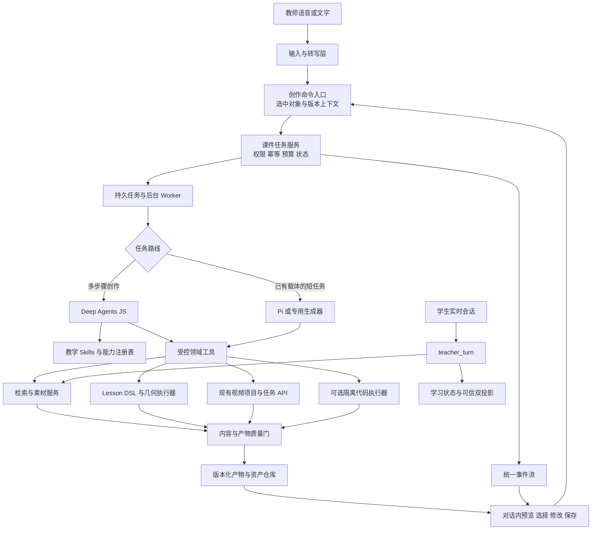

# 对话式课件助手与 Deep Agent 方案

## 1. 推荐决策

建议把课件助手演进为“教师表达目标，系统选择已有能力并完成制作，教师在对话中预览、修改和保存”的创作产品。**多步骤编排框架首选 LangChain Deep Agents JS，采用旁路试点，暂不替换全部 Pi Agent 或学生实时教学服务。** 选择理由是现有系统使用 Node/ESM，Deep Agents JS 提供可替换模型、领域工具、规划、子任务、工作文件及执行状态扩展点，较容易复用现有服务。[^1][^2]

这是目标方案，不是当前功能上线声明。现有课件助手主要是文字输入和关键词建议；教师自然语音创作、多轮语义修改、服务器课件版本库、完整多场景课件保存和统一持久任务尚需建设。框架接口存在，也不表示这些产品能力已经形成。

建议的实施次序是：**先统一任务与产物契约，改善对话式创作闭环；再在相同工具上比较 Pi 和 Deep Agents JS；确认收益后增加子 Agent；最后按实际需求考虑隔离代码生成。** 已有函数图、几何和力学预设直接调用受控执行器，多次研究、素材组合和跨载体创作才进入较长的规划流程。

“首选”表示架构适配上的推荐。尚无相同模型、相同任务的对照证据，不能宣称 Deep Agents JS 在中文教学质量、数学正确性、响应时长或总体费用上优于其他框架。现有 Pi 路径改动较少，也不能据此直接认定其运行总成本最低。

## 2. 必须限定或修正的关键主张

| 容易产生的理解 | 经复核后的准确边界 | 方案中的处理 |
| --- | --- | --- |
| 接入 Deep Agent 就获得语音课件助手 | 候选框架承担 Agent 执行，不自动提供本产品的收音、转写、打断、播报、屏幕指代与选中对象同步。现有 `courseware-assistant.js` 没有教师语音输入实现 | 新增教师创作语音接入层，先验证转写与指代，再连接同一创作命令入口 |
| 当前已经能够智能选择所有技术 | `suggestCoursewareType()` 是关键词规则，`TYPES` 是有限工具列表；技术研究目录中还有候选能力 | 当前称“根据关键词建议已有工具”；目标中的语义选型仅从经过健康检查和能力验证的注册表选择 |
| “整套课件”分类意味着能保存完整课件 | `materialCourseware()` 抓取当前可见 DOM，去除动态控件，保存 `type: visual` 和静态 HTML；没有保留完整原始 bundle 或全部场景 | 内容快照仍归知识点资源；只有完整场景、资产引用与所需状态可重载时才允许标记整套课件 |
| 分类字段升级就是内容迁移 | 当前 `catalog` 读时投影只增加发现元数据，不改变 renderer payload，也不补出缺失内容 | 保持旧 ID、时间戳和 payload；完整课件格式另建版本化契约，不能用分类字段假装完成迁移 |
| 保存当前版本意味着已有版本历史 | 当前 IndexedDB 保存按相同 ID 更新记录，保留 `createdAt` 并更新 `updatedAt`；这不保存每次历史版本，也不支持跨设备同步 | 目标资产仓库区分 artifact ID、revision ID 和草稿指针；现有本地保存明确标示为当前浏览器保存 |
| 关闭页面以后 Deep Agent 自然继续 | 当前互动课件 HTTP handler 监听 `res.close` 并中断生成；这是请求绑定执行，不是独立后台 job | 新长任务入口将“断开事件订阅”与“取消任务”分开；旧同步接口保留原语义，避免隐式改变行为 |
| `subagents` 配置就有后台并行和自然追问 | Deep Agents JS 同步委派会阻塞 supervisor；异步子 Agent 要有 Agent Protocol 服务。[^3] | 第一阶段可以仅把整个创作 run 放进后台 worker；确认需要独立子 Agent 后再建对应服务 |
| 异步任务 update 是无损热修改 | 官方文档说明 update 以 interrupt multitask 策略中断原 run，再在同线程加入新指令启动新 run。[^3] | 把修改保存为新修订请求，标明影响范围；避免让旧结果覆盖新版本，付费步骤先核对状态 |
| 有 checkpoint 就不会重复调用 | LangGraph 回放会重执行 checkpoint 之后的节点，包括 API 调用；持久存储也要正确配置。[^4] | 副作用由业务幂等键与 provider task ID 管理，不能依赖聊天历史或 checkpoint 实现“只调用一次” |
| 有文件 backend 就有安全沙箱 | State/Store/Filesystem/Shell 的职责不同；LocalShellBackend 没有隔离，路径模式也不能约束 shell。[^5] | 标准课件路径不暴露 shell；代码路线使用独立隔离执行器 |
| `abort()` 返回就证明上游取消完毕 | AbortSignal、Pi abort、SDK interrupt 表示对应执行层的中断机制，不能证明外部视频任务已终止。[^3][^6][^10] | 使用 `cancel_requested`，核对各执行层后才宣布取消完成 |
| 更换框架自动解决长等待 | 规划、上下文整理和子 Agent 也增加模型轮次；旧接口还可能等待完整生成才返回 | 首先拆分受理时间、首次真实进度、可操作预览、最终完成时间，测量关键等待阶段再优化 |

以上限制不是要求扩大本轮改动。当前分类、目录和界面整理可以独立完成；Deep Agent、新语音入口、新持久服务和完整课件格式均属于后续方案范围。

## 3. GitHub 项目比较与取舍

### 3.1 可核验项目事实

资料访问日期为 **2026-09-12**；发布日期为官方 Release 的 UTC 日期。这里列出的版本是访问时已核验版本，实施时仍需锁定版本和对应接口。[^1][^7][^8][^9][^10]

| 项目 | 已核验版本与许可 | 适合承担什么 | 当前项目的额外成本 | 选型结论 |
| --- | --- | --- | --- | --- |
| [LangChain Deep Agents JS](https://github.com/langchain-ai/deepagentsjs) | `deepagents@1.13.4`，2026-09-09，MIT；TypeScript/ESM | 多步骤内容创作的主编排，使用受控工具交付产物 | LangChain/LangGraph 依赖、工具 schema 适配、任务事件、真实 checkpoint 存储、模型兼容验证 | **主编排首选，旁路试点** |
| [Pi](https://github.com/earendil-works/pi) | 仓库 `v0.85.1`，2026-09-05，MIT；本系统锁定的 Agent Core/AI 是 `0.74.0` | 少量工具的短任务、已有 Lesson DSL 生成、回退执行 | 长期业务任务、统一版本、复杂委派仍需应用实现；不能把最新 Coding SDK 能力直接算成本地 Core 能力 | **继续保留，作为基线与短任务执行器** |
| [LangChain Deep Agents Python](https://github.com/langchain-ai/deepagents) | `0.7.13`，2026-09-02，MIT；Python `>=3.11,<4.0` | Python 工具占主导的多步骤任务 | 新增 Python 服务、依赖隔离、进程与协议边界 | 当前不作为主编排；Python renderer 可先由 JS 工具调用 |
| [OpenHands Software Agent SDK](https://github.com/OpenHands/software-agent-sdk) | `v1.47.0`，2026-09-10，MIT；核心 Python `>=3.12` | 隔离工作区内的代码生成、构建、执行测试和修复 | Agent Server/容器、Python 运行环境；TypeScript 客户端 README 明确为 alpha，且只支持远程 conversation | 有新代码执行需求时再试；TS 客户端状态不能推论整个 SDK 不可用 |
| [Claude Agent SDK TypeScript](https://github.com/anthropics/claude-agent-sdk-typescript) | `0.3.269`，2026-09-11；Node `>=18`；README 指明受 Anthropic Commercial Terms 管理 | 使用 Claude 进行代码与文件任务的可选执行服务 | Claude 模型渠道、原生程序、会话环境、商业条款与运维边界 | 保留候选，不作为任意模型可替换的默认内核 |

Deep Agents JS 的仓库 latest Release 本次指向 QuickJS 子包，不是 `deepagents` 主包，因此不能只用 monorepo 的 `/releases/latest` 得出库版本。JS 和 Python 的版本号也不能用来相互比较成熟度。[^1][^7]

### 3.2 首选的理由与通过条件

Deep Agents JS 接受模型对象或模型标识，提供工具、中间件、subagents、backend、checkpointer、store 和 interrupt 配置；这些能力与“复用现有领域服务，补足多步骤创作”较匹配。[^2] 与把核心迁移到 Python 相比，它保留当前服务器的语言边界；与引入通用代码 Agent 相比，它不要求先开放终端来完成标准课件。

它仍需要实际集成验证。当前 Pi 的 Ark 配置使用 OpenAI-compatible 适配，但不能据此认定切到 LangChain 后图片输入、tool calls、usage、超时、重试和取消完全等价。LangChain 的 ChatOpenAI 文档是适配入口证据，不是 Ark 兼容性验收结果。[^11]

库、运行服务和托管产品也应区分。Deep Agents JS 是可在应用中调用的库；异步子 Agent 文档允许使用任何兼容 Agent Protocol 的服务，包括自托管服务。[^2][^3] 因此无需把购买某一托管产品写成架构前提，但兼容服务、认证、持久化和运维工作也不会凭空消失。

Pi 作为回退只适用于**可以安全重执行**的步骤，例如尚未产生外部副作用的 DSL 草稿生成。若付费请求已提交而结果不确定，应查询现有任务或进入核对状态，不能切换框架后再次提交。最终是否扩大 Deep Agents JS 覆盖范围，应由任务成功率、人工修订量、模型兼容性、关键路径时长和费用对照决定，不用 star 数量或固定的未经验证占比代替判断。

## 4. 自然语音与最少必要 GUI

### 4.1 核心体验

教师可以说：“给八年级做一个斜面与摩擦实验，让学生先预测，再操作，最后回答一道迁移题。”系统回显简短的目标理解，从已有能力中选择表达方式，开始生成并显示真实状态。预览出现后，教师可以继续说：“把滑杆范围收窄”“只简化第一段”“保留第二版并保存”。

主要输入是自然语音，文字输入始终保留，转写可见可纠正。默认界面包括输入区、附件入口、简短任务状态和当前产物；只有预览需要的操作控件留在画布附近。技术框架、数据库、prompt 和模型参数放入专业设置，不作为正常制作的必经选择。

GUI 的最小化是减少流程负担，不是取消表达空间信息的控件。参数调节、拖动几何点、选中某个文本块、查看公式、比较候选和分镜顺序都需要可见对象。把这些动作全部改成语音会增加歧义，也降低教师验证结果的效率。

| 场景 | 默认交互 | 系统必须携带的上下文 |
| --- | --- | --- |
| 新建课件 | 语音/文字教学目标与附件 | 用户、学科/学段、来源引用、输出用途 |
| 自动选型 | 说明拟采用的教学效果，允许更改 | 可用 capability ID、约束、预算与选型理由 |
| 修改“这个角”“第一段” | 高亮已选对象；有歧义时让教师点选 | artifact ID、revision ID、object ID、观察版本 |
| 比较方案 | 默认一个推荐结果；有实质差异才显示第二个候选 | 候选版本和各自差异，避免仅换样式的伪比较 |
| 操作实验 | 直接拖拽、滑杆、播放或键盘操作 | 实验参数、单位、不变量、操作状态 |
| 保存 | 明确保存当前选中的版本，展示本地/服务器位置 | 幂等键、版本号、资产完整性、访问范围 |
| 生成中继续说话 | 新指令作为修订或后续任务，可取消当前任务 | 正在运行的 run ID、影响步骤、最新目标版本 |

“停止播报”“暂时关闭预览”“取消生成”应是三种不同动作。教师打断语音播报时，不能默认撤销已提交的视频任务；关闭预览不能丢弃草稿；只有明确取消生成时，任务服务才执行取消链。对无法消歧的精确动作，系统用一句短问句或对象选择器确认目标，避免重复确认已经授权的普通草稿修改。

### 4.2 手机、Pad 与桌面

手机以单一焦点为主，对话内预览可展开为全屏；退出全屏后回到相同消息、版本和操作状态。Pad 横屏并排呈现对话与预览，竖屏按可用宽度折叠侧区；不要按设备名称强行挤压复杂实验。桌面可扩展素材与版本侧栏，核心操作和数据与手机、Pad 相同。

创作中的对话、任务、产物和控制参数属于共同状态。切换布局只是呈现变化，不能重新创建任务、重复付费调用、覆盖参数或恢复旧结果。具体按钮、文字、触摸目标与横竖屏质量由浏览器验收确认；Agent 框架本身不提供这些保证。

## 5. 推荐架构与责任分工

### 5.1 两条独立运行链路

学生实时教学与教师课件创作可以共享资料和产物，但应保留不同的任务生命周期。`teacher_turn` 继续负责学生回合的学习状态、确定性判分和可信投影，不能等待一个长时间课件编排完成。教师创作使用独立 run，由任务服务接管执行、修改、保存和取消。



这是目标架构。现有视频服务已经具备自己的项目、持久任务、上游 ID 和轮询机制，应作为工具适配，不为接入 Deep Agent 再实现第二套相同状态。互动课件与素材生成需要补的能力，应围绕统一任务契约逐步增加。

### 5.2 Skill、MCP、Executor、契约分别做什么

| 组件 | 负责内容 | 本系统中的推荐形态 | 不应承担 |
| --- | --- | --- | --- |
| Skill | 专业教学步骤、选型指南、质量检查清单、示例与辅助资料 | 由项目维护、版本固定的技能目录；按需加载相关知识 | 决定用户权限、安装依赖、替代程序校验或宣称工具已经可用 |
| MCP | 发现与调用外部 tools/resources/prompts 的标准接口 | 对远端素材、外部检索或独立执行服务采用 MCP；同进程函数可以直接适配 | 自动授权、沙箱、持久任务、课件包格式 |
| Executor | 真正计算、生成、渲染、转码或调用上游 | 现有 DSL/几何 renderer、素材桥、Ark 客户端和视频合成服务 | 解释模糊的保存目标、自行扩大写权限、按模型文本判断业务完成 |
| 产物契约 | 可验证的输入输出与渲染能力 | Lesson DSL、几何模型、视频 storyboard、后续整套课件 manifest | 把格式正确等同于内容正确、把快照等同于可编辑原件 |
| 任务服务 | 状态、预算、幂等、修订、取消、恢复、事件 | 独立于 Pi/Deep Agents 的领域任务层 | 依赖模型“记得”task ID 或从自然语言结尾判断成功 |
| 资产仓库 | 来源、文件、版本、缩略图、访问范围和复用 | 服务端资产与修订表；本地 IndexedDB 可继续作为当前设备收藏/缓存 | 保存 framework 内部 checkpoint 即宣称交付成品 |

Agent Skills 官方规范说明了 `SKILL.md`、可选脚本/资源和按需加载；MCP 官方区分 tools、resources 和 prompts。[^12][^13] 这些规范帮助组织和连接能力，但“加载成功”不能作为内容正确、授权充分或执行完成的证据。

第一阶段默认只允许已验证的领域工具。应核对创建后实际暴露的工具集合，不能仅凭一个空的 `subagents` 配置就推断所有框架默认委派或文件能力都被禁用。文件 backend 应仅含该 run 需要的工作资料，不含应用源目录、环境密钥或其他教师的数据。[^2][^5]

### 5.3 可执行能力注册表

当前教学技术目录用于浏览和选型，不能直接充当模型的无限工具菜单。目标注册表至少记录：能力 ID、领域适用范围、输入输出 schema、实际 executor 及版本、支持的对象/交互/导出形式、验证等级、健康状态、预算、错误分类与降级方式。

生成顺序优先复用已有课件，再使用既有 DSL 或模板，随后调用专用视频/素材执行器，最后才考虑受控代码生成。候选技术保留研究状态；“源码已经纳入”“已存在调用链”“服务此刻健康”“相同场景验证通过”应是不同状态，不能合成一个模糊的已接入标签。

例如，“把几何图录成视频”可以是现有交互画布加录制/合成，不必为此启动新代码 Agent；“需要任意几何约束求解”则不能由当前直角三角形模板冒充。路由模型可以提出选择，但任务服务根据注册表验证可执行性。

### 5.4 建议的 Skill 切分与工具契约

Skill 以可复用教学任务切分，不为“数学”“高中数学”“抛物线”“Three.js”各建一套相互重复的技能。学科和学段是输入条件，技术差异是按需加载的参考资料与执行器选择。例如同一个“变量关系探究”Skill 可以服务函数、力学和化学，具体公式、不变量与边界由领域执行器校验。

| 建议 Skill | 输入与输出 | 按需调用的能力 |
| --- | --- | --- |
| 教学目标与活动设计 | 学生对象、目标、误区 → 可检查的目标和活动顺序 | 资料查询、能力目录 |
| 教材依据与素材组织 | 授权来源、知识点 → 引用片段、素材清单、缺口 | 检索与素材服务 |
| 交互探究设计 | 变量、观察量、学段 → 预测—操作—观察—迁移任务 | 已验证 DSL、几何/物理执行器 |
| 成套课件组织 | 环节、单元产物、时间约束 → 完整场景结构与资产清单 | OpenMAIC/DeepTutor 适配、包校验 |
| 视频讲解设计 | 目标、PPT/参考素材、时长 → 分镜、旁白、字幕和生成任务 | 图片/视频模型、现有视频任务、合成器 |
| 课件质量检查 | 指定产物版本 → 内容、交互、视觉与来源检查结果 | 结构校验、确定性计算、渲染检查 |

每个 Skill 使用一个版本化目录，`SKILL.md` 只保留使用时机、必要输入、步骤、返回要求和停止条件；`references/` 放学科规则、技术选择与示例，`scripts/` 仅放经审查的辅助脚本。先加载名称和描述，命中任务后再读取完整技能；不要把所有学科参考和所有技术文档放进每次系统提示。目录结构是基于 Agent Skills 格式的本项目建议，六个具体名称不是标准规定。[^12]

MCP 按服务所有权切分，而非按学科切分。若资料服务、渲染服务和资产服务分别部署，可以设计三个边界：`education-resources` 提供受授权检索与素材读取；`courseware-execution` 提供能力查询、创建任务、查看状态和取消；`courseware-assets` 提供版本读取与显式保存。仍在同一 Node 服务内的函数直接包装为领域工具即可，无需为了形式统一绕一层网络 MCP。

建议工具粒度围绕业务动作，例如 `search_teaching_sources`、`describe_capabilities`、`create_courseware_job`、`get_courseware_job`、`cancel_courseware_job`、`validate_artifact`、`save_artifact_revision`。创建长任务返回 run ID、真实状态与可订阅引用；保存返回仓库确认的版本 ID。所有写操作带业务幂等键及被修改的观察版本，服务端自行取得并校验权限，不能接受模型随意提交的用户角色作为授权依据。

最小产物清单建议包含下列字段；这是目标契约示意，实施时需冻结 schema，不代表当前保存格式已经具备：

```json
{
  "artifact_id": "由资产服务分配",
  "revision_id": "由版本服务分配",
  "resource_form": "knowledge_resource",
  "completeness": "complete",
  "renderer": { "id": "lesson_dsl", "version": "固定版本" },
  "payload_ref": "受权限控制的结构引用",
  "asset_refs": [],
  "source_refs": [],
  "affordances": ["adjust", "explore"],
  "validation": { "schema": "passed", "content": "needs_review" }
}
```

对话里渲染的是这份清单对应的指定版本。前端使用白名单 renderer 或隔离预览加载产物，显示其真实 affordances；禁止把工具返回的任意 HTML 直接插进具有主应用权限的 DOM。纯粹的文本修改也应产出新 revision 并说明差异，教师选择保存时才更新课件库里的目标版本。

## 6. 持久化、修改、取消与降级

### 6.1 持久化分四层

| 层 | 必须记录什么 | 恢复时的作用 |
| --- | --- | --- |
| 业务状态 | run/step ID、状态、目标修订、用户与权限、预算、幂等键、provider task ID | 决定当前允许执行什么，以及哪些副作用已经提交 |
| Agent checkpoint | 图状态、已执行节点、必要上下文与中断位置 | 恢复编排，不代替业务授权和副作用核对 |
| 工作文件 | 当前任务的素材摘录、中间结构、构建结果与校验输出 | 继续任务；按生命周期清理 |
| 成品与版本 | 原始结构、依赖资产、renderer 版本、来源、质量结果、revision ID | 预览、修改、复用、回滚与导出 |

`StateBackend` 的文件随图状态存在，`StoreBackend` 使用配置的 store；名称中有 State/Store 不等于已具备进程重启后的持久性。官方的 MemorySaver 是内存实现；生产持久方案需要选定并验证真实存储。[^4][^5] 初期先选择一套适合当前部署规模的实现，不同时引入多个数据库。

现有 `catalog.version: 2` 是发现元数据版本。它与 Lesson DSL 版本、renderer 版本、资产修订和 checkpoint 格式分别管理。读时补分类不重写原始 payload；未来迁移格式也应保留原数据并能识别不兼容 reader，不能静默修改已保存课件。

### 6.2 产物完整性

建议成品记录明确区分 `snapshot` 与 `complete`。标准互动课件保存完整 DSL、运行器版本和所需资产；视频保存真实可访问的成片资产及项目引用；整套课件保存全部场景/页面、动作与题目引用、资产清单和重载所需结构。缺少这些条件的多场景当前画面仍然是快照。

资源形态、呈现形式和交互能力不相互替代。三维场景的 PNG 快照应标为图文/静态快照，不能继续标记可三维探索；一套课件也可能同时包含图文、实验和视频。前端按 manifest 的可验证能力启用编辑、答题、导出和复用按钮，不从技术名称或模型描述推断能力。

保存为知识点资源、保存为整套课件与发布到共享空间属于不同业务动作。若教师已明确要求保存当前版本，系统可以在已有权限内执行；没有共享授权时，不应把“保存”解释为向其他教师发布。

### 6.3 任务状态和修订

建议至少区分 `queued`、`running`、`needs_input`、`cancel_requested`、`cancelled`、`failed`、`completed`。成功必须伴随可验证产物引用；“模型说已完成”或“返回 HTTP 200”不能成为唯一依据。

每次修改记录新的目标修订及所作用的 artifact revision。旧 run 迟到返回时，可以作为旧目标的候选保存，但不能覆盖新版本。对独立的文字修改可复用已生成素材；对影响上游镜头的修改，明确需要重跑的步骤，并使用既有预算与授权规则。

JS 异步子 Agent 的 update 会中断前一个 run，再在同线程以新指令运行。[^3] 产品层应明确选择“追加后续任务”“替换尚未开始的步骤”或“取消后新建修订”，不能把这些语义混在一个模糊的继续按钮中。

### 6.4 取消与断连

后台任务创建与事件订阅分离。页面刷新或切换手机/Pad 布局只是重新订阅任务，不应自动取消后台工作；明确的取消命令再传递到 worker、Agent、执行器与外部 provider。迁移时保留旧同步接口的断连取消语义，避免一批客户端仍按旧接口使用时出现后台残留任务。

取消请求是中间状态。任务服务应逐层核对：是否仍在排队，模型是否停止下一轮，本地计算是否终止，外部任务能否取消，是否有已完成但尚未交付的结果。无法取消的外部任务应保留关联并停止新副作用，不能伪报已退款或上游已停止。[^3][^6][^10]

### 6.5 检索降级、重试与框架回退

数据库连接状态由后端 provider 健康检查和熔断规则维护，模型只读取其结果。Neo4j 失败可跳过图谱扩展；Qdrant 失败可跳过向量召回；若还有可用可信索引则继续对应路径。没有可靠来源时明确标记依据不足，不能把服务错误静默改成“知识库没有相关内容”。

对教学回合仍遵守既有 `teacher_turn` 的失败语义；创作场景可在允许无检索草稿时继续，但产物必须保留该状态。前端连接状态是解释和诊断入口，不能通过浏览器本地红绿状态直接决定后台授权或检索开关。

重试共用 run 总 deadline 和费用预算。框架、provider 客户端与外层任务不能各自无限重复。视频提交结果不确定时，复用现有服务的 `provider_task_id`、提交状态和核对机制；对不存在外部副作用的可重执行步骤，才允许改用 Pi 或其他 provider 生成。

## 7. 分阶段验收

### 7.1 阶段与进入条件

| 阶段 | 实施范围 | 必须通过的验收 | 未通过时的处理 |
| --- | --- | --- | --- |
| A：统一创作闭环 | 任务标识、真实进度、可操作预览、明确版本、保存能力说明；保留现有执行器 | 手机/Pad/桌面状态一致；刷新后可恢复已持久任务；失败和取消不伪报；快照与整套课件不混淆 | 继续修任务与产物层，不以更换模型掩盖问题 |
| B：教师语音入口 | 转写、文字兜底、对象指代、停止播报与取消区分，接入相同创作命令 | 噪声、修改口误、连续追问、歧义对象均可纠正；无重复命令或误保存 | 保留文字主流程，不默认启用未可靠的语音动作 |
| C：Deep Agents JS 旁路 | 相同领域工具上的 Pi 对照；标准 DSL 路线；持久 checkpoint | Ark 模型接口、工具参数、异常恢复、任务预算、结果质量和回退通过；无任意 shell | Pi 路线继续默认，修复适配或缩小试点任务 |
| D：必要的子 Agent | 可独立的素材、策划与验证任务；确有需要才部署异步服务 | 相比单 Agent 缩短关键路径或降低人工修订；错误可局部恢复；子任务成本可归因 | 不扩大委派，仅保留单 Agent 后台任务 |
| E：扩展代码和整套课件 | 隔离代码执行、完整包 manifest、依赖资产与重载 | 构建/交互/数学检查、运行边界、资产完整性、取消及版本恢复通过 | 产物留为待检查候选，不冒充正式完整课件 |

这些阶段是建议依赖顺序，不是工期承诺。A 与部分 B 可以独立于框架迁移开展；是否进入 D、E 由任务需求和 C 的实测结果决定。

### 7.2 最小试点样本与指标

试点应包括：现有斜面实验、精准函数图、教材来源约束、多轮局部修改、图片/教材附件、视频分镜与真实任务状态、完整课件与静态快照、Neo4j/Qdrant 不可用、模型超时、提交结果不确定、页面刷新、服务重启、运行中取消和并发修改。

| 验收维度 | 需要的证据 | 不能替代它的现象 |
| --- | --- | --- |
| 教学正确性 | 有标准答案/不变量的样本，来源对应，教师盲评与人工修订量 | 仅 schema 通过，或另一模型声称正确 |
| 真实等待 | 受理、首次进度、首个可操作预览、最终完成分别统计 p50/p95 | 用“已收到请求”的耗时代替生成耗时 |
| 费用 | run 聚合模型、重试、子 Agent、图片/视频及失败成本 | 只计算主 Agent 的 token |
| 保存完整性 | 新会话从仓库重载全部结构/资产，预览和交互一致 | 当前页面还能显示，或数据库有一条记录 |
| 恢复 | 重启后知道已完成步骤和已提交上游任务，副作用不重复 | 单纯恢复聊天历史 |
| 取消 | 各执行阶段的实际停止与最终状态一致 | UI 马上显示“已取消”但上游仍被重复驱动 |
| 权限与隔离 | 越权素材、恶意文档指令、路径逃逸输入和资源预算检查 | MCP 连接成功、Skill 加载成功或模型口头保证 |
| 交互与语音 | 触摸/键盘操作、不同宽高比、转写修正、对象选择、打断语义 | 静态截图漂亮或能收一段音频 |

时延和费用门槛应在采集现有基线后冻结。接受请求应迅速返回，但不在未测量前写“必定快几倍”或“必定更便宜”；复杂媒体生成与已有 DSL 使用不同完成预算，并在界面中显示实际阶段。

## 8. 方案边界与来源

当前研究支持选型和架构判断，不提供候选框架已安装、真实模型对照已通过、完整课件保存已实现或自然语音创作已上线的证据。关键版本、许可、运行环境和接口来自官方资料；本地边界来自当前代码。没有为该方案运行付费模型、部署沙箱或新增生产执行器。

下列编号对应正文引用。在线文档为 2026-09-12 访问版本；GitHub `main` 页面可能后续变化，已归档关键快照位于 `source-snapshots/deep-agent/`，完整取证说明见同目录 `deep-agent-evidence.md`。

[^1]: LangChain / npm：[Deep Agents JS README](https://github.com/langchain-ai/deepagentsjs/blob/main/libs/deepagents/README.md)、[MIT LICENSE](https://github.com/langchain-ai/deepagentsjs/blob/main/LICENSE)、[deepagents@1.13.4 Release](https://github.com/langchain-ai/deepagentsjs/releases/tag/deepagents%401.13.4)、[npm metadata](https://registry.npmjs.org/deepagents/latest)、[monorepo Releases](https://api.github.com/repos/langchain-ai/deepagentsjs/releases?per_page=25)。用于 JS 包定位、版本和许可。

[^2]: LangChain：[JS customization](https://docs.langchain.com/oss/javascript/deepagents/customization)、[createDeepAgent 源码快照 eb288dd](https://github.com/langchain-ai/deepagentsjs/blob/eb288dd53a2a8cf921e25ad93688212ffc1aca72/libs/deepagents/src/agent.ts)。用于模型、工具、子 Agent、中间件、backend 和 checkpoint 接口。接口存在不等于本项目已适配。

[^3]: LangChain：[JS async subagents](https://docs.langchain.com/oss/javascript/deepagents/async-subagents)、[JS subagents](https://docs.langchain.com/oss/javascript/deepagents/subagents)、[async middleware 源码快照](https://github.com/langchain-ai/deepagentsjs/blob/eb288dd53a2a8cf921e25ad93688212ffc1aca72/libs/deepagents/src/middleware/async_subagents.ts)。用于同步/异步边界、Agent Protocol 服务、自托管、update 中断语义与取消。

[^4]: LangChain：[LangGraph JS checkpointers](https://docs.langchain.com/oss/javascript/langgraph/checkpointers)、[persistence](https://docs.langchain.com/oss/javascript/langgraph/persistence)、[Deep Agents JS human-in-the-loop](https://docs.langchain.com/oss/javascript/deepagents/human-in-the-loop)。用于持久存储、回放和审批恢复边界。

[^5]: LangChain：[JS backends](https://docs.langchain.com/oss/javascript/deepagents/backends)、[sandboxes](https://docs.langchain.com/oss/javascript/deepagents/sandboxes)、[LocalShellBackend 源码快照](https://github.com/langchain-ai/deepagentsjs/blob/eb288dd53a2a8cf921e25ad93688212ffc1aca72/libs/deepagents/src/backends/local-shell.ts)。用于文件状态、store、路径约束与 shell 无隔离事实。

[^6]: Earendil Works / LangChain：[Pi Agent Core README](https://github.com/earendil-works/pi/blob/main/packages/agent/README.md)、[RunnableConfig 源码](https://github.com/langchain-ai/langchainjs/blob/main/libs/langchain-core/src/runnables/types.ts)。用于 abort、工具 hooks、signal 和 deadline 相关接口。

[^7]: LangChain / PyPI：[Deep Agents Python README](https://github.com/langchain-ai/deepagents/blob/main/README.md)、[manifest](https://github.com/langchain-ai/deepagents/blob/main/libs/deepagents/pyproject.toml)、[0.7.13 Release](https://github.com/langchain-ai/deepagents/releases/tag/deepagents%3D%3D0.7.13)、[PyPI metadata](https://pypi.org/pypi/deepagents/json)、[Python customization](https://docs.langchain.com/oss/python/deepagents/customization)。用于 Python 版本、许可、运行要求和配置能力。

[^8]: Earendil Works：[Pi README](https://github.com/earendil-works/pi/blob/main/README.md)、[Pi AI README](https://github.com/earendil-works/pi/blob/main/packages/ai/README.md)、[Coding Agent README](https://github.com/earendil-works/pi/blob/main/packages/coding-agent/README.md)、[Coding Agent SDK](https://github.com/earendil-works/pi/blob/main/packages/coding-agent/docs/sdk.md)、[v0.85.1 Release](https://github.com/earendil-works/pi/releases/tag/v0.85.1)。用于包分工、扩展、provider、会话、默认权限和版本。

[^9]: OpenHands：[Software Agent SDK README](https://github.com/OpenHands/software-agent-sdk/blob/main/README.md)、[MIT LICENSE](https://github.com/OpenHands/software-agent-sdk/blob/main/LICENSE)、[SDK manifest](https://github.com/OpenHands/software-agent-sdk/blob/main/openhands-sdk/pyproject.toml)、[v1.47.0 Release](https://github.com/OpenHands/software-agent-sdk/releases/tag/v1.47.0)、[TypeScript client README 快照](https://github.com/OpenHands/software-agent-sdk/blob/9df0ca59bb8110c5294a508fb6761d91d043e6a3/clients/typescript/README.md)、[Task Tool Set](https://docs.openhands.dev/sdk/guides/task-tool-set)、[Pause and resume](https://docs.openhands.dev/sdk/guides/convo-pause-and-resume)。用于核心语言、定位、许可、TS alpha/remote 边界、同步子任务和暂停。

[^10]: Anthropic / npm：[Claude SDK README](https://github.com/anthropics/claude-agent-sdk-typescript/blob/main/README.md)、[v0.3.269 Release](https://github.com/anthropics/claude-agent-sdk-typescript/releases/tag/v0.3.269)、[npm metadata](https://registry.npmjs.org/@anthropic-ai/claude-agent-sdk/latest)、[Quickstart](https://code.claude.com/docs/en/agent-sdk/quickstart)、[TypeScript API](https://code.claude.com/docs/en/agent-sdk/typescript)、[Permissions](https://code.claude.com/docs/en/agent-sdk/permissions)、[Sessions](https://code.claude.com/docs/en/agent-sdk/sessions)。用于条款声明、运行要求、模型渠道、原生程序、取消和权限边界。

[^11]: LangChain：[ChatOpenAI JS integration](https://docs.langchain.com/oss/javascript/integrations/chat/openai)。用于兼容模型适配入口；未据此宣称 Ark 实测成功。

[^12]: Agent Skills / LangChain：[Agent Skills 官方说明](https://agentskills.io/home)、[Deep Agents JS skills](https://docs.langchain.com/oss/javascript/deepagents/skills)。用于 SKILL.md、资源组织与按需加载。

[^13]: Model Context Protocol：[Server concepts，2026-07-28 版](https://modelcontextprotocol.io/docs/2026-07-28/learn/server-concepts)。用于 tools/resources/prompts 的协议分工。

本地基线：`public/courseware-assistant.js` 的关键词建议和 `materialCourseware()`；`public/courseware-store.js` 的 IndexedDB 读写；`public/courseware-taxonomy.js` 的读时投影；`interactive-lesson-http.js` 的同步请求/断连取消；`pi-teaching-agent.js` 的单一受控工具；`teacher-agent.js` 与 `server.js` 的教学权威边界；`education-video-service.js` 与 repository/http 层的视频任务、上游提交与恢复。文件均在 `/Users/bytedance/work/项目/vibe coding-教育/豆包双工语音/outputs/doubao-voice-demo/`。
