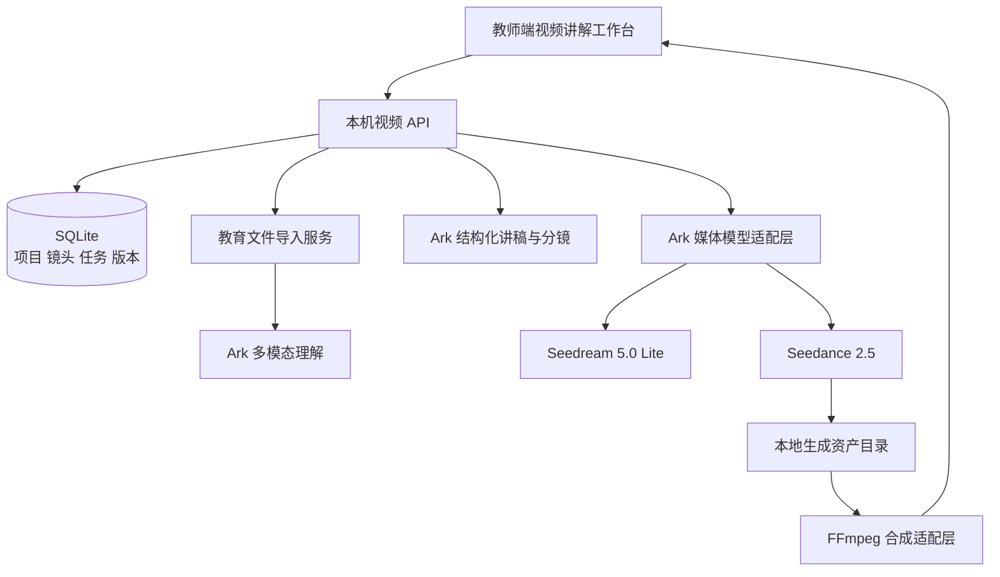
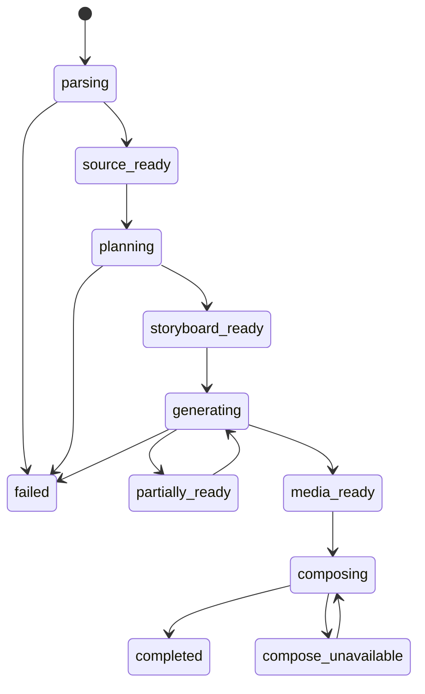

# 教材视频讲解架构与协议 v1

## 目标

把 PPT、Word、PDF 等教材转换为可审阅、可追溯、可局部重做的讲解视频。每个教学镜头都保留教材页、知识点、讲稿、字幕、视觉提示和模型任务的对应关系。

## 生产链


长教材不得作为一个 Seedance 任务处理。系统将课程拆成 4–30 秒的短镜头，单镜头失败或修改时只重做对应镜头。

## 运行时边界



- 浏览器不持有 Ark Key，也不直接请求模型。
- SQLite 是项目、镜头、任务和版本状态的事实源；页面离开后任务仍可恢复。
- 模型返回是非可信输入，必须经过字段白名单、长度、枚举和资源 URL 校验后写库。
- 创建付费任务没有已确认的幂等协议。请求超时后标记“提交结果未知”，不得盲目重发。
- 教材页会先归档为本地 `source_page` 资产；调用 Seedream 时由服务端校验文件边界、大小与摘要后临时编码为 data URL。Base64 只存在于上游请求内存中，不写入 SQLite，也不返回浏览器。
- Seedance 只能使用 Ark 可访问的参考素材。Seedream 刚完成且上游签名 URL 仍有效时，可把该 URL 作为参考图；本地转存资产不能直接交给 Ark。签名 URL 失效或镜头尚无画面时，只能按已审核的文字分镜生成。若要长期稳定引用本地画面，后续需增加受控对象存储或临时签名上传链路。

## 模型配置

| 能力 | Model ID | Endpoint | 默认值 |
|---|---|---|---|
| 教材理解 | `doubao-seed-2-1-turbo-260628` | `/api/v3/chat/completions` | 服务端现有配置 |
| 结构化规划 | `deepseek-v4-flash-260425` | `/api/v3/responses` | 服务端现有配置 |
| 多模态向量 | `doubao-embedding-vision-250615` | `/api/v3/embeddings/multimodal` | 服务端现有配置 |
| 教学视觉 | `doubao-seedream-5-0-260128` | `/api/v3/images/generations` | 2K、PNG、单图 |
| 视频镜头 | `doubao-seedance-2-5-260628` | `/api/v3/contents/generations/tasks` | 720p、MP4、生成音频 |

Seedream 返回图片 URL、Seedance 返回视频 URL 均只有有限有效期。服务端应在成功后立即转存，不把上游 URL 当永久资产。

浏览器只读取 `/api/education/videos/assets/:asset_id/content` 形式的本地资产地址。上游短效 URL、签名参数和教材页 Base64 都不会进入公开项目 JSON。

## 核心实体

### VideoProject

```json
{
  "project_id": "video-uuid",
  "tenant_id": "local-demo",
  "title": "一次函数图像讲解",
  "source_import_id": "import-uuid",
  "source_file_name": "一次函数.pptx",
  "status": "storyboard_ready",
  "audience": "八年级",
  "lesson_mode": "concept_explanation",
  "language": "zh-CN",
  "ratio": "16:9",
  "resolution": "720p",
  "target_duration_seconds": 180,
  "presenter_mode": "voice_only",
  "voice_style": "中文教师女声",
  "visual_style": "清晰板书",
  "current_version": 1
}
```

### TeachingScene

```json
{
  "scene_id": "scene-uuid",
  "sequence": 1,
  "source_page_ids": ["page-0006"],
  "knowledge_point_ids": ["kp.linear-function.graph"],
  "title": "斜率决定直线方向",
  "learning_objective": "能从图像判断斜率正负",
  "narration": "先观察直线从左向右的变化……",
  "subtitle": "斜率大于零，直线从左向右上升。",
  "visual_type": "function_graph",
  "visual_prompt": "教材风格坐标系，突出两条一次函数直线……",
  "duration_seconds": 11,
  "image_status": "ready",
  "video_status": "queued"
}
```

### GenerationTask

```json
{
  "task_id": "task-uuid",
  "project_id": "video-uuid",
  "scene_id": "scene-uuid",
  "task_type": "seedance_video",
  "provider_task_id": "cgt-uuid",
  "status": "running",
  "submission_state": "confirmed",
  "attempt": 1,
  "request_summary": {
    "model": "doubao-seedance-2-5-260628",
    "ratio": "16:9",
    "duration": 11
  }
}
```

请求摘要不得保存授权头、Key、图片 Base64 或完整外部素材正文。

## 状态机



## 教师操作与付费边界

| 操作 | 是否调用模型 | 是否可能付费 | 是否可撤销 |
|---|---:|---:|---|
| 上传与解析文件 | 是，多模态理解 | 是 | 保留项目后可删除 |
| 生成讲稿与分镜 | 是，结构化规划 | 是 | 生成新版本或恢复旧版本 |
| 编辑讲稿/镜头 | 否 | 否 | 有版本记录 |
| 生成教学视觉 | 是，Seedream | 是 | 可保留旧版本 |
| 生成视频镜头 | 是，Seedance | 是 | 排队状态可取消；运行后不可保证取消 |
| 合成成片 | 否，本地工具 | 否 | 原镜头不变，可重新合成 |

页面加载、选择项目、预览和切换设置不会创建模型任务。

## 从 AIVO 吸收的设计

| AIVO 能力区 | 可借鉴机制 | 教育版首版处理 |
|---|---|---|
| 即刻创作 | 入口集中，先选来源，再配置语言、比例、人物、音色和风格 | 已采用；新建项目把教材来源与讲解设置放在同一条任务流中 |
| 项目空间 | 创作项目、版本和生产任务可持续回看 | 已采用；项目、分镜版本、媒体任务和成片资产均持久化 |
| 剧本管理 | 先管理剧本，再进入媒体生产 | 已采用并强化；讲稿、字幕、视觉提示、教材页和知识点按镜头审阅 |
| 生产策略 | 比例、分辨率、时长、人物和批量生产策略可配置 | 部分采用；首版支持核心参数与逐镜/批量生成，复杂质量策略后置 |
| 道具 | 人物、音色、背景音乐和参考素材可复用 | 首版只提供项目级人物、音色和受控参考素材；独立资产库后置 |
| 灵感 | 模板和案例帮助用户快速开始 | 首版不做公共灵感广场；后续只引入有学科、年级和教学目标标注的模板 |

媒体生产任务与项目历史分离，用户离开页面后仍可回看进度。当前讲稿与分镜规划仍在一次 HTTP 请求内同步完成，生成期间需要保持页面打开；成功结果会立即持久化为新版本。没有照搬通用营销视频的“一键成片”：教育场景必须先审阅教材依据、讲稿和分镜，再明确触发付费媒体生成。

教育版增加的关键差异：

- 教材页与知识点溯源。
- 先审阅讲稿与分镜，再生成媒体。
- 镜头级局部重做与版本恢复。
- 失败、任务费用边界和模型配置状态显式展示。
- 字幕默认开启，讲解目标与教学证据优先于营销画面表现。

## 首版明确不做

- 不在导入后自动批量创建付费视频任务。
- 不上传普通真人照片或视频作为未授权教师形象。
- 不把过期的 Ark 媒体 URL 作为正式发布地址。
- 不承诺 Seedance 生成的口播逐字等于讲稿；精确旁白需后续接入独立 TTS 并与字幕对齐。
- FFmpeg 不可用时不伪装合成成功，项目保留全部已完成镜头并提示安装或配置合成器。
