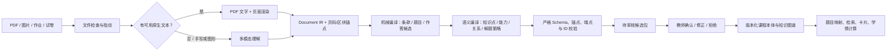
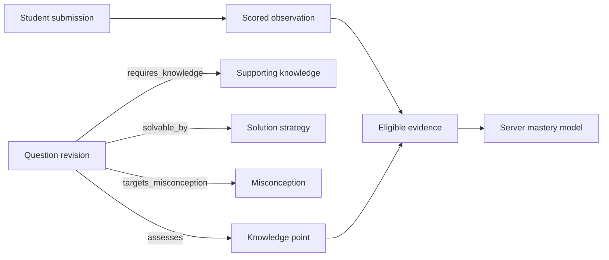

# 教育文件导入与知识编译 v1

> 适用范围：课标、考试大纲、教材、课件、题集、作业本、试卷、答案与评分表的导入、解析和候选知识编译。
>
> v1 原则：模型只能提议，系统负责验证，人负责发布；所有可用于学情计算的数据都必须可回到原文页码和区块。

## 1. 结论

本系统不在“本体”和“知识图谱”中二选一，而是分层使用：

- **课程本体**：定义稳定的实体类型、关系类型、字段、方向和质量规则，是数据合同。
- **知识图谱**：存储具体学科、版本和来源中的实体与关系实例，支持查询、依赖追溯和跨框架对齐。
- **向量索引**：只用于语义检索、去重和候选匹配，不负责创建权威知识点 ID，也不能直接决定掌握度。
- **学习证据库**：存储用户做了什么、答了什么、评分来自哪里。掌握度是服务端根据已审核的“题目—知识点映射”和学习证据计算的投影，不是模型填的一个数。

## 2. 为什么这样建模

[1EdTech CASE 1.1](https://www.1edtech.org/standards/case) 将课标/能力框架表达为 Document、Item、Association 和 Rubric，并为标准、能力和学习成果提供稳定标识。我们的课标文档、条款、学习目标、知识点、能力和框架对齐与此分层兼容。

[1EdTech QTI 3](https://www.1edtech.org/standards/qti/index) 专注题目、测试、交互、评分和结果交换。因此题目不应当成一段知识点文字，而应作为独立 Question IR，再通过 `assesses` / `requires_knowledge` 映射到知识。

[W3C SKOS](https://www.w3.org/TR/skos-reference/) 区分框架内的 `broader` / `narrower` / `related` 和框架间的 `exactMatch` / `closeMatch` / `broadMatch` / `narrowMatch` / `relatedMatch`。我们借用这个语义处理版本对齐、跨学科关联和外部知识库对齐，而不把“相似”误写成“同一”。

[1EdTech Caliper](https://www.imsglobal.org/spec/caliper/v1p2/) 将学习行为表达为特定时间和学习上下文中 actor 对 object 所做的 action。我们的 Submission、Observation 和 EvidenceCandidate 遵循同样的事件与证据分离原则。

## 3. 解析架构



### 3.1 OCR、视觉模型和 Embedding 的分工

| 能力 | 负责什么 | 不能单独负责什么 |
|---|---|---|
| PDF 原生解析 | 字符、页数、顺序、元数据 | 扫描页、手写、图形语义 |
| OCR / 文档解析 | 精确转录、坐标、表格、公式字符 | 教学语义、知识依赖、错因判断 |
| 多模态理解模型 | 页面角色、图形、手写与批注层、题目部件和语义提议 | 无审核地建立权威 ID、评分或掌握度 |
| 多模态 Embedding | 图搜文、文搜图、跨模态去重、相似候选召回 | 高保真 PDF 解析、图形推理、知识图谱生产 |

火山官方将图文 Embedding 定位为将文本和图片转换为统一向量，主要服务于跨模态检索和数据分析，而不是 OCR 替代品：[EmbeddingsMultimodal API](https://api.volcengine.com/api-docs/view?action=EmbeddingsMultimodal&serviceCode=ark&version=2024-01-01)。对复杂 PDF，官方也单列了视觉级文档解析能力，用于标题、表格、公式和图片区域结构化：[PDF 智能解析](https://www.volcengine.com/docs/6492/2301414)。

## 4. 核心数据对象

### 4.1 权威对象

- `DocumentIR`：文档、修订版、文档类型、学科、学段、来源指纹。
- `SourceAnchor`：文档修订版 + 页码 + block IDs + 原文摘要。
- `CurriculumStandardCandidate`：标准条款、学习目标、知识点或能力候选。
- `QuestionIR`：题干、题型、作答协议、选项、小问、修订版、来源锚点。
- `SubmissionIR`：某个学习者对某个题目修订版的作答与评分事件。
- `QuestionKnowledgeLink`：题目或小问直接考查哪个知识点，以及解题时还需要哪些辅助知识。
- `EvidenceCandidate`：学习观测能否进入掌握度模型的候选；禁止模型写 `mastery_delta` 或掌握概率。

### 4.2 评审扩展对象

这些对象先放在 semantic sidecar，不立即并入正式本体：

- `solution_strategy`：解题策略与步骤框架。
- `proposition_angle`：命题角度、变式方式、素材情境。
- `assessment_dimension`：概念识别、运算、说理、建模、迁移等可观测维度。
- `misconception`：典型错误概念、诊断线索和针对性干预。

它们值得提前规划，但不应全部伪装成“知识点之间的边”。否则图谱会将内容、教学、测评和用户证据混为一层，无法治理。

## 5. 关系分层

| 层 | 关系 | 使用边界 |
|---|---|---|
| 文档结构 | `part_of`, `derived_from_clause`, `aligned_to_objective` | 条款、目标、知识点的来源和层级 |
| 学习依赖 | `prerequisite_of`, `builds_on` | 前者是强学习依赖，后者是软进阶；都不从语义相似自动推导 |
| 语义 | `generalizes`, `specializes`, `contrasts_with`, `equivalent_view_of` | 概念范围、对比和等价表征 |
| 表征与应用 | `represented_by`, `uses_representation`, `applied_with`, `applies_in_context` | 公式、几何图、数轴、实验和跨知识应用 |
| 测评 | `assesses`, `requires_knowledge`, `solvable_by`, `targets_misconception` | 目标知识、辅助知识、解法与错因 |
| 证据 | `responds_to`, `graded_by`, `derived_from_observation`, `supports_claim`, `refutes_claim` | 只连接真实作答、评分、观测和证据声明 |
| 跨框架 | `exact_match`, `close_match`, `broader_than`, `narrower_than`, `analogous_to` | 跨学科/跨版本对齐；必须有两端框架版本、证据和审核状态 |

### 5.1 跨学科关联

跨学科不直接共用一个知识点 ID。应先保留各学科自己的 concept scheme，再建立带版本、来源和审核状态的对齐边。例如“一次函数”和“匀速直线运动图像”可以用 `applied_with` 或 `analogous_to` 表达应用/类比，不应写成 `exact_match`。

## 6. 题目与掌握度闭环



只有同时满足以下条件的观测才能进入掌握度计算：

1. 学习者身份在服务端确定，不是浏览器任意声明。
2. 题目修订版、小问和作答对应唯一。
3. 题目—知识点映射已通过审核，且有直接/辅助角色和权重。
4. 判题结果可验证，或有教师/受控 rubric 确认。
5. 证据未过期、未重复，并通过租户/用户隔离和幂等检查。

文件导入阶段仅生成 `EvidenceCandidate`，不直接修改掌握度。

## 7. 已实现的 v1 纵切

### 7.1 服务端

- PDF 内容指纹、MIME 嗅探、页数与大小限制。
- 原生文本提取和逐页渲染；扫描页、手写与图形进入多模态解析。
- 课标、试卷、作答等 12 类文档路由。
- 严格 Document IR、Question IR、Submission IR、TypedRelation 与 EvidenceCandidate 校验。
- 本地持久化任务、恢复、租约和源文件完整性检查。
- 多模态页面解析与语义本体编译共用受控 Ark 模型客户端。
- 长文档默认每 24 页分批语义编译，每批拥有独立 ID 命名空间和页面证据边界；单批失败不会吞掉后续页面。
- 模型只能返回文档内局部 proposal ID；正式候选 ID 由本地编译器生成。
- 解题策略、命题角度、错误概念和评估维度作为独立待审 sidecar 存储。
- 语义批次状态明确区分 `succeeded` / `partial` / `failed`；不完整候选包不允许整包标记为已验证。

### 7.2 HTTP 接口

| 方法 | 路由 | 用途 |
|---|---|---|
| `GET` | `/api/education/imports/config` | 读取可公开的模型/限制状态，不包密钥 |
| `POST` | `/api/education/imports` | `multipart/form-data` 单文件导入 |
| `GET` | `/api/education/imports` | 查看最近任务 |
| `GET` | `/api/education/imports/:id` | 查看进度和候选结果 |
| `POST` | `/api/education/imports/:id/review` | 确认、拒绝或标记待审 |

v1 HTTP 入口仅开放给本机请求。正式部署前必须改为服务端认证、角色授权和 tenant/user 强绑定，不能相信浏览器上报的 `tenant_id` / `learner_id`。

### 7.3 环境变量

```dotenv
ARK_API_KEY=
ARK_EDUCATION_BASE_URL=https://ark.cn-beijing.volces.com/api/v3
ARK_EDUCATION_VISION_MODEL=doubao-seed-2-1-turbo-260628
ARK_EDUCATION_TEXT_MODEL=deepseek-v4-flash-260425
ARK_EDUCATION_EMBEDDING_MODEL=doubao-embedding-vision-250615
EDUCATION_IMPORT_MAX_PAGES=300
EDUCATION_IMPORT_MAX_VISION_PAGES=300
EDUCATION_IMPORT_SEMANTIC_BATCH_PAGES=24
EDUCATION_IMPORT_MAX_SEMANTIC_BATCHES=50
```

密钥只能通过服务端环境注入，不写入代码、文档、浏览器、导入任务回执或 Git。

## 8. 还没有完成的能力

v1 是可运行的导入候选纵切，不等于已完成生产知识平台。后续仍需：

1. 将 Embedding 真正接入切片去重、已有本体候选召回和版本对齐；目前客户端已有 API 能力，但导入流程尚未建立向量索引。
2. 本地 proposal 与现有 140 知识点的候选映射、合并、冲突和版本迁移界面。
3. 教师可逐条修订实体、关系、题目映射和评审扩展；当前前端只提供整包确认的最小界面。
4. 发布仓库、版本 diff、回滚、影响分析和正式 CASE/QTI 导入导出适配器。
5. 从已审核 Submission/QuestionKnowledgeLink 到掌握度引擎的权威证据写入管道。
6. 正式用户认证、租户隔离、数据保留/删除策略与未成年人数据合规。
7. 跨语义批次的全局依赖关系对齐；v1 会将这类关系标记为待复核，不会自动猜测跨批边。

## 9. 质量门

- **Q0 文件门**：类型嗅探、大小/页数限制、SHA-256 和源文件完整性。
- **Q1 解析门**：原生文本优先，扫描/手写必须有多模态能力；没有能力时明确失败。
- **Q2 锚点门**：候选必须引用存在的页码和 block ID；无锚点不入合同集合。
- **Q3 Schema 门**：额外字段、非法 ID、未知端点和错误修订版全部拒绝或隔离。
- **Q4 语义门**：依赖、题目映射和跨框架对齐都是候选；低置信度和推断项强制审核。
- **Q5 发布门**：只有教师/内容管理者审核后才能进入正式本体或题库。
- **Q6 证据门**：掌握度只消费已审核、已绑定用户、可验证判题且幂等的学习观测。
